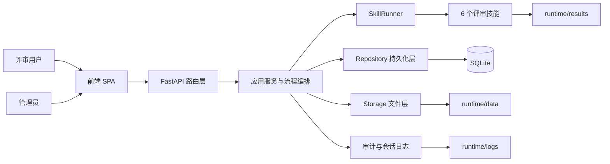
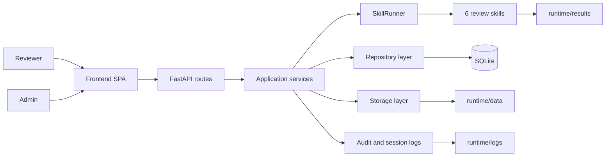

# PRD Draft Review Workflow V1

<p align="center">
	<a href="#中文"><strong>中文</strong></a>
	<span> | </span>
	<a href="#english"><strong>English</strong></a>
</p>

<a id="中文"></a>

## 中文

面向团队协作的需求评审工作流平台，重点解决 PRD 从上传、拆解、逐篇分析、系统评审到报告生成的全流程闭环问题。项目采用内网可部署架构，强调可追溯、可配置、可扩展，以及运行时数据与源码分离。当前版本 V0.2.13。

### 架构设计

系统当前采用四层协作结构：

- 接入层：FastAPI 提供认证、对话、上传、历史、管理、需求评审、团队空间、Agent 等 API，原生 JavaScript SPA 提供统一前端界面。
- 应用编排层：以 ChatApplicationService、ReviewPipelinePersistenceService 和 Review 路由为核心，负责模型选择、上下文装配、任务追踪、报告落库和流程协调。
- Agent 编排层：PiAgentBridge 以 RPC 子进程方式桥接 Pi Agent，管理 Agent 生命周期、工具调用审批、事件流转换和 SSE 推送；ToolRegistry 和 MCP 适配器负责工具注册与外部服务连接。
- 领域与持久化层：通过 repositories、storage、log_writers 分离数据库读写、文件存储和审计日志职责，降低路由层耦合。
- AI 工作流层：SkillRunner 以 Skill-as-a-Service 方式编排 6 个专业技能，负责文档转换、分类、逐篇分析、系统评审、洞察汇总和报告生成。



### 为需求评审设计的工作流

这是当前系统最核心的能力。围绕“需求评审”而不是“单次问答”来设计，现有流程主要包括：

1. 文档接入：用户在评审项目中上传 DOCX，系统将原文件和 Markdown 转换结果写入 runtime 目录。
2. 项目化组织：每次评审以项目为单位管理文档、上下文、Prompt 和任务记录，便于多轮迭代复用。
3. 预分类与版本线索：通过 prd-overview-classify 技能对文档做概览分类，并为后续演进分析准备版本链信息。
4. 逐篇多维分析：通过 prd-per-analysis 对单篇需求文档做结构化分析，输出可落库、可追踪的维度结果。
5. 系统级交叉评审：通过 system-review 汇总多文档结果，形成业务价值、架构、竞品、产品策略、技术演进、PM 评估、行动计划等系统视角结论。
6. 洞察与报告生成：通过 requirement-insights 和 report-generator 汇总演进洞察、差距分析、评审报告和 PRD 草稿。

当前评审模式覆盖：

- `quick`：快速单文档评审。
- `review`：标准需求评审流程。
- `pm`：偏 PM 能力评估视角。
- `insight`：在标准评审基础上增加演进与缺口洞察。
- `full`：完整分析链路。
- `draft`：基于评审结果生成 PRD 草稿。

### 功能要点

- 项目化评审：按项目管理需求文档、上下文版本、评审任务和报告输出。
- 协作审查（P4）：审查通过后进入"讲解准备→产物确认→协作审查"三阶段流程；ReviewRequest/Round/Participant 模型支持多轮审批与参与者管理；讲解准备模式自动注入审查结果和知识上下文；Artifact 产物支持 draft→confirmed 冻结生命周期；通知系统实时推送审批/评论/提及事件（SSE + 铃铛 Inbox）；评论组件支持回复和 @mention。
- 团队空间与资料库：支持团队共享资料上传、列表、详情、下载和软删除；项目可引用团队资料并自动冻结版本快照；四级角色权限（owner/admin/member/viewer）控制资料管理、上传和查看；停用成员自动阻断项目访问和资料引用；统一权限入口（require_action + is_active_member）覆盖全部 workspace 和 review 域操作。
- OpenAI 兼容模型接入：支持多模型配置、启停、排序、API Key 加密存储，思考级别配置（关/low/high 运行时调档）与思考过程流式展示。
- Agent 对话与工具注册：支持通过 Pi Agent（方案A：RPC 子进程桥接）进行自主工具调用对话；AgentProfile/AgentRun 管理身份与运行记录；ToolRegistry schema 声明可用工具；高风险工具调用触发人工审批流程；MCP 适配器支持外部工具服务连接；前端提供 Agent 模式开关和审批面板。
- 品牌与本地个性化配置：支持通过 `runtime/config/ui-branding.yaml` 和 `runtime/assets/branding/` 覆盖产品名称、Logo、favicon、主题色和页面文案，便于通用代码覆盖旧项目时保留本地品牌。版本号通过 `app_version` 字段配置。
- 流程可追踪：评审任务具备状态、步骤详情、结果落库和日志记录能力，便于排查和复盘。
- 上下文注入与 Prompt 配置：支持评审上下文管理、通用 Prompt 模板和需求评审 Prompt 分离管理。
- 实时任务体验：评审流程支持流式进度反馈，适合长流程 AI 审查任务。
- 内网部署友好：SQLite + runtime 目录隔离，部署简单，便于迁移和备份。

### 后台管理功能

当前后台管理聚焦“把工作流跑稳”和“让模型配置可控”，主要包括：

- 用户管理：创建、禁用、删除普通用户或管理员账号。
- 模型管理：维护模型列表、显示顺序、启停状态、API Key、思考级别配置与适配方式，并支持连通性测试与测速。
- Prompt 管理：维护通用 Prompt 模板和评审专用 Prompt。
- 技能管理：查看当前技能配置，并维护技能更新地址等元信息。
- 品牌配置管理：查看和导出当前品牌配置模板。
- Agent 管理：配置 Agent 身份、系统策略、授权范围和可用工具；查看运行记录和待审批的工具调用请求；配置 MCP 外部工具服务连接策略。
- 统计与审计：查看系统统计数据和最近访问记录，辅助运营与排障。

### 技术实现概览

- 后端：FastAPI、SQLAlchemy Async、SQLite。
- 前端：Vanilla JS SPA + CSS。
- 认证：JWT + bcrypt。
- LLM 接入：OpenAI-compatible API。
- 文档处理：python-docx、mammoth。

### 快速启动

```bash
python3 -m venv .venv
source .venv/bin/activate
pip install -r requirements.txt
cp .env.example .env
./start.sh
```

默认端口为 17957。

### 目录说明

```text
src/main.py                 FastAPI 入口与静态站点挂载
src/app/routers/            API 路由层（auth/chat/upload/history/admin/review/workspace/agent/review_request/notification/artifact）
src/app/services/           应用服务、SkillRunner、LLM 适配、品牌配置、PiAgentBridge、MCP 适配器、NotificationService
src/app/repositories/       数据访问层（含 Workspace/KnowledgeSource/ProjectSourceRef/Agent/ReviewRequest/Notification/Artifact）
src/app/storage/            文档与运行时文件存储（含 KnowledgeFileStorage）
src/app/log_writers/        审计、前端、LLM 会话日志
src/static/                 前端 SPA（含 workspace.js 资料库、notification.js 通知模块）
skills/                     需求评审技能链
src/agent/extensions/       Agent 安全 Extension（工具调用拦截与审批）
package.json                Pi Agent npm 依赖声明（pi-coding-agent）
runtime/                    数据库、上传、转换、结果、日志
runtime/config/             品牌配置模板（ui-branding.example.yaml）
runtime/assets/branding/    品牌资产目录（Logo、favicon）
tools/                      品牌迁移工具（migrate_branding.py）
tests/                      自动化测试
```

### 数据与代码分离

所有数据库、上传文件、转换结果、日志和评审产物都写入 runtime 目录。该目录默认不纳入 git，便于：

- 避免运行时数据进入源码仓库。
- 在部署时独立挂载数据卷。
- 在开源或跨环境迁移时保护业务数据。

### License

Apache License 2.0。详见 [LICENSE](LICENSE)。

<a id="english"></a>

## English

An intranet-deployable PRD review workflow platform built for team collaboration. The system is designed around end-to-end requirement review rather than isolated chat sessions, covering document intake, decomposition, per-document analysis, system-level review, and report generation in one traceable pipeline. Current version V0.2.13.

### Architecture

The current codebase follows a four-layer design:

- Access layer: FastAPI exposes authentication, chat, upload, history, admin, review, workspace, and Agent APIs, while a vanilla JavaScript SPA provides the unified UI.
- Application orchestration layer: services and review pipeline orchestration handle model selection, context assembly, task tracking, and report persistence.
- Agent orchestration layer: PiAgentBridge manages the Pi Agent RPC subprocess lifecycle, tool call approval, event stream conversion, and SSE push; ToolRegistry and MCP adapter handle tool registration and external service connections.
- Domain and persistence layer: repositories, storage modules, and log writers separate database access, file storage, and audit logging responsibilities.
- AI workflow layer: SkillRunner orchestrates six specialized skills in a Skill-as-a-Service pipeline.



### Requirement Review Workflow

The workflow is the core of the product. It is designed to support structured requirement review from raw input to final deliverables:

1. Document intake: users upload DOCX files into a review project; the original file and converted Markdown are stored under runtime.
2. Project-based organization: documents, context, prompts, tasks, and reports are managed per review project.
3. Overview classification: the prd-overview-classify skill prepares document categorization and version-chain clues.
4. Per-document analysis: the prd-per-analysis skill produces structured, persistable analysis results for each requirement document.
5. System-level review: the system-review skill synthesizes cross-document findings across business value, architecture, competition, product strategy, tech evolution, PM assessment, and action plan dimensions.
6. Insights and reporting: requirement-insights and report-generator produce gap analysis, evolution insights, review reports, and PRD draft outputs.

Supported review modes:

- `quick`: fast single-document review.
- `review`: standard requirement review pipeline.
- `pm`: PM-oriented assessment mode.
- `insight`: standard review plus evolution and gap insights.
- `full`: complete workflow.
- `draft`: generate a PRD draft from review outputs.

### Feature Highlights

- Project-centric review management for documents, context versions, tasks, and reports.
- Collaborative review (P4): post-approval workflow covers "presentation preparation → artifact confirmation → collaborative review"; ReviewRequest/Round/Participant models support multi-round approval and participant management; presentation mode auto-injects review results and knowledge context; Artifact lifecycle with draft→confirmed freeze; real-time notification system (SSE + bell Inbox) for approval/comment/mention events; comment component with replies and @mention support.
- Team workspace and knowledge library: shared upload, listing, detail, download, and soft-delete; project source refs with automatic snapshot versioning; four-tier role permissions (owner/admin/member/viewer) for manage, upload, and read access; inactive members automatically blocked from project access and source referencing; unified permission entry point (require_action + is_active_member) covering all workspace and review-domain operations.
- OpenAI-compatible multi-model integration with encrypted API key storage and configurable thinking settings.
- Branding and local customization: override product name, Logo, favicon, theme colors and page copy via `runtime/config/ui-branding.yaml` and `runtime/assets/branding/`. Version number configurable through `app_version`.
- Agent conversation and tool registration: autonomous tool-calling conversations via Pi Agent (Architecture A: RPC subprocess bridging); AgentProfile/AgentRun for identity and run tracking; ToolRegistry schema for available tools; high-risk tool calls trigger human approval; MCP adapter for external tool service connections; frontend Agent mode toggle and approval panel.
- Traceable workflow execution with task status, step details, persisted outputs, and runtime logs.
- Separate management for general prompts and review-specific prompts.
- Streaming progress for long-running AI review tasks.
- Deployment-friendly runtime isolation using SQLite and a dedicated runtime directory.

### Admin Console

The admin console focuses on operational control of the workflow:

- User management for creating, disabling, and deleting user or admin accounts.
- Model management for ordering, enabling, configuring API keys, testing connectivity, measuring latency, and tuning thinking-related settings.
- Prompt management for general prompts and review prompts.
- Skill management for skill metadata such as update URLs.
- Branding template export and configuration guidance.
- Agent management: configure Agent identity, system policy, authorization scope, and available tools; view run history and pending tool-call approval requests; configure MCP external tool service connection policies.
- System stats and recent access records for lightweight operations and troubleshooting.

### Tech Stack

- Backend: FastAPI, SQLAlchemy Async, SQLite.
- Frontend: Vanilla JS SPA + CSS.
- Authentication: JWT + bcrypt.
- LLM integration: OpenAI-compatible APIs.
- Document processing: python-docx, mammoth.

### Quick Start

```bash
python3 -m venv .venv
source .venv/bin/activate
pip install -r requirements.txt
cp .env.example .env
./start.sh
```

The default server port is 17957.

### Project Map

```text
src/main.py                 FastAPI entry point and static site mount
src/app/routers/            API routes (auth/chat/upload/history/admin/review/workspace/agent/review_request/notification/artifact)
src/app/services/           Application services, SkillRunner, LLM integration, branding config, PiAgentBridge, MCP adapter, NotificationService
src/app/repositories/       Persistence layer (incl. Workspace/KnowledgeSource/ProjectSourceRef/Agent/ReviewRequest/Notification/Artifact)
src/app/storage/            Runtime file storage (incl. KnowledgeFileStorage)
src/app/log_writers/        Audit, frontend, and LLM session logs
src/static/                 Frontend SPA (incl. workspace.js knowledge library, notification.js notification module)
skills/                     Review skill chain
src/agent/extensions/       Agent security Extension (tool call interception and approval)
package.json                Pi Agent npm dependency (pi-coding-agent)
runtime/                    Database, uploads, conversions, results, logs
runtime/config/             Branding config template (ui-branding.example.yaml)
runtime/assets/branding/    Branding assets directory (Logo, favicon)
tools/                      Branding migration tool (migrate_branding.py)
tests/                      Automated tests
```

### Data and Code Separation

All databases, uploads, converted files, logs, and review artifacts live under the runtime directory, which is git-ignored by default. This keeps runtime data out of source control, simplifies deployment with mounted data volumes, and reduces the risk of leaking business data across environments.

### License

Apache License 2.0. See [LICENSE](LICENSE) for details.