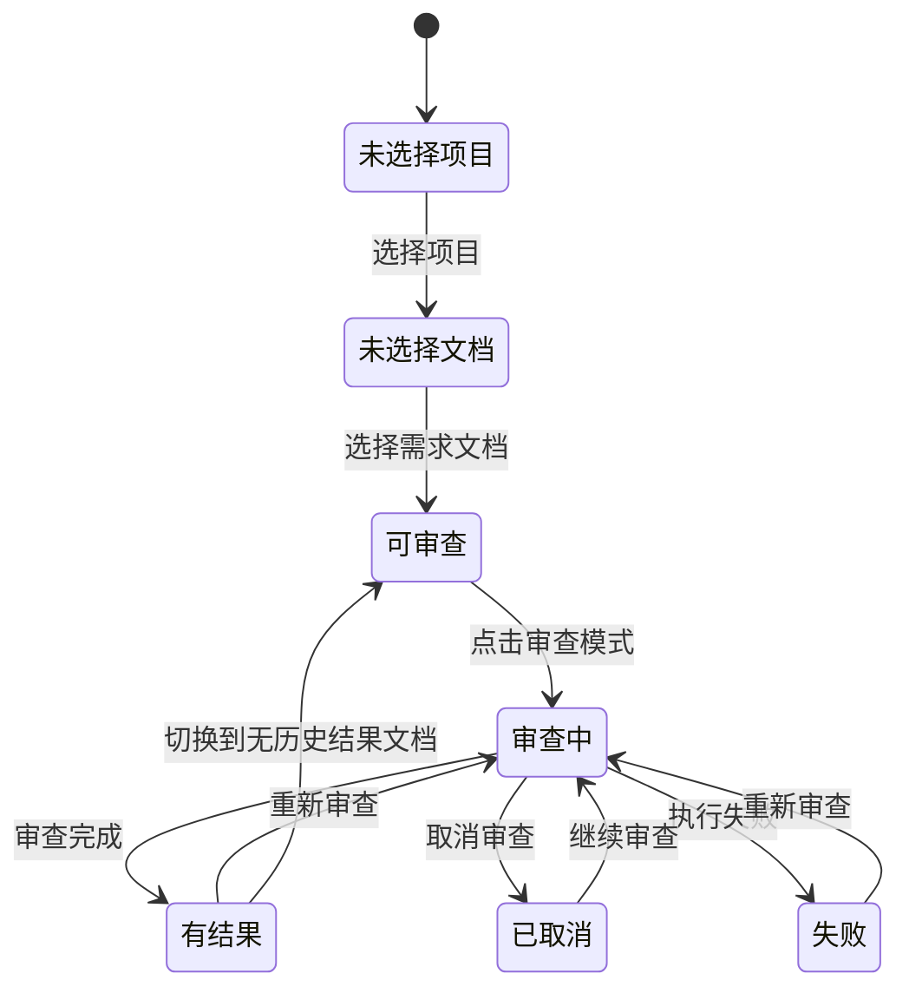

# 三栏式 UI 界面设计指南

> 适用项目：需求审查工作流平台  
> 适用场景：需求审查工作台升级为“导航 + 操作 + 结果”的动态三栏布局；智能对话升级为“对话列表 + 消息流 + 上下文辅助面板”的三栏布局  
> 目标读者：产品负责人、前端开发、UI 设计、AI Agent 实施者  
> 编写日期：2026-05-25

## 1. 设计目标

三栏式 UI 的核心目标不是“增加一栏”，而是让用户在审查工作中保持连续上下文。

当前需求审查工作台的核心流程是：

1. 选择项目和需求文档。
2. 维护需求规范、专业指导意见、历史文档等评审上下文。
3. 选择审查模式并启动 AI 审查。
4. 查看进度和结果。
5. 根据结果调整规范、切换文档、重新审查。

这是一个典型的迭代工作流，而不是一次性提交表单。因此，界面应同时支持“操作”和“查看结果”，避免用户每次查看结果都失去操作入口。

三栏式 UI 的目标包括：

- 保持项目、文档、资源、审查动作、审查结果之间的空间关系。
- 让用户在查看结果时仍能看到当前选中的文档和可执行操作。
- 支持审查结果与审查上下文之间的快速迭代。
- 降低“返回工作台”“重新进入结果页”等跳转成本。
- 为后续多文档、多结果、多模式对比留下布局扩展空间。

## 2. 当前两栏布局的问题

当前布局可以抽象为：

```text
┌──────────────────────────────────────────────┐
│ 顶栏：模型选择、导航、用户入口                 │
├──────────┬───────────────────────────────────┤
│ 左侧边栏  │ 主工作区                            │
│          │                                   │
│ 项目列表  │ 空状态 / 操作卡片 / 进度 / 结果       │
│ 文档列表  │                                   │
│ 上传资源  │ 四种状态互斥显示                     │
└──────────┴───────────────────────────────────┘
```

这种布局在 MVP 阶段足够简单，但在需求审查场景中会暴露几个问题：

### 2.1 操作和结果互相驱逐

用户点击审查模式后，操作卡片会被进度页替换；审查完成后，进度页又被结果页替换。用户想重新调整需求规范、切换模式、确认当前文档时，需要离开结果页回到工作区。

这会造成上下文中断：

- 不知道当前结果对应哪篇文档。
- 不知道当前模式是否已经完成。
- 不方便基于结果立即重跑。
- 容易误以为“返回工作台”会丢失当前结果。

### 2.2 结果页承担了过多功能

结果页当前包含概览、逐篇分析、体系 Review、需求洞察、PRD 草稿、PM 发展建议等多个 Tab。这些内容不是单纯报告，而是下一轮操作的依据。

如果结果页完全替代工作区，用户会在“看结果”和“做操作”之间频繁切换，效率下降。

### 2.3 AI 审查天然需要迭代

AI 审查不是一次出最终答案。真实使用中，用户常见动作包括：

- 看完初审结果后补充需求规范。
- 看完 PM 建议后重新跑深度分析。
- 看完 PRD 草稿后切换到另一篇需求对比。
- 发现 AI 理解偏差后调整专业指导意见。
- 查看历史结果后决定是否重新审查。

这些动作都要求“结果”和“操作”并存。

## 3. 推荐总体方案：动态三栏

不建议一开始做固定三栏。推荐采用动态三栏：

- 没有结果时：保持两栏，工作区占据主空间。
- 有结果时：展开右侧结果区，形成三栏。
- 窄屏时：回退到两栏，避免信息过挤。

### 3.1 无结果状态

```text
┌──────────────────────────────────────────────┐
│ 顶栏                                          │
├──────────┬───────────────────────────────────┤
│ 左侧边栏  │ 工作区                              │
│ 280px    │                                   │
│          │ 当前文档标题                         │
│ 项目列表  │ 审查模式卡片                         │
│ 文档列表  │ 资源面板                             │
│ 上传入口  │ 规范/指导意见/历史文档                 │
└──────────┴───────────────────────────────────┘
```

无结果时不展示空白右栏。用户的注意力集中在选择文档、配置上下文、启动审查。

### 3.2 有结果状态

```text
┌────────────────────────────────────────────────────────────┐
│ 顶栏                                                        │
├──────────┬──────────────────┬──────────────────────────────┤
│ 左侧边栏  │ 操作区             │ 结果区                        │
│ 280px    │ 380-460px         │ flex                          │
│          │                  │                              │
│ 项目列表  │ 当前文档            │ 结果标题                       │
│ 文档列表  │ 模式卡片            │ 状态/耗时/模型/上下文版本         │
│ 上传入口  │ 资源面板            │ Tab：概览/逐篇/体系/洞察/PRD/PM  │
│          │ 重跑/取消/继续       │ 结果内容                       │
└──────────┴──────────────────┴──────────────────────────────┘
```

结果出现后，用户仍然保留操作入口，右侧专注展示结果。

### 3.3 窄屏降级

屏幕宽度不足时，三栏会带来拥挤。推荐规则：

```text
>= 1280px：启用动态三栏
1024px - 1279px：两栏布局，结果和操作通过 Tab/按钮切换
< 1024px：移动端/窄屏模式，侧边栏可收起，主区单列显示
```

## 4. 三栏的信息架构

三栏不是简单地把页面切三块，每一栏都要有明确职责。

### 4.1 左侧：导航与对象选择

左侧边栏负责回答：“我正在处理哪个项目、哪批文档？”

内容包括：

- 项目列表。
- 当前项目状态。
- 需求文档列表。
- 历史文档列表入口。
- 上传入口。
- 文档状态徽章。

设计原则：

- 左侧保持稳定，不随审查状态频繁变化。
- 文档选中态必须明显。
- 文档状态要紧凑：待处理、已分类、已审查、部分完成、分析失败。
- 不承载大段说明文字。

建议宽度：

```css
--sidebar-width: 280px;
```

可接受范围：

- 最小 260px。
- 最大 320px。
- 不建议过宽，避免挤压结果区。

### 4.2 中间：操作与上下文配置

中间操作区负责回答：“我下一步可以做什么？”

内容包括：

- 当前选中文档标题。
- 6 个审查模式入口。
- 当前模式状态。
- 重新审查、继续审查、取消审查入口。
- 需求规范。
- 专业指导意见。
- 历史文档/参考资料管理。
- 模型选择提示或状态。

设计原则：

- 结果出现后，中间区应变得更紧凑。
- 操作卡片不再使用大面积营销式卡片，应改为密集但可扫读的工具型布局。
- 每个模式入口应清晰显示状态：未执行、进行中、已完成、部分完成、失败、已取消。
- 资源面板可以折叠，避免占用过多高度。

建议宽度：

```css
--work-panel-width: clamp(380px, 30vw, 460px);
```

三栏时，中间操作区重点展示“当前上下文 + 可执行动作”，不要再承担大面积结果展示。

### 4.3 右侧：结果与分析

右侧结果区负责回答：“AI 这次审查给出了什么判断？”

内容包括：

- 结果标题：文档名 + 模式 + 状态。
- 任务元信息：模型、上下文版本、耗时、任务状态。
- 结果 Tab。
- 对应 Tab 内容。
- 导出、复制、重新审查等辅助操作。

设计原则：

- 结果区是主要阅读空间，应获得最大弹性宽度。
- 右侧不要重复中间操作区的全部控制，只保留与结果强相关的操作。
- 长文结果必须有清晰层级：摘要先行、详情折叠、结构化展示。
- 概览页应适合快速判断，不应只是把所有 JSON 展开。

建议宽度：

```css
--result-panel-min-width: 520px;
```

低于该宽度时，应自动退出三栏。

## 5. 状态设计

三栏 UI 的关键在状态，而不是布局本身。

### 5.1 页面级状态

推荐定义以下页面状态：

```text
empty_project       未选择项目
empty_document      已选项目但未选文档
ready               已选文档，可启动审查
running             审查进行中
completed           有完成结果
partial             有部分完成结果
failed              有失败或中断结果
cancelled           用户取消审查
```

### 5.2 布局状态

推荐定义以下布局状态：

```text
two_column          两栏模式
three_column        三栏模式
result_expanded     结果区展开，操作区压缩
work_collapsed      操作区折叠为窄条
mobile_single       窄屏单列模式
```

布局状态应由以下因素共同决定：

- 屏幕宽度。
- 是否存在当前结果。
- 用户是否手动展开结果。
- 用户是否折叠操作区。

### 5.3 推荐状态机



### 5.4 布局切换规则

```text
未选择项目：两栏，主区显示项目引导
未选择文档：两栏，主区显示文档选择引导
可审查且无历史结果：两栏，主区显示操作卡片
审查中且宽屏：三栏，右侧显示进度，操作区保留
审查完成且宽屏：三栏，右侧显示结果
审查失败且有中间结果：三栏，右侧显示中断结果
窄屏任意状态：两栏或单列，不强制三栏
```

## 6. 交互设计细节

### 6.1 审查模式入口

审查模式卡片在三栏中应从“大卡片”变为“紧凑工具项”。

推荐结构：

```text
┌────────────────────────────┐
│ 图标  单篇快速审查      已完成 │
│      快速识别核心问题         │
└────────────────────────────┘
```

每个模式项应展示：

- 图标。
- 模式名称。
- 简短说明。
- 当前状态徽章。
- 最近任务状态。

状态徽章建议：

```text
未执行：灰色
进行中：蓝色
已完成：绿色
部分完成：黄色
失败：红色
已取消：灰色描边
```

### 6.2 结果区 Tab

右侧结果区保留 6 个 Tab，但需要更紧凑：

```text
概览 | 逐篇 | 体系 | 洞察 | PRD | PM
```

原则：

- 默认 Tab 由入口模式决定。
- 从 quick 进入，默认展示“逐篇”或“概览”。
- 从 review 进入，默认展示“体系”。
- 从 insight 进入，默认展示“洞察”。
- 从 draft 进入，默认展示“PRD”。
- 从 pm 进入，默认展示“PM”。
- 从 full 进入，默认展示“概览”。

Tab 不应因为某项未生成而消失。未生成的 Tab 应显示空态：

```text
当前文档尚未生成 PRD 草稿。
执行“基于历史生成 PRD”后将在这里展示。
```

### 6.3 进度展示

三栏后，进度页不应再替代整个工作区，而应显示在右侧结果区。

进度区建议包含：

- 当前任务标题。
- 总步骤进度。
- 当前步骤。
- 文档级进度。
- 维度级进度。
- 取消按钮。
- 后台日志摘要。

进度展示示例：

```text
正在执行：需求深度分析

步骤 3 / 5：体系 Review
[预处理 ✓] [分类 ✓] [逐篇分析 ✓] [体系Review ●] [报告生成]

文档进度：
需求A.docx     已分析
需求B.docx     分析中
需求C.docx     等待中
```

### 6.4 资源面板

资源面板包括：

- 需求规范。
- 专业指导意见。
- 历史文档。
- 项目资料。

三栏中资源面板应支持折叠。

推荐交互：

```text
资源上下文
├─ 需求规范           已配置 5 条
├─ 专业指导意见       已配置 3 条
└─ 历史文档           12 份
```

点击后展开编辑区域。默认只展示摘要，避免占用中间操作区。

### 6.5 操作区折叠

当结果内容较长时，用户需要更大阅读空间。

推荐提供“折叠操作区”按钮：

```text
边栏 280px + 操作区 56px + 结果区 flex
```

折叠后操作区只保留：

- 当前文档短标题。
- 当前模式图标。
- 展开按钮。
- 重跑按钮。

不建议第一阶段做拖拽分隔条。拖拽可以放到第二阶段，因为它涉及：

- 鼠标事件。
- 最小宽度保护。
- 用户偏好持久化。
- 窄屏还原。
- 文本溢出处理。

### 6.6 结果最大化

结果区最大化可以作为折叠操作区的延伸，而不是独立全屏模式。

推荐行为：

- 点击“展开结果”：操作区折叠。
- 再次点击：恢复三栏。
- 不改变左侧项目/文档边栏。

这样用户仍能切换文档，不会完全失去导航。

## 7. 响应式设计

### 7.1 宽屏桌面

适用宽度：

```text
>= 1440px
```

推荐布局：

```text
左侧 280px + 中间 420px + 右侧 flex
```

特点：

- 三栏常驻。
- 操作区完整显示。
- 结果区可展示复杂内容。

### 7.2 标准笔记本

适用宽度：

```text
1280px - 1439px
```

推荐布局：

```text
左侧 260-280px + 中间 360-400px + 右侧 flex
```

策略：

- 三栏可用，但中间区要紧凑。
- 资源面板默认折叠。
- 操作卡片使用列表样式。
- 结果区避免多列复杂网格。

### 7.3 窄屏

适用宽度：

```text
1024px - 1279px
```

推荐布局：

```text
左侧 + 主区
```

主区内部用顶部切换：

```text
[操作] [结果]
```

策略：

- 不启用三栏。
- 结果和操作互斥显示，但保留快速切换按钮。
- 结果页顶部保留当前文档和返回操作入口。

### 7.4 移动端或极窄屏

适用宽度：

```text
< 1024px
```

推荐布局：

```text
单列 + 可抽屉侧边栏
```

策略：

- 项目/文档列表进入抽屉。
- 操作和结果上下堆叠。
- 不展示复杂表格。
- Tab 可横向滚动。

## 8. 视觉设计原则

### 8.1 工作台风格

本项目是需求审查工作台，不是宣传落地页。视觉风格应偏向：

- 稳定。
- 清晰。
- 可扫读。
- 高信息密度。
- 少装饰。

避免：

- 大面积渐变背景。
- 过度圆角卡片。
- 营销式 Hero 区。
- 装饰性插画占据核心工作区。
- 大量同色系堆叠导致信息层级不清。

### 8.2 层级

三栏布局的信息层级建议：

```text
一级：当前项目、当前文档、当前结果状态
二级：审查模式、结果 Tab、任务进度
三级：资源上下文、历史任务、辅助操作
四级：调试信息、导出、复制、日志
```

### 8.3 间距

推荐基础间距：

```css
--space-1: 4px;
--space-2: 8px;
--space-3: 12px;
--space-4: 16px;
--space-5: 20px;
--space-6: 24px;
```

三栏内不建议使用过大的 section 间距。工作台应紧凑。

### 8.4 圆角

建议：

```css
--radius-sm: 4px;
--radius-md: 6px;
--radius-lg: 8px;
```

卡片圆角不超过 8px，避免界面变得松散。

### 8.5 字体

建议：

```css
正文：14px
辅助说明：12px - 13px
区域标题：15px - 16px
页面标题：18px - 20px
```

不要用视口宽度动态缩放字体。按钮文字必须保证在窄栏中不溢出。

## 9. 组件设计规范

### 9.1 三栏容器

推荐结构：

```html
<div class="review-shell">
  <aside class="review-sidebar"></aside>
  <section class="review-work-panel"></section>
  <section class="review-result-panel"></section>
</div>
```

推荐 CSS：

```css
.review-shell {
  display: grid;
  grid-template-columns: 280px minmax(380px, 440px) minmax(520px, 1fr);
  height: 100%;
  min-height: 0;
}

.review-shell.no-result {
  grid-template-columns: 280px minmax(0, 1fr);
}

.review-shell.no-result .review-result-panel {
  display: none;
}

@media (max-width: 1279px) {
  .review-shell,
  .review-shell.no-result {
    grid-template-columns: 280px minmax(0, 1fr);
  }

  .review-result-panel {
    display: none;
  }
}
```

### 9.2 操作卡片

三栏模式下，操作卡片建议从网格改为列表：

```text
┌────────────────────────────┐
│ 快速审查            已完成  │
│ 识别核心问题和边界           │
├────────────────────────────┤
│ 需求深度分析        未执行  │
│ 进行体系化 Review           │
└────────────────────────────┘
```

推荐 CSS：

```css
.action-list {
  display: flex;
  flex-direction: column;
  gap: 8px;
}

.action-card.compact {
  display: grid;
  grid-template-columns: 24px 1fr auto;
  align-items: center;
  min-height: 56px;
  padding: 10px 12px;
}
```

### 9.3 结果头部

结果头部应始终展示关键上下文：

```text
产品需求A · 需求深度分析
已完成 · DeepSeek · Context V3 · 3分28秒
```

推荐字段：

- 文档名。
- 模式名称。
- 任务状态。
- 模型。
- 上下文版本。
- 创建时间或完成时间。
- 重跑入口。

### 9.4 空状态

右侧结果区空状态不应太重。

推荐文案：

```text
暂无审查结果

选择一个审查模式后，AI 生成的分析、洞察、PRD 草稿和 PM 建议会展示在这里。
```

如果已经选中文档但未执行当前模式：

```text
当前文档尚未生成“需求洞察”

点击左侧“挖掘下一阶段需求”后，结果会展示在这里。
```

### 9.5 加载与进度

进度组件必须稳定，不应因文案长度变化导致布局跳动。

建议：

- 步骤项固定高度。
- 状态图标固定宽度。
- 文档进度列表支持滚动。
- 错误信息单独显示，不挤压进度条。

## 10. 数据与状态管理建议

三栏布局会放大前端状态复杂度，因此需要明确状态来源。

### 10.1 推荐状态字段

```js
{
  currentProjectId,
  selectedDocumentId,
  currentTaskId,
  currentMode,
  currentReport,
  hasResultPanel,
  resultPanelExpanded,
  workPanelCollapsed,
  viewportMode,
  reviewHistoryMap
}
```

### 10.2 状态归属

```text
项目/文档选择：左侧边栏拥有，但全局可读
操作模式：中间操作区拥有
当前任务：全局状态
结果内容：右侧结果区拥有
布局状态：页面容器拥有
```

### 10.3 避免的问题

不要让三个栏位各自维护一套不一致的状态。例如：

- 左侧文档已切换，但右侧仍显示旧文档结果。
- 中间模式显示 review，右侧 Tab 还停留在 draft。
- 任务取消了，进度区仍显示 running。
- 历史结果已刷新，但操作卡片徽章未更新。

每次文档切换时，应执行：

```text
1. 更新 selectedDocumentId
2. 同步当前文档标题
3. 刷新操作卡片状态
4. 检查当前模式是否有历史结果
5. 如果有结果，更新右侧结果区
6. 如果无结果，右侧显示当前模式空态或收起
```

## 11. 分阶段实施方案

### Phase 1：动态结果面板

目标：用最低风险实现“三栏收益”。

范围：

- 增加右侧结果区容器。
- 有结果时显示三栏。
- 无结果时保持两栏。
- 进度页迁移到右侧结果区。
- 操作区在审查中继续可见。
- 窄屏回退两栏。

不做：

- 拖拽分隔条。
- 自定义宽度持久化。
- 完整最大化。
- 多结果并排对比。

验收标准：

- 审查完成后不离开操作区即可查看结果。
- 查看结果时仍能修改资源上下文。
- 审查中右侧显示进度，中间操作区不消失。
- 小于 1280px 时不出现拥挤三栏。

### Phase 2：操作区折叠与结果展开

目标：提升长结果阅读体验。

范围：

- 操作区可折叠为窄条。
- 结果区可展开。
- 记住用户本次会话内的展开状态。
- 结果区顶部增加“展开/恢复”按钮。

验收标准：

- 折叠后仍能看见当前文档和模式。
- 恢复后操作区状态不丢失。
- 切换文档后布局状态可预测。

### Phase 3：可调宽度与高级工作台

目标：增强专业用户控制感。

范围：

- 拖拽分隔条。
- 宽度持久化。
- 多结果对比。
- 历史任务侧抽屉。

验收标准：

- 拖拽时文字不溢出。
- 宽度有最小值保护。
- 刷新后能恢复用户偏好。
- 窄屏自动忽略不适合的宽度设置。

## 12. 可访问性与可用性

### 12.1 键盘访问

至少保证：

- Tab 可以进入左侧项目列表。
- Tab 可以进入文档列表。
- Tab 可以进入操作模式。
- Enter 可以启动当前模式。
- Esc 可以关闭展开面板或取消临时弹层。

### 12.2 焦点管理

切换到结果区时，不应强制抢走用户焦点，除非用户主动点击结果。

审查完成后可以轻量提示：

```text
审查完成，结果已在右侧更新。
```

### 12.3 文本溢出

三栏布局中最容易出现的问题是文本溢出。

必须处理：

- 长项目名。
- 长文档名。
- 长模式名称。
- 长错误信息。
- 长模型名称。

建议：

```css
.truncate {
  overflow: hidden;
  text-overflow: ellipsis;
  white-space: nowrap;
}
```

对于必须完整阅读的内容，使用换行和最大高度滚动，不要简单截断。

## 13. 常见反模式

### 13.1 固定三栏

无论有没有结果都展示三栏，会造成初始状态空白，降低空间效率。

### 13.2 三栏都能滚动但没有边界

如果三栏各自滚动，却没有清晰头部和底部，用户容易迷失。每一栏都应有固定头部和独立滚动内容区。

### 13.3 结果区复制工作区所有按钮

右侧结果区只保留结果相关动作，不要把所有审查模式按钮复制一遍。

### 13.4 过度卡片化

三栏本身已经增加了视觉分割，不应再把每个 section 都包成大卡片。重复卡片会造成噪音。

### 13.5 拖拽优先于基础体验

拖拽是高级能力，不是三栏成功的前提。优先保证默认宽度合理、响应式正确、状态不丢失。

## 14. 验收清单

### 14.1 布局验收

- [ ] 无结果时保持两栏，不出现空白结果区。
- [ ] 有结果且宽屏时显示三栏。
- [ ] 宽度低于 1280px 时回退两栏。
- [ ] 三栏高度填满视口，不出现页面级双滚动混乱。
- [ ] 左侧边栏宽度稳定。
- [ ] 中间操作区不会被结果内容挤压到不可用。
- [ ] 右侧结果区最小宽度可读。

### 14.2 状态验收

- [ ] 切换项目后清理旧文档和旧结果。
- [ ] 切换文档后结果区同步更新。
- [ ] 无历史结果时结果区显示空态或收起。
- [ ] 审查中右侧显示进度。
- [ ] 审查完成后右侧显示结果。
- [ ] 取消审查后右侧显示取消状态和可继续入口。
- [ ] 失败任务能展示中间结果或错误说明。

### 14.3 操作验收

- [ ] 查看结果时仍能修改需求规范。
- [ ] 查看结果时仍能切换审查模式。
- [ ] 重新审查不会丢失当前文档上下文。
- [ ] full 模式不要求选中单篇文档。
- [ ] 单篇模式必须选中文档。
- [ ] 操作卡片状态徽章准确。

### 14.4 内容验收

- [ ] 结果标题包含文档名和模式名。
- [ ] 结果元信息包含模型和上下文版本。
- [ ] Tab 未生成时展示明确空态。
- [ ] 长文档名不溢出。
- [ ] 错误信息可读。
- [ ] Markdown 内容渲染正常。

### 14.5 测试验收

- [ ] 增加前端契约测试，确认三栏容器存在。
- [ ] 增加响应式契约测试，确认 1280px 断点。
- [ ] 增加状态切换测试，确认有结果时展示结果面板。
- [ ] 增加无结果测试，确认不展示空白右栏。
- [ ] 增加 full 模式回归测试。
- [ ] 增加文档切换后结果同步测试。

## 15. 推荐实施顺序

建议按以下顺序执行：

1. 梳理现有 `review-workspace`、`review-progress`、`review-result` 的 DOM 关系。
2. 新增页面级容器 `review-shell`。
3. 将操作区抽成 `review-work-panel`。
4. 将结果区抽成 `review-result-panel`。
5. 用状态类控制两栏/三栏：

```text
review-shell no-result
review-shell has-result
review-shell result-expanded
review-shell work-collapsed
```

6. 先迁移结果页，不改结果内容结构。
7. 再迁移进度页：摘要状态留在中间操作区，详细步骤进度移到右侧结果区。
8. 最后压缩操作卡片和资源面板。
9. 补响应式、空状态、过渡动画和 sticky 头部。
10. 增加测试。

### 15.1 当前 DOM 迁移建议

当前页面结构可抽象为：

```html
<div class="app-layout">
  <aside class="review-sidebar">...</aside>
  <main class="review-main">
    <div id="review-empty">...</div>
    <div id="review-workspace">...</div>
    <div id="review-progress">...</div>
    <div id="review-result">...</div>
  </main>
</div>
```

推荐迁移为：

```html
<div class="app-layout">
  <aside class="review-sidebar">...</aside>
  <div class="review-shell has-result">
    <section class="review-work-panel">
      <div class="review-work-panel-head">
        <!-- 当前文档、当前模式、运行状态摘要 -->
      </div>
      <div class="review-work-panel-body">
        <!-- 原 review-empty + review-workspace 内容 -->
        <!-- 运行时保留一个精简状态条，不承载完整步骤进度 -->
      </div>
    </section>
    <section class="review-result-panel">
      <div class="review-result-panel-head">
        <!-- 原 result-header，sticky -->
      </div>
      <div class="review-result-panel-body">
        <!-- 原 review-result 内容 -->
        <!-- 原 review-progress 的详细步骤进度也移入这里 -->
      </div>
    </section>
  </div>
</div>
```

关键变化不是简单把 `review-progress` 整体搬到右侧，而是拆分为两层：

- 中间操作区保留运行摘要：当前模式、进行中状态、取消入口、已完成步骤数。
- 右侧结果区展示详细进度：步骤列表、文档进度、维度进度、错误明细。

这样能保证用户在审查运行时仍知道“我正在做什么”，同时右侧拥有足够空间展示详细进度。

## 16. 示例 CSS 骨架

```css
.review-shell {
  --sidebar-width: 280px;
  --work-width: clamp(380px, 30vw, 460px);
  --result-min: 520px;

  display: grid;
  grid-template-columns: var(--sidebar-width) minmax(0, 1fr);
  height: 100%;
  min-height: 0;
  background: var(--surface-page);
  transition: grid-template-columns 0.25s ease-out;
}

.review-shell.has-result {
  grid-template-columns:
    var(--sidebar-width)
    var(--work-width)
    minmax(var(--result-min), 1fr);
}

.review-sidebar,
.review-work-panel,
.review-result-panel {
  min-height: 0;
  overflow: hidden;
  opacity: 1;
  transition: opacity 0.2s ease, transform 0.25s ease-out;
}

.review-shell.no-result .review-result-panel {
  opacity: 0;
  transform: translateX(12px);
  pointer-events: none;
}

.review-work-panel-body,
.review-result-panel-body {
  height: 100%;
  min-height: 0;
  overflow: auto;
}

.review-shell.no-result .review-result-panel {
  display: none;
}

.review-work-panel-head,
.review-result-panel-head {
  position: sticky;
  top: 0;
  z-index: 2;
  background: var(--surface-panel);
  border-bottom: 1px solid var(--color-border);
}

.review-shell.work-collapsed {
  grid-template-columns:
    var(--sidebar-width)
    56px
    minmax(var(--result-min), 1fr);
}

@media (max-width: 1279px) {
  .review-shell,
  .review-shell.has-result,
  .review-shell.work-collapsed {
    grid-template-columns: var(--sidebar-width) minmax(0, 1fr);
  }

  .review-result-panel {
    display: none;
  }

  .review-shell.show-result-mobile .review-work-panel {
    display: none;
  }

  .review-shell.show-result-mobile .review-result-panel {
    display: block;
  }
}
```

## 17. 细化交互规范

### 17.1 过渡动画

两栏和三栏切换必须有轻量过渡，避免右侧结果区突然出现导致用户困惑。

推荐原则：

- 动画时长控制在 200ms - 300ms。
- 使用 `ease-out`，让面板进入更自然。
- 避免复杂弹性动画，工作台界面应稳定。
- 窄屏降级时可以关闭动画，避免布局抖动。

推荐 CSS：

```css
.review-shell {
  transition: grid-template-columns 0.25s ease-out;
}

.review-result-panel {
  transition: opacity 0.2s ease, transform 0.25s ease-out;
  overflow: hidden;
}

.review-shell.no-result .review-result-panel {
  opacity: 0;
  transform: translateX(12px);
  pointer-events: none;
}

.review-shell.has-result .review-result-panel {
  opacity: 1;
  transform: translateX(0);
}
```

说明：

- 现代浏览器已支持 `grid-template-columns` 的过渡，但仍需测试实际目标环境。
- 如果发现 grid 过渡不稳定，可以只保留右侧面板 `opacity + transform` 过渡。
- 不建议用大幅滑入动画，结果区是工作内容，不是营销弹层。

### 17.2 审查运行时的中间操作区

审查运行时，中间操作区不应消失，也不应保持完全普通状态。它需要明确告诉用户“当前正在运行什么，以及哪些操作仍可用”。

推荐结构：

```text
中间操作区（审查运行时）
├─ 顶部状态条：当前模式 · 进行中 · 取消
├─ 模式卡片：当前模式高亮，其余模式 disabled
├─ 资源面板：可编辑，但提示“修改将在下次审查生效”
└─ 底部摘要：已完成步骤数 / 总步骤数
```

具体规则：

- 当前运行模式卡片高亮，并显示“进行中”徽章。
- 非当前模式卡片禁用，避免同一文档并发启动多个审查任务。
- full 模式运行时，单篇模式也应禁用，避免批量任务和单篇任务混淆。
- 资源面板允许编辑和保存，但保存后应提示：`已保存，修改将在下一次审查生效`。
- 中间操作区可以显示进度摘要，但详细步骤、文档进度、维度进度应放在右侧结果区。

### 17.3 Sticky 头部

右侧结果区内容很长，结果头部必须 sticky。否则用户滚动到体系 Review 或 PRD 草稿深处时，会忘记当前结果对应哪篇文档、哪个模式。

推荐：

```css
.review-result-panel-head,
.result-header {
  position: sticky;
  top: 0;
  z-index: 2;
  background: var(--color-bg-white);
  border-bottom: 1px solid var(--color-border);
}

.review-work-panel-head,
.workspace-doc-titlebar {
  position: sticky;
  top: 0;
  z-index: 2;
  background: var(--color-bg-white);
}
```

Sticky 头部至少展示：

- 当前文档名。
- 当前模式。
- 任务状态。
- 模型和上下文版本。
- 重新审查、取消、继续审查等主操作。

### 17.4 切换文档时的右侧结果同步

三栏布局中，文档切换是最容易产生认知错误的地方。必须避免“左侧选中文档 B，右侧还显示文档 A 结果”的情况。

推荐规则：

```text
场景 A：文档 A 有结果，切换到文档 B，文档 B 无任何历史结果
期望：保持三栏，右侧显示文档 B 的上下文空态

场景 B：文档 A 有 quick 结果，右侧停在逐篇 Tab；切换到文档 B，文档 B 有 review 结果
期望：右侧更新为文档 B 最近完成模式对应的默认 Tab，例如 review → 体系 Review

场景 C：文档 A 审查运行中，切换到文档 B
期望：停止监听旧任务进度；如果文档 B 有结果则展示结果，否则显示文档 B 空态

场景 D：切回文档 A，且任务仍在运行
期望：重新拉取任务状态，展示文档 A 的最新进度
```

不建议在文档 B 无结果时立即收起右栏回到两栏。保持三栏并显示上下文空态更稳定，因为用户已经处于“查看/对比结果”的工作心智中，突然收起右栏会造成布局跳变。

空态文案示例：

```text
当前文档暂无审查结果

选择左侧任一审查模式后，AI 结果会显示在这里。
```

### 17.5 模式卡片点击行为

三栏下，模式卡片点击不再意味着“跳转页面”，而是驱动右侧面板内容变化。

推荐行为：

```text
未执行：启动审查，右侧显示进度。
进行中：右侧切换到进度视图。
已完成：右侧直接展示该模式结果，不重新执行。
部分完成：右侧展示已有结果和提示条。
失败：右侧展示错误说明和中间结果，操作区显示重新审查。
已取消：右侧展示取消状态，操作区显示继续审查。
```

这条规则与“点击已完成模式不重新执行”的既有逻辑一致，只是在三栏语境下从“整个页面切到结果页”变为“右侧结果区更新”。

### 17.6 失败和取消状态

失败和取消不是简单的空态。它们通常仍有中间结果、错误原因和下一步操作。

推荐展示：

```text
中间操作区：
├─ 当前模式卡片显示失败/已取消徽章
├─ 提供重新审查或继续审查入口
└─ 资源面板继续可编辑

右侧结果区：
├─ 顶部提示条：审查中断 / 审查已取消
├─ 如果有中间结果：正常展示已生成内容
├─ 如果没有中间结果：展示错误说明
└─ 提供重试、导出日志、返回工作台等操作
```

提示条示例：

```text
审查中断：体系 Review 步骤失败，以下为已生成的中间结果。
```

### 17.7 文档与测试补充要求

三栏实现必须补充自动化契约测试，至少覆盖：

- `review-shell` 有 `no-result / has-result` 状态类。
- `review-progress` 和 `review-result` 位于右侧结果区。
- 审查中时 `review-workspace` 仍可见。
- 文档切换到无历史结果时，右侧显示上下文空态，而不是旧文档结果。
- 点击已完成模式时不重新执行任务，只更新右侧结果区。
- 结果头部和中间操作区头部具备 sticky 样式。
- CSS 包含 1279px 响应式降级。
- CSS 包含结果面板进入/退出动画。

## 18. 智能对话三栏布局设计

智能对话也可以采用三栏布局，但它和需求审查三栏不是同一个信息架构。

需求审查三栏解决的是：

```text
项目/文档导航 + 审查操作区 + 审查结果区
```

智能对话三栏解决的是：

```text
对话列表 + 消息流 + 上下文辅助面板
```

右侧辅助面板不是结果区，而是“当前对话的上下文包管理区”。它的价值在于让用户把历史文档、规则文档、临时资料、网页链接和手动规则绑定到某个对话中，使 AI 在后续多轮对话里持续参考这些资料，而不是每次发送消息前重复上传一次。

### 18.1 设计目标

智能对话三栏的目标包括：

- 让当前对话的资料上下文始终可见。
- 支持用户把历史文档、规则文档和临时资料绑定到当前对话。
- 支持用户启用、停用、删除上下文项。
- 支持拖拽或按钮上传文档。
- 支持手动添加规则说明。
- 用户切换到同一对话时，右侧上下文仍然保留。
- 不把上下文面板做成全局知识库，避免 MVP 阶段过度复杂。

本阶段采用“B 方案”：上下文绑定当前对话。也就是说：

```text
对话 A 的上下文只属于对话 A。
切换到对话 B 时，右侧面板显示对话 B 的上下文。
切回对话 A 时，对话 A 的上下文仍然存在。
```

### 18.2 布局结构

推荐布局：

```text
┌──────────────────────────────────────────────────────────────┐
│ 顶栏：模型选择、提示词、导航                                  │
├────────────┬──────────────────────────────┬──────────────────┤
│ 对话列表     │ 消息流                         │ 上下文辅助面板     │
│ 280px      │ flex                         │ 320-380px        │
│            │                              │                  │
│ 新建对话     │ 欢迎态 / 消息历史                │ 当前上下文包        │
│ 搜索对话     │ AI 流式回复                     │ 历史文档           │
│ 历史会话     │ 输入框                          │ 规则文档           │
│            │ 一次性附件状态                    │ 临时资料           │
│            │                              │ 手动规则           │
└────────────┴──────────────────────────────┴──────────────────┘
```

三栏职责：

| 栏位 | 职责 | 不承担 |
|------|------|--------|
| 左侧对话列表 | 新建、搜索、切换、删除对话 | 不展示具体资料内容 |
| 中间消息流 | 消息阅读、发送、一次性附件 | 不管理长期上下文 |
| 右侧上下文面板 | 管理当前对话的持续上下文 | 不展示完整聊天历史 |

### 18.3 右侧上下文辅助面板

右侧面板建议命名为“上下文辅助”或“对话上下文”。

推荐结构：

```text
上下文辅助
├─ 状态摘要
│  3 个文档 · 2 条规则 · 将随消息发送
│
├─ 历史文档
│  [x] 示例历史PRD.docx        历史文档
│  [x] 用户反馈汇总.docx            历史文档
│  + 添加历史文档
│
├─ 规则文档
│  [x] 需求写作规范.docx            规则文档
│  [ ] PRD检查清单.docx             规则文档
│  + 添加规则文档
│
├─ 临时资料
│  [x] 会议纪要.docx                临时资料
│  [x] https://example.com/doc      网页资料
│
├─ 手动规则
│  请按高级产品经理视角回答，重点关注边界、价值和验收口径。
│
└─ 操作
   清空本对话上下文
```

每个上下文项至少包含：

```js
{
  id: "context_item_id",
  conversation_id: "conv_id",
  source_type: "file" | "url" | "manual_rule",
  context_type: "historical_doc" | "rule_doc" | "temporary" | "webpage" | "manual_rule",
  title: "需求写作规范.docx",
  file_id: "uploaded_file_id",
  url: null,
  enabled: true,
  created_at: "...",
  summary: "可选，后续扩展"
}
```

### 18.4 上下文类型

第一版建议支持以下类型：

| 类型 | 中文名 | 用途 | 是否默认启用 |
|------|--------|------|--------------|
| `historical_doc` | 历史文档 | 提供业务演进、历史 PRD、过往需求依据 | 是 |
| `rule_doc` | 规则文档 | 提供写作规范、评审规则、公司模板 | 是 |
| `temporary` | 临时资料 | 当前对话临时参考资料，如会议纪要 | 是 |
| `webpage` | 网页资料 | URL 抓取后的网页内容 | 是 |
| `manual_rule` | 手动规则 | 用户直接输入的约束、角色、偏好 | 是 |

暂不建议第一版支持复杂标签体系。上下文类型已经能覆盖主要使用场景。

### 18.5 与现有一次性附件的关系

当前智能对话已有一次性附件能力：

```js
_files: []  // 上传文件，随下一条消息发送，发送后清空
_urls: []   // URL资料，随下一条消息发送，发送后清空
```

新增上下文面板后，应增加会话级上下文：

```js
_contextItems: []  // 当前对话绑定的持续上下文项
_contextRules: []  // 当前对话绑定的手动规则
```

二者区别：

| 类型 | 生命周期 | 展示位置 | 发送后是否清空 |
|------|----------|----------|----------------|
| 一次性附件 `_files/_urls` | 下一条消息 | 输入框附近 | 是 |
| 会话上下文 `_contextItems/_contextRules` | 当前对话长期有效 | 右侧上下文面板 | 否 |

发送消息时应合并：

```text
file_ids = 一次性附件 file_ids + 当前对话已启用上下文 file_ids
urls = 一次性 URL + 当前对话已启用上下文 URL
context_rules = 当前对话已启用手动规则
```

如果后端暂时没有 `context_rules` 字段，可以在 MVP 中把手动规则拼接到用户消息前面。但长期更推荐后端显式支持 `context_rules`，便于审计和调试。

### 18.6 会话级持久化

由于选择 B 方案，上下文必须绑定到当前对话，并在切换回来时恢复。

推荐后端新增会话上下文表：

```sql
CREATE TABLE chat_context_items (
  id INTEGER PRIMARY KEY AUTOINCREMENT,
  conversation_id INTEGER NOT NULL,
  user_id INTEGER NOT NULL,
  source_type TEXT NOT NULL,
  context_type TEXT NOT NULL,
  title TEXT NOT NULL,
  file_id TEXT,
  url TEXT,
  manual_text TEXT,
  enabled BOOLEAN DEFAULT 1,
  sort_order INTEGER DEFAULT 0,
  created_at DATETIME NOT NULL,
  updated_at DATETIME NOT NULL
);
```

约束建议：

- `conversation_id` 必须属于当前登录用户。
- `file_id` 只能引用当前用户上传的文件。
- 删除对话时，关联上下文应一并删除或标记失效。
- 手动规则不得作为普通消息写入历史，避免污染对话正文。

推荐 API：

```text
GET    /api/chat/conversations/{id}/contexts
POST   /api/chat/conversations/{id}/contexts
PATCH  /api/chat/conversations/{id}/contexts/{context_id}
DELETE /api/chat/conversations/{id}/contexts/{context_id}
POST   /api/chat/conversations/{id}/contexts/reorder
```

第一版可以不做 `reorder`，按创建时间排序即可。

### 18.7 上传与拖拽交互

右侧面板支持两种添加方式：

1. 按钮添加。
2. 拖拽添加。

按钮：

```text
+ 添加历史文档
+ 添加规则文档
+ 添加临时资料
+ 添加网页资料
+ 添加手动规则
```

拖拽规则：

```text
拖拽文件到“历史文档”区域 → 默认 context_type = historical_doc
拖拽文件到“规则文档”区域 → 默认 context_type = rule_doc
拖拽文件到“临时资料”区域 → 默认 context_type = temporary
拖拽到面板空白区域 → 默认 context_type = temporary，上传后允许修改类型
```

拖拽状态需要明确：

- 拖入面板时显示边框高亮。
- 拖入具体分区时高亮该分区。
- 上传中显示进度或 loading 状态。
- 上传失败显示错误，并允许重试。

### 18.8 发送消息时的上下文注入

发送消息前，系统应计算当前会话启用的上下文：

```js
const enabledContextItems = this._contextItems.filter(item => item.enabled);
const contextFileIds = enabledContextItems
  .filter(item => item.file_id)
  .map(item => item.file_id);
const contextUrls = enabledContextItems
  .filter(item => item.url)
  .map(item => item.url);
const contextRules = enabledContextItems
  .filter(item => item.context_type === 'manual_rule')
  .map(item => item.manual_text);
```

发送 payload：

```js
{
  model_id,
  prompt_template,
  conversation_id,
  message,
  file_ids: [...oneShotFileIds, ...contextFileIds],
  urls: [...oneShotUrls, ...contextUrls],
  context_rules: contextRules
}
```

后端处理建议：

- 一次性附件和会话上下文可以进入同一 prompt context。
- 规则文档应在普通历史文档之前注入。
- 手动规则应靠近系统提示词或用户消息前置位置。
- 超长上下文需要截断，并在日志里记录截断情况。

上下文注入顺序建议：

```text
1. 系统提示词 / Prompt Template
2. 当前对话手动规则
3. 规则文档摘要或全文
4. 历史文档摘要或全文
5. 临时资料 / 网页资料
6. 当前用户消息
```

### 18.9 切换对话时的状态同步

切换对话时，三栏状态必须同步：

```text
1. 停止当前流式回复（如果正在发送，禁止切换或提示确认）。
2. 加载目标对话消息。
3. 加载目标对话上下文。
4. 更新右侧上下文面板。
5. 更新上下文数量摘要。
6. 清空一次性附件。
```

场景规则：

```text
对话 A 有上下文，切换到对话 B：
右侧显示对话 B 的上下文；如果 B 无上下文，显示空态。

对话 B 新增规则文档后，切回对话 A：
右侧恢复对话 A 的上下文，不显示 B 的规则文档。

新建对话：
消息流显示欢迎态，右侧上下文面板为空态，提示可以添加历史文档或规则文档。
```

空态文案：

```text
当前对话暂无上下文

添加历史文档、规则文档或手动规则后，AI 会在后续回复中持续参考这些资料。
```

### 18.10 视觉和响应式规则

推荐宽度：

```css
--chat-sidebar-width: 280px;
--chat-context-width: clamp(320px, 24vw, 380px);
```

桌面布局：

```css
.chat-shell {
  display: grid;
  grid-template-columns:
    var(--chat-sidebar-width)
    minmax(520px, 1fr)
    var(--chat-context-width);
  height: 100%;
  min-height: 0;
}
```

响应式：

```text
>= 1440px：三栏常驻。
1280px - 1439px：三栏，右侧面板压缩到 320px。
1024px - 1279px：左侧 + 消息流，右侧上下文改为抽屉。
< 1024px：单列，顶部按钮打开对话列表和上下文抽屉。
```

右侧上下文面板建议 sticky 顶部：

```css
.chat-context-head {
  position: sticky;
  top: 0;
  z-index: 2;
  background: var(--color-bg-white);
  border-bottom: 1px solid var(--color-border);
}
```

### 18.11 交互细节

上下文项操作：

```text
启用/停用：checkbox 或 switch。
删除：图标按钮，需二次确认或撤销提示。
修改类型：下拉菜单。
预览：点击标题展开摘要或片段。
上传失败：显示红色状态和重试按钮。
```

发送前提示：

```text
本次将携带 3 个上下文文档和 2 条规则
```

如果上下文过多：

```text
当前上下文较多，可能影响响应速度；系统会自动截断超长内容。
```

不建议第一版做复杂 token 估算。可以先做数量提示和超长警告。

### 18.12 与需求审查历史文档的关系

智能对话右侧上下文面板第一版可以先独立上传文件，不必立刻打通需求审查项目的历史文档库。

后续可扩展为：

```text
从需求审查项目导入历史文档
从需求审查项目导入需求规范
从某次审查结果导入 PRD 草稿
从某次 PM 发展建议导入规则
```

但第一版不建议做跨模块引用，原因：

- 权限边界更复杂。
- 项目和对话的生命周期不同。
- 会增加 UI 选择器复杂度。
- 当前目标是先验证“会话级上下文面板”是否提升对话质量。

### 18.13 分阶段实施方案

#### Phase 1：会话级上下文面板

范围：

- 新增智能对话三栏 DOM。
- 新增右侧上下文辅助面板。
- 支持上传历史文档、规则文档、临时资料。
- 支持启用、停用、删除上下文项。
- 支持手动规则。
- 上下文绑定当前对话并持久化。
- 发送消息时携带当前对话已启用上下文。

验收标准：

- 对话 A 添加的上下文不会出现在对话 B。
- 切回对话 A 时，上下文仍然存在。
- 禁用某个上下文后，下一条消息不携带它。
- 删除某个上下文后，刷新页面仍不再出现。
- 新建对话时右侧上下文为空态。

#### Phase 2：拖拽和预览

范围：

- 支持拖拽到面板和具体分区。
- 支持上下文项摘要预览。
- 支持修改上下文类型。
- 支持上传失败重试。

#### Phase 3：上下文模板和跨模块引用

范围：

- 保存为常用上下文模板。
- 从历史对话复用上下文。
- 从需求审查项目导入历史文档和规则。
- 会话之间复制上下文。

### 18.14 测试验收

必须补充测试：

- 智能对话页面存在 `chat-shell` 三栏容器。
- 右侧存在 `chat-context-panel`。
- 新建对话时上下文面板为空态。
- 切换对话时加载对应上下文。
- 上下文绑定到当前对话，不跨对话串用。
- 勾选启用的上下文会进入发送 payload。
- 禁用上下文不会进入发送 payload。
- 手动规则会进入 `context_rules`。
- 上传历史文档后显示为 `historical_doc`。
- 上传规则文档后显示为 `rule_doc`。
- 窄屏时上下文面板改为抽屉或隐藏入口。

### 18.15 不做事项

第一版不做：

- 全局知识库。
- 多用户共享上下文库。
- 复杂标签体系。
- 向量检索。
- 自动摘要质量评估。
- 跨项目资料权限联动。
- token 精确预算 UI。

这些能力可以在会话级上下文面板验证有效后再设计。

## 19. 总结

三栏式 UI 适合需求审查工作台，也适合增强后的智能对话工作台，但两者的业务目标不同。

需求审查三栏必须采用动态策略：

- 无结果时不要硬三栏。
- 有结果时让操作和结果并存。
- 窄屏时回退两栏。
- 第一阶段先做右侧结果面板。
- 第二阶段再做操作区折叠。
- 第三阶段再考虑拖拽分隔和多结果对比。

智能对话三栏应采用会话级上下文策略：

- 左侧是对话列表。
- 中间是消息流。
- 右侧是当前对话的上下文辅助面板。
- 上下文绑定当前对话，切换回来仍可见。
- 第一版不做全局知识库，先验证上下文面板对对话质量的提升。

最重要的判断标准是：用户看结果时，是否还能顺手完成下一步操作。如果三栏只是增加信息密度，却让用户更难判断当前任务、当前文档和下一步动作，那么设计就是失败的。真正好的三栏布局，应该让用户在“选择、审查、查看、调整、重跑”的循环中始终保持上下文。

对于智能对话，最重要的判断标准是：用户是否能清楚知道“当前 AI 正在参考哪些资料”。如果用户无法判断某份规则文档是否已启用，或者切换对话后上下文串用，那么三栏设计就是失败的。
