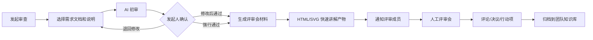

# Cloud co-worker 远期规划与开源项目调研

> 日期：2026-06-04
> 目标：围绕“基于需求文档流转的内部 Cloud co-worker”做远期产品规划，调研 GitHub star 超过 600 的成熟项目，并判断哪些架构和产品设计可以被本项目吸收。
> 结论口径：本项目不应转向通用 AI 平台，而应从“需求审查工作流平台”演进为“团队需求协作与知识增强 co-worker”。

## 一、结论摘要

远期方向可以明确为：

> 以团队空间为组织单元，以需求文档、评审记录、团队规范和个人上下文为知识底座，以智能对话和审查任务为协作入口，以 Pi Agent/SkillRunner/MCP 工具为执行层，形成一个可被团队成员对话、委托、评审、追踪和治理的内部 Cloud co-worker。

这条路线和当前项目已有基线是连续的。当前系统已经具备：

- `ReviewProject`、`ReviewContext`、`ReviewTask`、`SkillRunner` 支撑需求审查工作流。
- `Conversation`、`Message`、`ContextItem`、`ChatApplicationService` 支撑智能对话和会话级上下文。
- `ModelConfig`、Prompt 管理、Skill 管理和审计日志支撑基础治理。
- V0.2.x 未开始的“公共文件库”和“飞书导入”已经是团队知识库的前置版本。

需要补齐的是五条能力链：

1. 团队空间：从单用户资源隔离升级到 workspace/team/membership/ACL。
2. 团队知识库：从公共文件库升级到知识源、文档切块、索引、召回、引用溯源和权限过滤。
3. Agent 对话：从“聊天 + 手动上下文”升级到“会话可调用 Agent、搜索、MCP、知识库和审查工作流”。
4. 协作消息：从用户账号管理升级到通知、评论、提及、任务指派和“有人与我的 Agent 沟通后我可介入回复”。
5. 审查平台升级：从个人可见的五类审查结果升级到“发起审查 -> AI 初审 -> 人工确认/强行通过 -> HTML/SVG 快速讲解产物 -> 人工评审会”的协作闭环。

最重要的架构边界是：Pi Agent 不替代 SkillRunner。稳定、可审计、可缓存的需求审查链路继续由 SkillRunner 执行；Pi Agent 负责理解目标、选择工具、检索资料、提出计划、触发 Runner、处理追问和协调人机协作。

## 二、外部开源项目调研

说明：star 数来自 2026-06-04 对 GitHub 仓库页面/API 的调研。GitHub star 实时变化，本文使用“约数/档位”表达；入选项目均明显高于 600 star。

| 项目 | Star 档位 | 相关方向 | 核心定位 | 来源 |
| --- | ---: | --- | --- | --- |
| langgenius/dify | 约 144k | Agent 工作流、知识库、MCP、平台化 | 面向 Agentic workflow 的 AI 应用平台 | [GitHub](https://github.com/langgenius/dify) / [API](https://api.github.com/repos/langgenius/dify) |
| n8n-io/n8n | 约 191k | 工作流自动化、连接器、MCP | 自托管工作流自动化平台，带 AI 和集成能力 | [GitHub](https://github.com/n8n-io/n8n) / [API](https://api.github.com/repos/n8n-io/n8n) |
| open-webui/open-webui | 约 140k | AI 对话工作台、RAG、工具调用 | 自托管多模型 AI 对话界面 | [GitHub](https://github.com/open-webui/open-webui) / [API](https://api.github.com/repos/open-webui/open-webui) |
| langchain-ai/langchain | 约 138k | Agent 框架、工具调用、RAG | LLM/Agent 应用开发框架 | [GitHub](https://github.com/langchain-ai/langchain) / [API](https://api.github.com/repos/langchain-ai/langchain) |
| infiniflow/ragflow | 约 82k | RAG、文档理解、Agentic retrieval | 面向文档知识库的 RAG 引擎 | [GitHub](https://github.com/infiniflow/ragflow) / [API](https://api.github.com/repos/infiniflow/ragflow) |
| Mintplex-Labs/anything-llm | 约 61k | 私有知识库、工作区、Agent | Local-first 知识库和 Agent 工作区 | [GitHub](https://github.com/Mintplex-Labs/anything-llm) / [API](https://api.github.com/repos/Mintplex-Labs/anything-llm) |
| microsoft/autogen | 约 59k | 多 Agent 编排 | Agentic AI 编程框架 | [GitHub](https://github.com/microsoft/autogen) / [API](https://api.github.com/repos/microsoft/autogen) |
| FlowiseAI/Flowise | 约 53k | 低代码 Agent 工作流 | 可视化构建 AI Agent 和 RAG 流程 | [GitHub](https://github.com/FlowiseAI/Flowise) / [API](https://api.github.com/repos/FlowiseAI/Flowise) |
| run-llama/llama_index | 约 50k | 数据连接器、索引、检索、Agent over data | 面向文档和企业数据的 LLM 数据框架 | [GitHub](https://github.com/run-llama/llama_index) / [API](https://api.github.com/repos/run-llama/llama_index) |
| outline/outline | 约 39k | 团队知识库、协作文档 | 团队 wiki 和文档知识库 | [GitHub](https://github.com/outline/outline) / [API](https://api.github.com/repos/outline/outline) |
| langfuse/langfuse | 约 28k | LLM 可观测、Prompt、Trace、Eval | LLM 工程观测与评估平台 | [GitHub](https://github.com/langfuse/langfuse) / [API](https://api.github.com/repos/langfuse/langfuse) |
| abi/screenshot-to-code | 万星级 | 原型生成、HTML 生成 | 截图到前端代码的 AI 原型生成工具 | [GitHub](https://github.com/abi/screenshot-to-code) |

### 2.1 精选项目拆解

#### Dify：平台化 Agent 工作流

Dify 的价值在于把模型、应用、工作流、知识库、工具、运行日志和发布组织成一个平台。它适合参考“团队如何配置一个可运行的 AI 应用/Agent”，但不适合照搬为本项目主形态。

可借鉴：

- 应用级配置：一个 co-worker 可以绑定模型、知识库、工具和工作流。
- 工作流编排：把复杂任务拆成可观测步骤。
- 知识库绑定：对话或 Agent 不直接吃全量文档，而是绑定可检索资料集。
- 运行日志：每次调用有输入、输出、工具调用、耗时和错误。

不可照搬：

- Dify 是通用 AI 应用平台，抽象层太宽。本项目要保留“需求文档、评审任务、团队空间、会议前讲解”这些业务对象，不应变成通用低代码平台。

#### RAGFlow 与 LlamaIndex：知识库和检索质量

RAGFlow 更像成品 RAG 引擎，LlamaIndex 更像数据和检索框架。两者共同说明：RAG 的重点不是“加一个向量库”，而是文档解析、切块、元数据、权限过滤、召回、重排、引用和评估。

可借鉴：

- `KnowledgeSource -> DocumentChunk -> Index -> RetrievalResult` 的数据链。
- 文档切块要保留来源、标题、章节、页码/段落、文档版本、权限范围。
- 回答必须带引用，区分“引用资料得出的结论”和“模型推断”。
- 检索结果需要质量评估：命中率、无结果、低置信召回、引用覆盖。

不可照搬：

- 本项目不是纯知识问答。RAG 是智能对话和审查工作流的增强层，不是产品本体。

#### Open WebUI 与 AnythingLLM：团队 AI 对话入口

这两个项目适合参考“AI 对话工作台”的产品体验：会话、模型选择、知识库、工具、工作区和用户私有资料。

可借鉴：

- 会话和知识库的组合入口。
- 用户可见“当前 AI 正在使用哪些资料”。
- 工作区/Workspace 概念，让不同资料、对话和 Agent 隔离。
- Local-first/自托管思路，适合内部部署和数据不外溢。

不可照搬：

- 它们以 Chat 为中心，而本项目应以“需求协作和审查任务”为中心。聊天只是入口之一，不应吞掉审查工作台的信息架构。

#### AutoGen：多 Agent 角色协作

AutoGen 适合参考多角色协作：一个复杂问题可由多个 Agent 承担不同视角，再由汇总者合并结论。

可借鉴：

- 审查平台可把系统审查拆成产品价值、技术可行性、测试验收、交付风险、数据指标、规范合规等角色。
- 每个角色输出统一 Schema：发现、证据、严重级别、建议动作、关联文档、是否阻断。
- 汇总 Agent 负责去重、排序、冲突处理和最终建议。

不可照搬：

- 多 Agent 自主对话容易失控。需求审查必须保留确定性步骤、Schema、缓存和人工确认。

#### Flowise 与 n8n：工作流编排和连接器

Flowise 展示 LLM 流程的可视化节点编排；n8n 展示连接器、触发器、动作和自动化平台的成熟形态。

可借鉴：

- 将“导入文档、检索知识、初审、人工确认、生成讲解、发通知”看成工作流。
- 连接器应通过能力声明接入，例如飞书、Figma、SVG/HTML 原型生成、Webhook、CLI。
- 工作流运行要有状态、重试、失败节点、人工确认节点。

不可照搬：

- 第一阶段不要给普通业务用户完整画布。应先做模板化工作流和管理员配置，后续再开放高级编排。

#### Outline：团队知识库信息架构

Outline 的价值不在 AI，而在团队知识库：集合、文档树、权限、协作、搜索、归档和版本。

可借鉴：

- 团队空间下的资料分层：规范、模板、术语、历史需求、评审记录、会议材料。
- 文档不是孤立文件，而属于集合、项目、标签和权限范围。
- 搜索体验需要让用户知道来源和上下文。

不可照搬：

- Outline 不是审查系统。本项目应吸收知识组织方式，但保留 AI 初审、任务、报告和讲解产物。

#### Langfuse：LLM 运行观测

Langfuse 适合参考 Prompt、Trace、Eval、成本和质量观测。对内部 co-worker 来说，治理能力决定能不能长期用。

可借鉴：

- 每次 Agent run、Skill step、模型调用、检索、工具调用都应有 trace。
- 后台应看得到耗时、失败率、token、模型、prompt 版本、人工反馈和质量评分。
- Prompt/Skill 升级前要有样例和回归评估。

不可照搬：

- Langfuse 是观测平台，不是业务系统。本项目应吸收数据模型，不需要把主界面做成纯 trace 后台。

## 三、目标业务形态

### 3.1 团队空间

团队空间是远期所有对象的归属边界。它不是简单的“公共文件库”，而是一个可权限治理的业务域：

- 团队成员：owner/admin/member/viewer 等角色。
- 团队资料：规范、模板、术语、历史需求、评审报告、优秀案例、会议纪要。
- 团队知识库：资料导入、解析、切块、索引、检索和引用。
- 团队 Agent：默认需求 co-worker、评审 Agent、讲解 Agent、原型 Agent。
- 团队治理：访问审计、知识源状态、索引状态、运行统计、人工确认记录。

V0.2.x 的公共文件库可以作为第一步，但建议更名或设计为“团队资料库”的 MVP：先支持本地上传和项目引用，再扩展飞书导入、知识库索引和权限。

### 3.2 智能对话升级

当前智能对话是“用户会话 + 手动上下文 + 模型回复”。远期应升级为“Agent 对话入口”：

1. 用户选择对话对象：个人账号 Agent、项目 Agent、团队需求 co-worker、某个审查任务 Agent。
2. 对话时 Agent 可调用搜索能力：历史需求、团队规范、评审报告、个人知识库。
3. Agent 可调用 MCP/连接器：Figma、SVG/HTML 原型生成、外部文档导入、任务通知。
4. Agent 可触发 SkillRunner：需求初审、体系审查、PRD 草稿、讲解产物生成。
5. 回复必须显示引用和工具调用摘要。

这里要区分三类知识：

| 知识层 | 归属 | 用途 | 权限原则 |
| --- | --- | --- | --- |
| 团队知识库 | workspace | 团队规范、历史需求、公共经验 | 按团队 ACL 过滤 |
| 项目知识库 | project | 项目需求、评审记录、上下文版本 | 按项目成员过滤 |
| 个人知识库 | user/account | 个人需求、个人偏好、个人历史会话 | 默认仅本人和授权 Agent 可用 |

用户提到“每一个人的账号代表着他需求的全部内容”，建议实现为“账号绑定个人需求画像/个人知识库/个人 Agent 身份”，但不能默认把个人资料暴露给团队。别人和某人的 Agent 沟通时，应产生消息或待确认请求，由本人决定是否回复、授权或确认结论。

### 3.3 账号体系和消息功能

账号体系要从“登录和管理员管理”升级为“协作身份”：

- 个人 Agent：代表一个用户的需求上下文、偏好、负责项目和历史结论。
- 消息收件箱：别人向我的 Agent 询问、评论我的需求、要求我确认初审结果时，生成消息。
- 评论和回复：用户可在需求、审查结果、讲解产物、Agent 对话片段下评论。
- 提及和订阅：支持 @成员、@Agent、关注项目、关注任务。
- 审批节点：AI 初审通过、强行通过、讲解生成、发起人工评审前，都可以产生确认消息。

消息功能应服务审查平台，而不是单独做聊天软件。第一版建议只做站内通知和评论，不做复杂实时 IM。

### 3.4 审查平台升级

当前审查功能偏“我跑我的审查，我看我的结果”。远期应变成团队评审流程：

关键产物：

- AI 初审记录：结构化问题、证据、严重级别、建议修改、是否阻断。
- 发起人修改记录：哪些问题已采纳、哪些问题被驳回、哪些强行通过。
- HTML/SVG 快速讲解产物：面向评审会前快速浏览，包含需求背景、流程、关键边界、风险、待决策问题。
- 评审会包：议程、争议点、决策项、行动项、相关链接。
- 归档知识：最终版本、审查结论、会议决策、后续追踪。

HTML/SVG 讲解产物可以先做成“可播放的网页讲解页”，不必第一版做视频编码。SVG 动画、Mermaid、分段讲解文案和导出 HTML 更符合当前前端/Markdown/Mermaid 基线。

## 四、与现有代码架构的承接方式

### 4.1 当前可复用基础

| 当前基础 | 文件/模块 | 可承接远期能力 |
| --- | --- | --- |
| 会话和上下文装配 | `ChatApplicationService` | Agent 对话、知识检索注入、工具调用前后文 |
| 会话、消息、搜索 | `ConversationRepository` | 消息搜索、个人历史、Agent 对话记录 |
| 会话级上下文 | `ContextItemRepository` / `chat_context_items` | 个人/项目/团队知识引用的过渡形态 |
| 审查项目和上下文 | `ReviewProject` / `ReviewContext` | 项目空间、规则版本、需求资料范围 |
| 审查任务 | `ReviewTask` | Agent run / workflow run 的第一个业务样板 |
| SkillRunner | `skill_runner.py` | 稳定审查 pipeline、讲解产物生成、可注册 workflow |
| 模型配置 | `ModelConfig` | Agent 引擎的模型和推理参数配置 |
| Skill 管理 | `SkillConfig` | 插件包、工具注册、版本治理 |
| 审计日志 | `log_writers` | 工具调用、知识访问、人工确认、消息动作审计 |

### 4.2 需要新增的数据模型

建议按以下顺序补齐，而不是一次性做完：

| 模型 | 作用 | 第一版字段建议 |
| --- | --- | --- |
| `Workspace` | 团队空间 | name、description、created_by、created_at |
| `WorkspaceMember` | 成员和角色 | workspace_id、user_id、role、status |
| `ResourceACL` | 资源权限 | resource_type、resource_id、subject_type、subject_id、permission |
| `KnowledgeSource` | 知识源 | workspace_id、source_type、title、origin_url、owner_id、status |
| `KnowledgeDocument` | 解析后的文档 | source_id、filename、content_hash、version、metadata |
| `KnowledgeChunk` | 检索切块 | document_id、chunk_no、text、section、source_ref、embedding_ref |
| `RetrievalLog` | 检索日志 | query、filters、hit_count、selected_chunks、latency |
| `AgentProfile` | Agent 身份 | owner_type、owner_id、name、system_policy、allowed_tools |
| `AgentRun` | Agent 运行 | agent_id、user_id、status、goal、plan、created_at |
| `AgentStep` | 运行步骤 | run_id、step_type、tool_name、status、input_ref、output_ref |
| `Notification` | 站内消息 | recipient_id、actor_id、object_type、object_id、type、status |
| `Comment` | 协作评论 | object_type、object_id、author_id、body、parent_id |

### 4.3 关键服务边界

| 服务 | 职责 |
| --- | --- |
| `WorkspaceService` | 团队空间、成员、权限判断 |
| `KnowledgeIngestionService` | 文件/飞书/URL 导入、解析、切块、索引任务 |
| `RetrievalService` | 关键词/向量/混合检索、权限过滤、引用构造 |
| `AgentApplicationService` | 目标理解、计划、工具调用、人工确认、AgentRun 落库 |
| `ToolRegistryService` | Skill、搜索、MCP、Figma/SVG/HTML 生成等工具注册和权限 |
| `NotificationService` | 消息、提及、订阅、确认请求 |
| `ReviewInitiationService` | 发起审查、AI 初审、确认、讲解产物、评审会包 |

这些服务应继续遵守现有分层：router 只处理 HTTP/SSE，service 做用例编排，repository 做持久化，storage 只写 runtime，log_writer 处理审计。

## 五、阶段路线图

### P0：把 V0.2.x P4/P5 收束为团队资料库 MVP

目标：先有可共享资料和项目引用，不急着做复杂 RAG。

- 公共文件库改造为团队资料库：本地上传、分类、标签、引用项目。
- 建立 `library_documents` 与 `project_library_documents` 的快照语义。
- 支持文档内容 hash、上传人、引用人、引用时间、版本记录。
- 飞书导入仍按保守方案：管理员导入到资料库，正文优先，凭证加密，OAuth 后置。
- 聊天和审查可显式选择资料，不做自动召回。

验收重点：

- 资料只写入 `runtime/`。
- 引用审查任务时记录快照，后续资料变更不污染历史结果。
- 用户能知道本次 AI 使用了哪些资料。

### P1：团队空间和权限底座

目标：从单用户资源升级为 workspace 资源。

- 新增 Workspace、WorkspaceMember、ResourceACL。
- ReviewProject、Conversation、LibraryDocument 逐步挂 workspace。
- Repository 所有权校验从 `user_id` 扩展为 `workspace_id + permission`。
- 后台增加团队成员和角色管理。
- 保持旧单用户数据兼容：默认迁移到个人 workspace。

验收重点：

- 不同 workspace 的文档、对话、审查结果不能串数据。
- 管理员和普通成员权限不同。
- 旧数据可读，旧接口不破坏。

### P2：知识库检索和智能对话 RAG

目标：让智能对话不再只靠手动上下文，而能检索团队和项目知识。

- 新增 KnowledgeSource、KnowledgeDocument、KnowledgeChunk。
- 建立本地全文检索优先的第一版索引；向量检索可作为增强，不作为第一版阻塞。
- RetrievalService 输出结构化结果：标题、来源、片段、命中原因、权限范围、时间。
- ChatApplicationService 在 build_messages 前接入检索结果。
- 前端展示引用来源和“本次检索到的资料”。

验收重点：

- 所有检索结果必须按权限过滤。
- AI 回复必须显示引用，不把检索内容和模型推断混在一起。
- 无命中时明确提示，而不是编造。

### P3：Agent 引擎和工具注册

目标：把智能对话升级为可委托任务的 Agent。

- 新增 AgentProfile、AgentRun、AgentStep。
- ToolRegistry 注册搜索、SkillRunner、报告生成、HTML/SVG 讲解、MCP 连接器。
- Pi Agent 先做计划和工具选择，不替代 SkillRunner。
- 关键动作前加入人工确认：写入知识库、发起正式审查、通知他人、生成公开讲解产物。
- AgentRun 通过 SSE 推送步骤事件。

验收重点：

- Agent 每次工具调用可追溯。
- 用户能看到计划并确认。
- 失败可恢复，至少能保留已完成步骤。

### P4：审查平台协作化

目标：把个人审查变成团队评审流程。

- 发起审查：用户描述目标、选择文档、选择评审范围。
- AI 初审：生成结构化问题和证据。
- 发起人确认：采纳、驳回、修改后通过、强行通过。
- 生成 HTML/SVG 快速讲解产物。
- 通知评审成员，支持评论和确认。
- 评审会后归档决议和行动项。

验收重点：

- 每次人工修改和强行通过都记录原因。
- 讲解产物引用原始需求和初审结论。
- 评审成员能在会前快速理解需求背景、关键流程、风险和待决策点。

### P5：个人账号 Agent 和消息中心

目标：让每个账号可以代表一个可沟通、可授权、可追踪的需求上下文。

- 每个用户有个人 AgentProfile。
- 用户可管理个人知识库和授权范围。
- 别人与我的 Agent 沟通后，生成消息或待确认项。
- 我可以回复、评论、授权、拒绝或转为正式审查。
- 消息中心聚合：评论、提及、Agent 沟通、审查确认、任务结果。

验收重点：

- 个人知识默认不共享。
- Agent 代表用户发出的结论必须标识“自动回复/本人确认”。
- 所有跨人沟通都能回到具体需求、任务或对话。

### P6：治理和运营

目标：让平台可长期运行和持续改进。

- LLM trace：模型、prompt、上下文、检索、工具、耗时、token、错误。
- Skill/Agent 质量：失败率、schema 修复率、缓存命中率、人工采纳率。
- 团队质量：高频问题、缺失章节、评分趋势、需求缺口收敛。
- 权限审计：文件访问、知识库检索、外部连接器、人工确认。
- Prompt/Skill 回归：样例集、版本对比、升级前验证。

## 六、风险和设计约束

| 风险 | 说明 | 控制方式 |
| --- | --- | --- |
| 过度平台化 | 照搬 Dify/Flowise 会稀释需求审查主线 | 所有能力围绕需求文档、审查任务和评审会闭环设计 |
| RAG 幻觉 | 检索质量差会让回答看似有依据 | 强制引用、低置信提示、无命中提示、检索评估 |
| 权限串用 | 团队知识和个人知识混用风险高 | Workspace ACL、个人默认私有、检索前权限过滤 |
| Agent 失控 | 自主规划可能绕过审查流程 | Pi Agent 只调工具，稳定流程仍由 SkillRunner 执行 |
| 前端复杂度 | 原生 SPA 长期承载复杂协作会吃力 | 分阶段演进；先加任务中心/消息中心，再评估前端架构升级 |
| 长任务可靠性 | 当前进程内任务队列不适合 Cloud co-worker | 引入 durable job/event 表，再考虑外部 worker |
| 运行时数据合规 | 知识库、索引、日志都可能含用户数据 | 全部写入 runtime，禁止提交到 git，索引也视为运行时数据 |

## 七、推荐的下一步

1. 将 V0.2.x P4 重新命名和收束为“团队资料库 MVP”，明确它是远期知识库的第一步。
2. 在架构设计文档中补一版 Workspace/Knowledge/Agent/Notification 的数据模型草案。
3. 先实现团队资料库和项目引用快照，再做飞书导入。
4. 在智能对话中加入“检索工具”的显式按钮或命令，先做关键词/FTS 检索引用，再做自动 RAG。
5. 设计 AgentRun/AgentStep/ToolCall 的最小持久化模型，让未来 Pi Agent、SkillRunner、HTML/SVG 讲解生成共用事件语义。
6. 审查平台升级先做“发起审查 + AI 初审 + 发起人确认”，再做 HTML/SVG 快速讲解和评审成员通知。

## 八、资料来源

- [langgenius/dify](https://github.com/langgenius/dify)
- [n8n-io/n8n](https://github.com/n8n-io/n8n)
- [open-webui/open-webui](https://github.com/open-webui/open-webui)
- [langchain-ai/langchain](https://github.com/langchain-ai/langchain)
- [infiniflow/ragflow](https://github.com/infiniflow/ragflow)
- [Mintplex-Labs/anything-llm](https://github.com/Mintplex-Labs/anything-llm)
- [microsoft/autogen](https://github.com/microsoft/autogen)
- [FlowiseAI/Flowise](https://github.com/FlowiseAI/Flowise)
- [run-llama/llama_index](https://github.com/run-llama/llama_index)
- [outline/outline](https://github.com/outline/outline)
- [langfuse/langfuse](https://github.com/langfuse/langfuse)
- [abi/screenshot-to-code](https://github.com/abi/screenshot-to-code)
- 本项目现有材料：[README.md](../../README.md)、[需求审查工作流平台-需求说明书.md](../3-design/需求审查工作流平台-需求说明书.md)、[Skill-as-a-Service人机协同工具开发范式.md](Skill-as-a-Service人机协同工具开发范式.md)、[V0.2.x-功能迭代任务分解.md](../3-design/V0.2.x-功能迭代任务分解.md)、[Claude Cowork 对需求初审工作流的迭代启示.md](2026-06-02-Claude-Cowork-需求初审工作流迭代启示.md)
