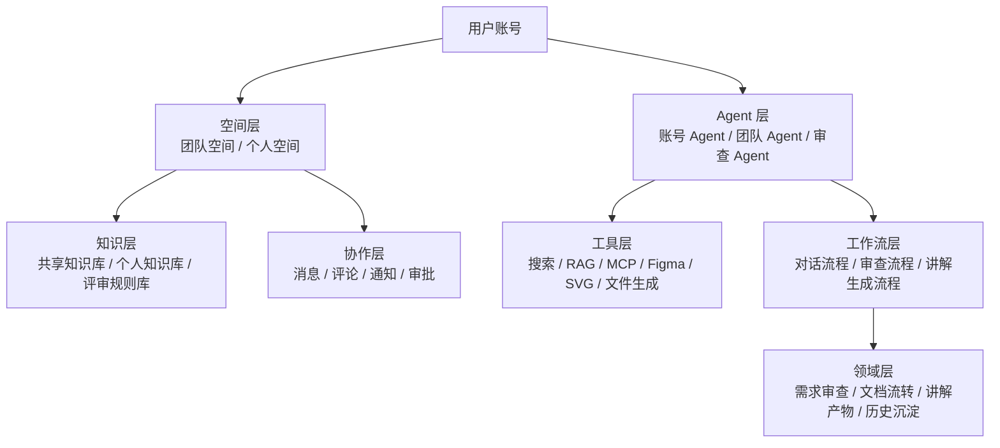

# Cloud co-worker 远期规划与架构演进方案

> 日期：2026-06-04
> 目的：围绕“基于需求文档流转的内部 Cloud co-worker”做远期规划，结合 GitHub 高 star 开源项目调研，明确可借鉴的产品模式、技术框架和当前仓库的延续式演进路径。
> 调研口径：仅关注与团队知识库、Agent 对话、协作工作流、内部检索、MCP 工具接入、需求/文档审查升级强相关的 GitHub 项目；候选仓库要求 star >= 600。

---

## 1. 规划目标重述

本项目的远期目标，不再只是“需求文档上传后做一次 AI 初审”，而是演进为一个面向团队内部协同的 Cloud co-worker。

这个 co-worker 的业务核心不是泛化聊天，而是围绕“需求文档流转”形成一个持续运转的协作闭环：

1. 团队有公共空间，能够沉淀团队文档、需求规范、历史评审材料和共享知识。
2. 每个用户账号都对应一个可持续对话、可持续积累上下文的 Agent 身份。
3. Agent 不只是回答问题，还能调用搜索、知识库检索、设计工具、原型生成、内容生成等能力。
4. 需求审查从“一次性跑完的流水线”升级为“可发起、可初审、可人工修订、可二次生成交付物”的多阶段协作流程。
5. 平台内会逐步出现消息、评论、通知、转交、围绕审查与需求的团队互动。

因此，远期产品可以拆成四条主线：

- 团队空间与团队知识库
- 账号绑定的智能对话与个人知识库
- Agent 工具能力与 MCP 生态接入
- 升级后的需求审查协作平台

这四条主线不是并列模块，而是一个逐步叠加的体系：团队空间和知识库提供基础上下文，账号和个人记忆提供长期连续性，Agent 工具能力提供执行力，审查平台则成为最重要的垂直业务场景。

---

## 2. 调研方法与筛选原则

本次调研不追求“找最像的现成成品”，而是寻找已经被开源社区验证过的经典能力模块，再判断它们是否适合组合进当前平台。

筛选原则如下：

1. GitHub star 必须大于等于 600。
2. 重点看产品是否覆盖以下至少一个能力：团队知识库、Agent 工作流、企业内部检索、记忆层、MCP/工具接入、协作自动化、设计工具桥接。
3. 优先选择已经形成清晰产品心智和稳定架构边界的项目，而不是低 star Demo。
4. 不把纯底层模型框架当作主样本，除非它对我们的 Agent 编排、记忆、检索或工具化能力有直接启发。

---

## 3. 候选项目池概览

以下项目均满足 star >= 600，且与目标业务场景具有较强相关性。

| 项目 | GitHub | Star（2026-06-04） | 相关维度 | 初步判断 |
| --- | --- | ---: | --- | --- |
| Dify | https://github.com/langgenius/dify | 143752 | 工作流、Agent、RAG、工作空间 | 最适合借鉴平台化产品壳与 Agent 工作流 |
| Open WebUI | https://github.com/open-webui/open-webui | 139893 | 多模型聊天、知识接入、团队部署 | 适合借鉴统一 AI 入口，但协作工作流较弱 |
| AnythingLLM | https://github.com/Mintplex-Labs/anything-llm | 61010 | Workspace、文档聊天、Agent、MCP | 最适合借鉴“工作空间优先”的知识库交互形态 |
| RAGFlow | https://github.com/infiniflow/ragflow | 81856 | 企业 RAG、上下文工程、文档摄入 | 最适合借鉴知识库与检索层 |
| Onyx | https://github.com/onyx-dot-app/onyx | 30005 | 企业检索、连接器、RBAC、协作分享 | 最适合借鉴企业级权限和连接器体系 |
| Langflow | https://github.com/langflow-ai/langflow | 149195 | 可视化 Agent/Workflow | 适合借鉴编排体验，不适合直接当业务壳 |
| Flowise | https://github.com/FlowiseAI/Flowise | 53319 | 可视化构建 Agent | 适合借鉴调试与节点表达，不适合直接承载审查业务 |
| CrewAI | https://github.com/crewAIInc/crewAI | 52784 | 多 Agent 协作 | 适合借鉴多角色协作思路，不适合作为平台产品骨架 |
| Rowboat | https://github.com/rowboatlabs/rowboat | 14886 | AI coworker、知识图谱、MCP、长时记忆 | 与“Cloud co-worker”定位最接近 |
| Mem0 | https://github.com/mem0ai/mem0 | 57625 | 记忆层、user_id/agent_id 作用域 | 最适合借鉴账号级个人记忆设计 |
| n8n | https://github.com/n8n-io/n8n | 190980 | 工作流自动化、审批、人机协同、消息集成 | 最适合借鉴消息/审批/通知自动化骨架 |
| Framelink MCP for Figma | https://github.com/GLips/Figma-Context-MCP | 14984 | Figma MCP、设计上下文桥接 | 最适合借鉴设计工具桥接能力 |
| Talk to Figma MCP | https://github.com/grab/cursor-talk-to-figma-mcp | 6810 | Figma 读写、设计修改 | 适合补足 Figma 双向操作思路 |
| Langchain-Chatchat | https://github.com/chatchat-space/Langchain-Chatchat | 38131 | 本地 RAG、知识库聊天、中文场景 | 适合参考国内化知识库产品落地经验 |

综合相关性与可借鉴价值，本次重点拆解 8 个代表项目：Dify、AnythingLLM、RAGFlow、Onyx、Rowboat、Mem0、n8n、Figma-Context-MCP。

---

## 4. 重点项目拆解

## 4.1 Dify：最像“平台级 AI 工作台”的成熟样本

### 它解决的问题

Dify 的价值不在于“单个 Agent 很强”，而在于它把工作流、RAG、Agent、模型管理、可观测性、工作空间等能力组合成了一个统一平台。它最值得借鉴的是产品壳和能力装配方式。

### 从仓库中看到的关键信号

- README 明确把 AI workflow、RAG pipeline、agent capabilities、model management 放在同一个平台描述里。
- 仓库中同时存在 workflow、knowledge retrieval、agent、workspace 等结构化概念。
- `ALLOW_CREATE_APP_MODES = ["chat", "agent-chat", "agent", "advanced-chat", "workflow", "completion"]` 这种模式设计说明它把“交互模式”与“底层能力”解耦了。

### 可借鉴点

1. 平台层要把“聊天、Agent、Workflow、知识库”设计成统一能力集合，而不是四套完全分裂的产品。
2. “知识检索节点”应成为工作流中的标准能力节点，而不是仅在聊天页临时拼接。
3. 工作空间和应用模式要分层：团队空间承载资产，具体 Agent 或工作流是空间里的应用实例。

### 对我们的启发

我们的远期形态不应该是“在当前聊天页里不断堆按钮”，而应该形成：

- 空间层：团队空间、个人空间
- 应用层：智能对话、需求审查、知识检索、原型生成
- 能力层：模型、搜索、知识库、MCP、消息、审计

---

## 4.2 AnythingLLM：最适合借鉴的 Workspace-first 交互模型

### 它解决的问题

AnythingLLM 的核心心智不是“一个大而全平台”，而是“一个 Workspace 就是一块可持续工作的上下文空间”。这与我们未来的团队空间思路高度一致。

### 从仓库中看到的关键信号

- README 直接强调 chat with your docs、AI Agents、multi-user、workspace。
- API 明确区分 `query`、`automatic`、`chat` 三种对话模式。
- 文档与对话是在 workspace 级别组织，而不是散落在全局聊天里。
- 它同时支持 built-in memories、scheduled tasks、MCP compatibility、agent builder。

### 可借鉴点

1. 以空间为核心，而不是以单轮会话为核心。
2. 对话模式应显式区分：
   - 纯检索问答
   - Agent 自动执行
   - 普通对话
3. 文档摄入、文档处理、聊天、记忆、Agent 工具能力应统一挂到同一空间上。

### 对我们的启发

可以把未来的“团队空间”定义为：

- 一个团队的共享文档库
- 一个共享规则库和术语库
- 一组团队级 Agent
- 一组可被成员调用的知识检索与原型工具

同时，每个用户在团队空间内还应保留个人视角和个人记忆。

---

## 4.3 RAGFlow：最适合借鉴的知识库和检索层

### 它解决的问题

RAGFlow 不是聊天工具，而是“高质量上下文层”。它最强的价值在于把文档摄入、切分、检索、引用、上下文工程做成企业可用的 RAG 基础设施。

### 从仓库中看到的关键信号

- README 把自己定义为 RAG engine，并强调 context engine 和 agent capabilities 的结合。
- 重点强调 heterogeneous data sources、template-based chunking、grounded citations、automated RAG workflow。
- 它的产品边界很清晰：核心不是 UI，而是高质量上下文供给。

### 可借鉴点

1. 团队空间知识库要先把“检索质量”做好，再谈 Agent 自动化。
2. 文档摄入不应只停留在上传后转 Markdown，而要补齐 chunk、embedding、引用、重排、来源回溯。
3. 团队文档、历史评审、上下文规则应有不同的切分和召回策略。

### 对我们的启发

当前仓库已有 DOCX 转 Markdown、项目文档、评审上下文等基础，但还缺真正的 RAG 层。下一阶段做团队空间时，应把 P4 公共文件库升级为“共享知识库 + 检索层”，而不是只做一个文件列表。

---

## 4.4 Onyx：最适合借鉴企业内部知识工作台的权限与连接器思路

### 它解决的问题

Onyx 的定位非常适合我们参考，因为它站在企业内部知识助手的角度，强调 connectors、RBAC、协作分享、Agent + RAG 的统一使用。

### 从仓库中看到的关键信号

- README 明确强调 50+ indexing connectors、Agentic RAG、Deep Research、Custom Agents、Actions & MCP。
- 标出 Collaboration、RBAC、usage analytics 等企业能力。
- 代码里明确存在 connector、permissions、document sets、group-based authorization。

### 可借鉴点

1. 知识库不是“上传文件”这么简单，还要支持连接器接入其他内部系统。
2. 权限设计不能只停留在 user/admin 两档，要尽早引入团队、组、资源级权限边界。
3. 聊天、搜索、Agent、知识库、动作执行应共用权限体系。

### 对我们的启发

如果未来要让 co-worker 接入团队文档、内部 wiki、需求库、设计资源、历史评审材料，那么必须尽早建立：

- team / space / role / membership
- connector / source / sync job
- document set / knowledge base / permission scope

否则后面只能靠不断打补丁。

---

## 4.5 Rowboat：与“Cloud co-worker”定位最接近的样本

### 它解决的问题

Rowboat 的心智不是知识库问答，也不是工作流搭建器，而是“一个持续工作的 AI coworker”。这和你的远期想法最接近。

### 从仓库中看到的关键信号

- README 直接写明它是 open-source AI coworker。
- 强调长时知识、knowledge graph、Obsidian-compatible vault、working memory。
- 支持 MCP、web search、external tools，并把 agent memory 做成可编辑的 Markdown。
- 代码中有 agent notes、user preferences、save-to-memory、MCP tool 执行等结构。

### 可借鉴点

1. coworker 的核心不是“更聪明的聊天”，而是“积累、可编辑、可检查的长期知识”。
2. 记忆不一定全放数据库，也可以保留可读可编辑的知识表示层。
3. Agent 应天然带工具能力，而不是把工具调用当作一个后置外挂。

### 对我们的启发

我们未来的账号级 Agent，可以借鉴 Rowboat 的三个设计原则：

- 记忆长期化，而不是只保留聊天历史
- 工具可插拔，而不是写死在单个场景里
- 用户可理解 Agent 在“知道什么、调用了什么、产出了什么”

---

## 4.6 Mem0：最适合借鉴的个人记忆层

### 它解决的问题

Mem0 专注做 memory layer，而不是做聊天 UI。它对我们的最大价值，是给“每个账号绑定自己的知识库/记忆”提供了很清晰的作用域设计。

### 从仓库中看到的关键信号

- README 明确定位为 Universal memory layer for AI Agents。
- 提供 user、session、agent 多级记忆。
- 文档与代码都明确支持 `user_id`、`agent_id`、`run_id` 过滤。
- 强调 hybrid search、entity linking、temporal reasoning。

### 可借鉴点

1. 个人记忆一定要有明确作用域，至少区分：
   - user-level memory
   - agent-level memory
   - session-level memory
   - shared/team memory
2. 记忆层不应与业务表硬耦合，而应作为独立的检索与存储能力。
3. 检索过滤和记忆写入是产品能力，不只是数据库字段。

### 对我们的启发

你提到“每个账号代表他需求的全部内容”，如果直接靠 conversations/messages 很快就会失控。更合理的方式是：

- 账号保留个人知识库与个人记忆
- 团队空间保留共享知识库
- Agent 在回答时按权限合并召回

也就是：个人记忆、共享知识、会话历史，必须三层分开。

---

## 4.7 n8n：最适合借鉴消息、审批、人机协同的流程骨架

### 它解决的问题

n8n 的重点不是 LLM 本身，而是流程自动化、系统集成、人机协同、审批节点。对于你提到的“别人和我的账号 Agent 沟通后，我要不要回复评论”，它提供的是流程层面的启发。

### 从仓库中看到的关键信号

- README 强调 workflow automation、400+ integrations、native AI capabilities。
- 仓库中存在 approval、send-and-wait、Slack、Linear、message scope 等结构。
- 支持从消息源、工单源、调度源触发 AI 流程。

### 可借鉴点

1. 消息和审批不应写死在审查页内部，而应成为通用流程能力。
2. 平台应支持 send-and-wait / approval / human-in-the-loop 模式。
3. 与 Slack/飞书/邮件/工单的联动，最终都属于同一种“外部事件驱动的工作流”。

### 对我们的启发

需求审查平台升级后，可以设计为：

- 发起人提交审查请求
- AI 初审完成后进入人工确认节点
- 人工确认通过后自动生成讲解产物
- 相关人收到通知并可评论/回复
- 所有过程留下消息和任务痕迹

这本质上已经是一个带 HITL 的业务工作流，而不是单次 AI 调用。

---

## 4.8 Figma-Context-MCP：最适合借鉴的设计工具桥接层

### 它解决的问题

Figma-Context-MCP 不是设计生成器，而是一个把 Figma 结构化上下文交给 AI Agent 的桥梁。这正好对应你提出的“通过 MCP 连接 Figma 或 SVG 生成原型”的方向。

### 从仓库中看到的关键信号

- README 明确定位为给 coding agents 提供 Figma data 的 MCP server。
- 核心不是截图，而是把 Figma API 响应做简化和翻译，减少上下文噪音。
- 代码里明确有 tool 注册、数据抓取、图片下载、安全路径校验。

### 可借鉴点

1. 设计工具接入应该走 MCP / tool bridge，而不是硬塞进业务服务。
2. 要把“原始设计数据”转换成“更适合模型消费的结构化上下文”。
3. 原型生成最好拆成两段：
   - 设计资产读取
   - SVG / HTML 讲解产物生成

### 对我们的启发

未来在需求审查平台里，AI 完成初审后生成 HTML + SVG 动画版讲解，其实不一定需要一开始就强依赖 Figma；更合理的顺序是：

1. 先支持结构化讲解稿生成
2. 再支持 SVG 讲解稿自动渲染
3. 最后引入 Figma MCP 做设计资产读取与反向落图

---

## 5. 对远期业务蓝图的综合判断

综合这些项目，可以得到一个重要结论：

**没有一个开源项目可以直接替代我们要做的产品，但已经有几类能力模块被充分验证，可以组合进我们的业务蓝图。**

建议采用“产品自研壳 + 能力分层借鉴”的路线，而不是直接 Fork 某个大项目。

### 5.1 最值得借鉴的能力归类

| 能力方向 | 最值得参考的项目 | 借鉴重点 |
| --- | --- | --- |
| 平台级产品壳 | Dify | 工作空间、应用模式、工作流节点化 |
| 团队空间与工作区交互 | AnythingLLM | Workspace-first、多模式对话、文档即上下文 |
| 企业知识库与连接器 | Onyx、RAGFlow | 连接器、权限、检索质量、上下文工程 |
| Cloud co-worker 产品心智 | Rowboat | 长时知识、工具使用、持续工作型 Agent |
| 账号级记忆体系 | Mem0 | user_id / agent_id 作用域、记忆层独立化 |
| 消息/审批/通知流程 | n8n | HITL、审批节点、事件驱动流程 |
| 设计工具桥接 | Figma-Context-MCP | MCP、Figma 结构化上下文转换 |

### 5.2 不建议直接照搬的部分

1. 不建议直接把当前平台改造成通用型 Langflow / Flowise 式画布产品。那会稀释“需求文档流转”这一业务优势。
2. 不建议一开始就把多 Agent 编排做得非常重。当前最重要的是把空间、知识库、记忆、消息和审查流程接起来。
3. 不建议早期就大规模替换前后端技术栈。现有仓库的 FastAPI + SQLite + 原生 JS SPA 仍然足够支撑下一阶段能力抽象。

---

## 6. 面向当前业务的目标产品结构

建议把远期产品定义为一个六层结构。



### 6.1 空间层

需要把现有“个人项目”能力升级为真正的空间能力：

- 个人空间：个人知识库、个人记忆、个人 Agent、个人会话
- 团队空间：共享文档、共享规则、共享消息、共享 Agent
- 审查空间：围绕一个需求发起的具体协作工作区

### 6.2 知识层

知识层至少要拆成四类：

- 团队知识库
- 个人知识库
- 评审规则库
- 需求项目知识库

其中团队知识库和个人知识库都需要检索层；评审规则库则更适合结构化注入；需求项目知识库则兼顾全文检索和版本链追踪。

### 6.3 Agent 层

建议至少存在三类 Agent：

- 账号 Agent：代表用户个人，绑定个人记忆与个人知识库
- 团队 Agent：代表团队规范、共享文档与团队上下文
- 审查 Agent：负责需求初审、修订建议、讲解稿生成、原型辅助生成

### 6.4 协作层

协作层是当前平台最大的缺口。它应该提供：

- 评论与回复
- 站内消息与通知
- Agent 提及与用户回复
- 审批与确认节点
- 任务状态广播

### 6.5 工作流层

工作流层建议统一承载三类流程：

- 对话流程：问题 -> 检索 -> 工具调用 -> 响应
- 审查流程：发起 -> AI 初审 -> 人工修订/确认 -> 讲解产物生成 -> 团队评审
- 生成流程：摘要、HTML 讲解、SVG 动画、原型草稿

---

## 7. 与你提出的四个方向逐项对应

## 7.1 团队空间

### 目标

让团队文档导入和共享知识沉淀成为基础设施，而不是某个审查项目的附属能力。

### 建议设计

1. 新增 Team Space 作为高于 ReviewProject 的容器。
2. 团队空间下可挂：
   - 共享文档库
   - 团队规则库
   - 团队 Agent
   - 团队消息流
3. 以公共文件库为起点，但不要停在文件管理，应直接把它设计为共享知识库。
4. 检索能力先做混合检索，再逐步增强 Agent 检索编排。

### 借鉴来源

- AnythingLLM 的 workspace-first
- RAGFlow 的 context engine
- Onyx 的 connectors + document sets + RBAC

---

## 7.2 智能对话升级为 Agent 对话

### 目标

把现有智能对话页升级成“绑定账号身份、可调用工具、可访问知识库、可连接 MCP”的 Agent 控制台。

### 建议设计

1. 每个账号默认拥有一个 Personal Agent Profile。
2. Agent Profile 绑定：
   - 模型
   - 思考配置
   - 个人知识库
   - 个人记忆
   - 可用工具集合
3. 对话请求不再只传 `model_id`，还应支持 `agent_id`。
4. 工具能力至少按三类分组：
   - 检索类：团队知识库、个人知识库、外部搜索
   - 生成类：HTML 讲解、SVG 动画、文档/PDF 输出
   - 设计类：Figma MCP、SVG 原型、结构图生成

### 借鉴来源

- Dify 的 agent/workflow 模式分层
- Rowboat 的 coworker + MCP + memory
- Mem0 的 user / agent / session 记忆作用域
- Figma-Context-MCP 的设计工具桥接

---

## 7.3 账号体系盘活：消息、评论、通知

### 目标

让“账号”从登录凭证升级为协作主体。用户不仅能和 Agent 对话，还能收到消息、回复评论、参与审查流转。

### 建议设计

1. 增加消息域模型：
   - thread
   - comment
   - mention
   - notification
   - inbox state
2. Agent 的关键动作要生成可追踪消息，例如：
   - 某个需求已完成初审
   - 某个讲解稿已生成
   - 某个评论等待回复
3. 人和 Agent 的沟通不应只保留在聊天页，也要能落到审查任务和空间消息流里。

### 借鉴来源

- n8n 的 send-and-wait / approval / event-driven flow
- Onyx 的团队协作与资源共享

---

## 7.4 审查平台升级

### 目标

把当前“一次性执行的审查流水线”升级为“发起式、可人工干预、可生成讲解产物”的协作工作流。

### 建议目标流程

```text
发起审查
  -> AI 初审
  -> 人工确认 / 修订 / 强行通过
  -> 生成 HTML 讲解稿
  -> 生成 SVG 动画版讲解
  -> 推送团队消息
  -> 进入正式评审前预览
```

### 关键设计点

1. AI 初审和正式通过之间必须存在人工确认节点。
2. 讲解产物不应附属于前端临时渲染，而应成为正式 Artifact。
3. 审查流程应支持重跑局部阶段，而不是每次全量重跑。
4. 初审结果、人工修订记录、最终讲解稿、会议前预览都应留存。

### 借鉴来源

- n8n 的人机协同流程骨架
- Dify 的工作流节点化思路
- Rowboat 的可执行 coworker 心智
- Figma MCP 的设计桥接能力

---

## 8. 基于现有仓库的可延续演进方案

当前仓库并不是需要推倒重来，反而已经具备几个很好的基座。

## 8.1 可以直接复用的基础

### 1. 账号与隔离基础

- 已有 JWT 登录、用户角色、用户隔离。
- 已有 Conversation / Message / ContextItem 基础数据模型。
- 已有较清晰的 Router -> Service -> Repository / Storage 分层。

### 2. 对话与上下文基础

- `ChatApplicationService` 已承担对话上下文装配。
- `ConversationRepository` 已承担会话持久化。
- 已支持模型配置、Prompt 模板、思考级别。

### 3. 审查域基础

- `ReviewProject`、`ReviewDocument`、`ReviewContext`、`ReviewTask` 已构成项目化容器。
- `SkillRunner` 和审查 pipeline 已是一个天然的工作流编排基础。
- 已具备 DOCX 转 Markdown、历史版本、规则注入、报告生成等流程能力。

### 4. 运维与治理基础

- 已有 runtime 数据边界、日志、审计、品牌配置迁移机制。
- 这意味着下一阶段做扩展时，运行时数据与代码分离原则可以继续保持。

## 8.2 必须新增的关键领域对象

建议引入以下新领域模型：

| 领域对象 | 作用 |
| --- | --- |
| TeamSpace | 团队空间容器 |
| TeamMember | 团队成员与角色 |
| KnowledgeBase | 知识库定义（团队/个人/项目） |
| KnowledgeDocument | 知识文档元数据 |
| KnowledgeChunk | 检索粒度单元 |
| AgentProfile | 账号 Agent / 团队 Agent 配置 |
| MemoryEntry | 个人记忆与 Agent 记忆 |
| ConversationThread | 协作线程，与聊天会话区分 |
| Comment / Mention / Notification | 消息协作基础 |
| ReviewRequest | 发起式审查请求 |
| ReviewStageExecution | 多阶段审查执行记录 |
| Artifact | HTML 讲解、SVG 动画、原型草稿等产物 |

## 8.3 不建议的做法

1. 不建议把“个人知识库、团队知识库、项目文档”混在一张表里只靠 type 区分，但没有清晰权限和生命周期。
2. 不建议继续让 review router 直接承担越来越多流程职责，应逐步演进成独立编排服务。
3. 不建议让消息功能直接挂在 messages 表上；当前 `Message` 更适合聊天消息，不适合协作评论和通知。

---

## 9. 建议的分阶段路线图

## Phase 1：从公共文件库升级为团队知识层

### 目标

把 V0.2.x 的公共文件库方向，升级为真正的共享知识库能力。

### 范围

- 团队空间雏形
- 团队共享文档库
- 文档摄入、切分、索引、检索
- 项目引用共享文档

### 成功标志

团队成员能在一个空间中导入共享文档，并在聊天和审查中被稳定召回。

## Phase 2：把智能对话升级为 Agent 控制台

### 目标

把现有 chat 升级为 agent chat。

### 范围

- AgentProfile
- 个人知识库 + 团队知识库合并召回
- 外部搜索
- MCP 接口层
- 工具白名单与调用日志

### 成功标志

用户能以“自己的账号 Agent”完成对话、检索、搜索和简单内容生成。

## Phase 3：激活账号体系与协作消息

### 目标

让平台内出现人、Agent、任务之间的可追踪互动。

### 范围

- 评论/回复/提及
- 通知中心
- 任务 inbox
- Agent 动作消息化

### 成功标志

用户不必只盯着聊天页，也能通过站内消息理解任务进度和待处理事项。

## Phase 4：审查平台升级为多阶段协作流程

### 目标

形成“发起 -> 初审 -> 人工确认 -> 讲解产物 -> 团队评审”的闭环。

### 范围

- ReviewRequest
- 多阶段状态机
- 局部重跑
- HTML 讲解 Artifact
- SVG 动画讲解 Artifact

### 成功标志

一次需求发起后，平台能输出可播放/可分享的讲解结果，并支持正式评审前预热。

## Phase 5：设计工具与企业连接器增强

### 目标

让 co-worker 能对接 Figma、更多内部系统和外部协作通道。

### 范围

- Figma MCP
- SVG 原型生成
- 企业文档连接器
- 外部消息渠道集成

### 成功标志

从需求到讲解再到原型和外部同步，形成更完整的协作链。

---

## 10. 推荐的总体策略

### 10.1 产品策略

推荐走“需求审查工作流平台 -> Cloud co-worker 平台”的递进路线，而不是突然转向一个完全通用的 AI 平台。

原因是：

1. 当前最强的业务资产就是需求审查与需求文档流转。
2. 团队知识库、个人 Agent、消息协作、设计工具能力，都能围绕这条主线自然长出来。
3. 这样既延续现有优势，也避免因为泛化过早而失焦。

### 10.2 技术策略

推荐走“保留现有后端与领域模型，逐步增加知识层、记忆层、消息层、工具层”的方式。

不建议短期内做以下动作：

- 重写前端框架
- 切换数据库到重型分布式方案
- 引入过于庞杂的通用 Agent 平台作为主框架

更合理的方式是：

- 借鉴 Dify 的能力分层
- 借鉴 AnythingLLM 的空间交互
- 借鉴 RAGFlow / Onyx 的知识库方法
- 借鉴 Mem0 的记忆作用域
- 借鉴 n8n 的人机协同流程
- 借鉴 Rowboat 的 coworker 产品心智

### 10.3 最终判断

这条远期路线是可行的，而且当前代码基础并不差。真正的关键不在于“再接一个大模型”或者“加几个按钮”，而在于尽快建立以下四个基础抽象：

1. Space
2. Knowledge
3. Agent
4. Workflow + Collaboration

一旦这四个抽象建立起来，团队空间、账号 Agent、知识检索、消息通知、需求审查升级、讲解视频/原型生成，都会进入同一个可演进框架里。

---

## 11. 建议的近期落地顺序

如果要把远期规划压缩成“下一阶段最值得做的事”，建议优先顺序如下：

1. 先把 P4 公共文件库升级为“团队知识库”方案，而不是单纯文件管理。
2. 再把智能对话升级为 `agent_id` 驱动的账号 Agent 对话。
3. 随后补消息、评论、通知和发起式审查模型。
4. 最后把审查平台升级成多阶段工作流，并接入 HTML/SVG 讲解产物生成。

这四步做完后，产品就会从“AI 需求初审工具”真正进入“面向团队的需求协作 co-worker”阶段。