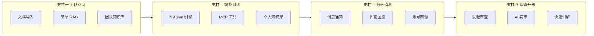
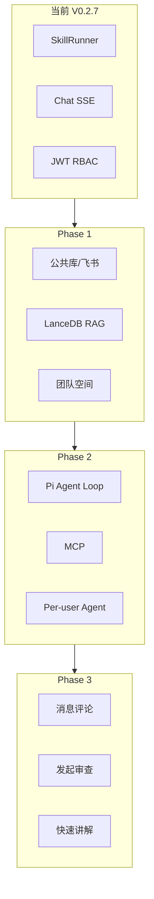

# Cloud co-worker：子 Agent 调研与 Plan 规划汇总

> 日期：2026-06-04  
> 文档性质：本稿由本轮对话中 **6 路并行子 Agent 调研** 与 **Plan 模式规划稿** 独立汇总而成，不引用、不复述仓库内另两份远期规划 Markdown。  
> 筛选口径：GitHub 开源项目以 **star ≥ 600** 为主（Figma/MCP 等新兴方向允许略低 star 的头部社区项目单独标注）。  
> 产品锚点：**基于需求文档流转的内部 Cloud co-worker**，而非通用 Chat 或低代码 AI 平台。

---

## 0. 阅读指引

| 章节 | 内容 |
| --- | --- |
| §1 | 产品愿景与四大支柱（含 Plan 模式结论） |
| §2 | 当前仓库基线（架构子 Agent 结论） |
| §3 | 外部调研总览（按能力域分类的项目池） |
| §4 | 分域深度拆解（可借鉴点与不宜照搬点） |
| §5 | 业务逻辑梳理（团队空间 / 对话 / 账号消息 / 审查） |
| §6 | 推荐技术组合与演进阶段 |
| §7 | 与现有代码的延续式迭代路径 |
| §8 | 风险、边界与下一步动作 |

同目录另有两份讨论/设计稿时，本稿定位为 **「调研过程 + Plan 决策的第三份总览」**，便于评审时对照子 Agent 原始结论与阶段路线图。

---

## 1. 产品愿景与四大支柱

### 1.1 愿景一句话

从「个人可用的需求审查工具」演进为 **团队内围绕 PRD/需求文档持续运转的 Cloud co-worker**：每人有账号绑定的 Agent 身份，Agent 承载该人的需求上下文与历史；同事可与你的 Agent 异步对话；审查从「自己跑完自己看」变为「发起 → AI 初审 → 人工确认 → 会前讲解 → 正式评审」。

### 1.2 四大支柱（Plan 模式 + 业务讨论对齐）



| 支柱 | 目标 | 关键能力 |
| --- | --- | --- |
| **一、团队空间与知识库** | 团队级知识底座 | 团队文档导入（含 V0.2.x 规划的公共库/飞书）、分块索引、混合检索、审查结论沉淀 |
| **二、智能对话升级** | 对话 = Agent 执行 | Pi Agent 引擎、搜索、MCP（Figma/SVG 等）、团队库 + 个人库召回、**每账号一个可对话 Agent** |
| **三、账号体系与消息** | 账号「活起来」 | 他人与你的 Agent 沟通时你可收到消息并回复/批注；审查事件驱动通知 |
| **四、审查平台改造** | 协作式评审闭环 | 自审或**发起审查** → AI 初审 → 修改/通过/强通 → **HTML+SVG 动画讲解** → 会前预习 |

### 1.3 架构边界（必须写清）

- **SkillRunner**：继续负责确定性、可缓存、可审计的六种审查流水线（quick / review / pm / insight / full / draft）。
- **Pi Agent**：负责理解意图、选工具、检索、编排、触发 Runner、处理追问、协调人机协作；**不替代** SkillRunner 主链。
- **MCP**：Agent 与外部工具（Figma、搜索、文件、通知等）的标准连接层。
- **数据**：业务库 SQLite + 向量库/大文件仍放 `runtime/`，与代码分离。

---

## 2. 当前仓库基线（架构探索结论）

> 版本：**V0.2.7**；技术栈：**FastAPI + SQLAlchemy Async + SQLite + Vanilla JS SPA**（无 React/Vue 工程）。

### 2.1 分层与目录

```
Router（薄/部分仍厚） → Service → Repository / Storage / LogWriter
                              ↘ SkillRunner → 6 个 skills/
```

- 入口：`src/main.py`；配置：`src/config.yaml` + `.env`；运行时：`runtime/`（DB、上传、日志、品牌资产）。
- 前端：单页多视图 `login` / `review`（默认）/ `user`（对话）/ `admin`；`api.js` + JWT + SSE ticket。

### 2.2 已有能力（可直接承接远期）

| 域 | 现状 |
| --- | --- |
| 认证 | JWT、user/admin、`sse-ticket`、审计 JSONL |
| 对话 | SSE 流式、`ChatApplicationService`、上下文项、thinking_level、`reasoning_content` |
| 审查 | 项目/文档/任务/分析/体系评审/报告、六种模式、进度 SSE、结果缓存 |
| 搜索 | 聊天消息 **FTS5**（非评审全文向量库） |
| AI | OpenAI 兼容 API、ThinkingAdapter、6 Skills + schema 校验 |
| 品牌 | `ui-branding.yaml`、`/api/app/branding`、迁移工具 |

### 2.3 明确缺失（远期要补）

- 无 **团队空间 / workspace** 数据模型  
- 无 **向量库 / RAG** 服务  
- 无 **Agent 工具循环**（tool_calls）  
- 无 **MCP Client**  
- 无 **站内消息 / 评论 / 通知**  
- 无 **发起审查 + 协作状态机 + 讲解产物**  
- V0.2.x 文档中 **P4 公共文件库、P5 飞书导入** 仍为「未开始」，但与支柱一强相关  

### 2.4 与 V0.2.x 迭代的衔接点

- **P4 公共文件库**：`library_documents` + 项目引用 + 审查快照 → 天然演进为团队知识库的「文档层」。  
- **P5 飞书导入**：团队外部知识源接入的第一条管道。  
- **Cowork 启示稿**（同目录）：项目工作空间、插件包、多角色 Agent、计划任务 — 与本远期四支柱方向一致，实施顺序宜 **知识底座 → Agent → 协作消息 → 审查升级**。

---

## 3. 外部调研总览

本轮共梳理 **50+** 仓库（多路子 Agent 交叉验证）。下表按 **能力域** 归纳 star 档位与对本项目的相关度（★ 为 1–5）。

### 3.1 文档工作流 / AI co-worker 形态

| 项目 | 约 Star | 相关度 | 一句话 |
| --- | ---: | :---: | --- |
| [Dify](https://github.com/langgenius/dify) | 143K | ★★★★★ | 工作流 + RAG + Agent + MCP 的一体化平台壳 |
| [Multica](https://github.com/multica-ai/multica) | 34K | ★★★★ | 把 Agent 当「队友」编 Squad、复用技能 |
| [ChatDev](https://github.com/OpenBMB/ChatDev) | 33K | ★★★★ | 多角色群聊式协作、可视化工作流 |
| [CrewAI](https://github.com/crewAIInc/crewAI) | 53K | ★★★★★ | 角色化 Crew + Flow，适合多视角 PRD 评审原型 |
| [Coze Studio](https://github.com/coze-dev/coze-studio) | 20K | ★★★★ | 知识库 + Workflow + Plugin 可视化 |
| [Onyx](https://github.com/onyx-dot-app/onyx) | 26K | ★★★★★ | 企业连接器 + 权限感知 RAG + 自定义 Agent |
| [WeKnora](https://github.com/Tencent/WeKnora) | 16K | ★★★★★ | 中文场景、飞书/语雀、Wiki 模式、多租户 RBAC |
| [AFFiNE](https://github.com/toeverything/AFFiNE) | 69K | ★★★ | 文档+白板+DB 知识库底座 |
| [Docmost](https://github.com/docmost/docmost) | 20K | ★★★ | 协作 Wiki + 企业版审查流 |
| [Cabinet](https://github.com/hilash/cabinet) | 2K | ★★★★ | Markdown 知识库 + 团队频道 + 多 Agent 模板 |
| [PRD Productivity Toolkit](https://github.com/Scofy0123/prd-productivity-toolkit) | <100 | ★★★★★ | **垂直对标**：章节式 PRD 评审 + 飞书闭环 |

### 3.2 Agent 框架与 MCP

| 项目 | 约 Star | 相关度 | 一句话 |
| --- | ---: | :---: | --- |
| [LangGraph](https://github.com/langchain-ai/langgraph) | 34K | ★★★★ | 有状态图、检查点、Human-in-the-loop |
| [AutoGen / MAF](https://github.com/microsoft/autogen) | 55K | ★★★ | 群聊式多 Agent，适合「评审辩论」实验 |
| [mcp-agent](https://github.com/lastmile-ai/mcp-agent) | 8K | ★★★★ | MCP 原生 + router/parallel/evaluator 模式 |
| [MCP servers](https://github.com/modelcontextprotocol/servers) | 87K | ★★★★★ | 工具协议事实标准 |
| [n8n](https://github.com/n8n-io/n8n) | 191K | ★★★★ | 工作流胶水 + 双向 MCP |
| [n8n-mcp](https://github.com/czlonkowski/n8n-mcp) | 21K | ★★★ | AI 驱动自动化编排 |

### 3.3 RAG / 团队知识库

| 项目 | 约 Star | 相关度 | 一句话 |
| --- | ---: | :---: | --- |
| [RAGFlow](https://github.com/infiniflow/ragflow) | 82K | ★★★★★ | DeepDoc 解析 + 混合检索 + Agent 模板 |
| [LlamaIndex](https://github.com/run-llama/llama_index) | 50K | ★★★★ | 连接器与索引策略工具箱 |
| [AnythingLLM](https://github.com/Mintplex-Labs/anything-llm) | 61K | ★★★ | Workspace 隔离 + 多向量库 |
| [LangExtract](https://github.com/google/langextract) | 37K | ★★★★ | 结构化抽取 + 源定位 |

### 3.4 消息、审查协作、Per-user Agent

| 项目 | 约 Star | 相关度 | 一句话 |
| --- | ---: | :---: | --- |
| [OpenClaw](https://github.com/openclaw/openclaw) | 377K | ★★★★★ | Gateway + Skills + Channels，per-user 标杆 |
| [Open WebUI](https://github.com/open-webui/open-webui) | 139K | ★★★★ | 多用户聊天 + RAG + RBAC |
| [LibreChat](https://github.com/danny-avila/LibreChat) | 36K | ★★★★ | MCP + per-user 工具认证隔离 |
| [Mattermost](https://github.com/mattermost/mattermost) | 37K | ★★★★ | Agent 消息与人类消息同线程 + MCP 插件 |
| [Novu](https://github.com/novuhq/novu) | 39K | ★★★★ | 通知工作流引擎 + Inbox 组件 |
| [ntfy](https://github.com/binwiederhier/ntfy) | 30K | ★★★ | 极简 HTTP 推送 |
| [PR-Agent](https://github.com/The-PR-Agent/pr-agent) | 11K | ★★★★★ | `/review` 命令 + 结构化审查意见 |
| [QwenPaw](https://github.com/agentscope-ai/QwenPaw) | 17K | ★★★★ | 多渠道个人 Agent + Skills |

### 3.5 原型、Figma MCP、讲解动画

| 项目 | 约 Star | 相关度 | 一句话 |
| --- | ---: | :---: | --- |
| [screenshot-to-code](https://github.com/abi/screenshot-to-code) | 72K | ★★★★ | 描述/截图 → HTML/SVG |
| [tldraw](https://github.com/tldraw/tldraw) | 47K | ★★★ | 画布 + Agent 操作 UI |
| [Remotion](https://github.com/remotion-dev/remotion) | 48K | ★★★★★ | React 程序化视频，适合后期 MP4 |
| [Manim](https://github.com/3b1b/manim) / [ManimCE](https://github.com/ManimCommunity/manim) | 87K / 38K | ★★★ | 技术概念动画 |
| [Motion Canvas](https://github.com/motion-canvas/motion-canvas) | 18K | ★★★★ | 解释性动画 + 编辑器（上游维护放缓） |
| [Reveal.js](https://github.com/hakimel/reveal.js) | 71K | ★★★★ | HTML 演示 + Auto-Animate |
| [Slidev](https://github.com/slidevjs/slidev) | 46K | ★★★★ | Markdown → 演示 |
| [GSAP](https://github.com/greensock/GSAP) | 24K | ★★★★★ | SVG 时间线（已免费商用） |
| [Anime.js](https://github.com/juliangarnier/anime) | 67K | ★★★★ | 轻量 DOM/SVG 动画 |
| [Figma 官方 MCP](https://github.com/figma/mcp-server-guide) | 1.5K | ★★★★ | 官方设计上下文 + 写画布 |
| [Framelink Figma MCP](https://github.com/GLips/Figma-Context-MCP) | 14K | ★★★★ | 简化 Figma JSON 给编码 Agent |
| [cursor-talk-to-figma-mcp](https://github.com/grab/cursor-talk-to-figma-mcp) | 7K | ★★★★ | 插件双向读写 Figma |
| [figma-console-mcp](https://github.com/southleft/figma-console-mcp) | 1.7K | ★★★★ | 106 工具，设计系统级 API |

---

## 4. 分域深度拆解（独立结论）

### 4.1 团队空间与 RAG — 学什么、不学什么

**建议吸收：**

- **RAGFlow**：模板化分块、表格/版面感知解析、向量 + BM25 + rerank 管线。  
- **WeKnora**：团队 Wiki 蒸馏、飞书/语雀源、四级 RBAC — 与国内团队工具链一致。  
- **AnythingLLM**：Workspace = 文档容器 + 权限边界，适合映射「团队空间」。  
- **Onyx**：连接器思维 + **检索结果继承源系统 ACL**，避免「能搜到不该看的文档」。

**不宜照搬：**

- 整包替换为 Dify/RAGFlow 独立部署会失去现有 SkillRunner 与审查 UX 投资。  
- 一上来做 40+ 连接器；先做 **本地上传 + 公共库 + 飞书** 即可。

**推荐最小数据链：**

`team_spaces` → `knowledge_documents` → `knowledge_chunks` → 向量索引（独立存储）→ `retrieve(query, filters)` 返回带 `source_id` 的片段。

### 4.2 Pi Agent 与 MCP — 学什么、不学什么

**建议吸收：**

- **mcp-agent**：MCP 原生、evaluator-optimizer 循环（生成讲解稿 / 审查摘要可质检重试）。  
- **LangGraph**：审查协作状态机（draft → ai_reviewing → pending_confirm → presenting）用图表达最清晰。  
- **CrewAI**：PM / 技术 / QA / 用户视角多角色 — 可映射为 **可选** 的「评审插件包」，而非默认每次全跑。  
- **OpenClaw**：Gateway（控制面）/ Skills（能力）/ Channels（触达）三层 — 对应本项目的 Router+Service / skills+tools / SSE+未来 IM。  
- **LibreChat**：per-user MCP 凭据隔离 — 多人共用 Figma/搜索 API 时必需。

**不宜照搬：**

- 引入 LangChain 全栈或 CrewAI 作为唯一运行时 — 与现有 Python Service + SkillRunner 重复。  
- 默认开放无界 ReAct 循环 — 必须 **步数上限、工具白名单、审计日志**。

**推荐 Agent 循环（轻量自建）：**

```
用户消息 → 规划（可选）→ 工具调用（search / rag / run_review_skill / mcp_figma …）
         → 观察结果 → 直至完成或达上限 → SSE 流式回复
```

现有 `skills/*` 通过 **Tool Registry** 注册为 Agent 可调用工具，参数与 `output-schema.json` 不变。

### 4.3 消息与账号 — 学什么、不学什么

**建议吸收：**

- **Novu**：事件 → 渠道路由 → 模板 → 投递；站内 In-App 优先，外链 ntfy/邮件可选。  
- **Mattermost**：@bot 与人在同线程 — 「他人问我的 Agent」在 UI 上应是 **会话线程 + 通知**。  
- **PR-Agent**：审查意见分类（风险/规范/风格…）+ 命令触发 — 可映射为审查页 slash 命令或按钮。  

**业务规则（产品层）：**

1. 用户 B 与 A 的 Agent 对话 → 产生 `agent_conversation` 通知给 A。  
2. A 可选择 **亲自回复** 或 **授权 Agent 代答**（需显式策略与审计）。  
3. 对 `doc_analyses` / `system_reviews` 行级 **comment**，支持 resolve / 强行通过标记。  

### 4.4 审查升级与快速讲解 — 学什么、不学什么

**流程（支柱四）：**

```
发起审查（模式、文档、审查人、说明）
    → AI 初审（SkillRunner，现有六种模式）
    → 人工改初审记录 / 确认 / 强行通过
    → 生成「快速讲解」产物（HTML 页面，内嵌 SVG 动画）
    → 会前分发链接；会中批注
```

**讲解管线（Plan 模式 + 动画域调研合并）：**

| 阶段 | 输入 | 输出 | 参考项目 |
| --- | --- | --- | --- |
| 理解 | PRD + 初审报告 | 功能点、用户故事、约束、架构关系 | 现有 classify / per_analysis；LangExtract |
| 脚本 | 结构化摘要 | Treatment：场景列表（标题/要点/旁白/视觉/时长） | claude-remotion-flow 思路 |
| 素材 | 脚本 | Mermaid→SVG、LLM 示意图、可选 Figma MCP 截图 | GSAP/Anime.js；screenshot-to-code |
| 合成 | 场景 | 单页 HTML 播放器（章节、进度、全屏） | Reveal.js / Slidev 交互借鉴 |
| 进阶 | 同上 | MP4 批量渲染 | Remotion（注意 BSL 许可） |

**MVP 决策：** 先做 **HTML + SVG + GSAP** 浏览器内讲解，不依赖 Remotion 渲染集群；MP4 作为 Phase 3+。

**不宜照搬：**

- 全自动 Manim 视频作为默认 — 生成质量与维护成本高。  
- 强依赖 Figma — 无设计资产团队应允许 **纯 SVG/Mermaid** 路径。

---

## 5. 业务逻辑梳理（四大支柱展开）

### 5.1 支柱一：团队空间

1. **空间实体**：团队名、成员、角色（owner/admin/member/viewer 可参考 WeKnora 四档简化）。  
2. **文档导入**：管理员/授权成员上传；P5 飞书链接导入公共库；审查项目可 **引用** 空间文档（只读 + 快照 hash）。  
3. **索引**：异步任务切块、嵌入；失败可重试、可人工重分块。  
4. **检索 API**：`semantic + keyword` 混合；返回 snippet + 文档 ID + 页码/章节。  
5. **沉淀**：审查报告定稿、对话摘要（可选）写入空间「结论库」。

### 5.2 支柱二：智能对话 + Pi Agent

1. **个人知识库**：绑定 `user_id` — 历史审查项目、上传文件、会话摘要（注意隐私策略）。  
2. **团队库召回**：对话与 Agent 默认带 `team_id` 过滤。  
3. **工具**：`search_team_kb`、`search_personal_kb`、`web_search`（白名单）、`mcp_figma_*`、`trigger_review` 等。  
4. **Per-user Agent**：`agent_profile`（system prompt、工具集、可见知识范围）；对外 URL/会话：**与 {用户名} 的需求助手对话**。  
5. **与审查台关系**：对话可 **发起** 审查任务，但执行仍走 SkillRunner SSE。

### 5.3 支柱三：账号与消息

1. **账号扩展**：`profile_data` — 角色标签、领域、通知偏好。  
2. **消息类型**：`review_request` | `review_complete` | `agent_conversation` | `comment_reply` | `system`。  
3. **投递**：站内列表 + SSE `/api/notifications/stream`；可选 ntfy 推移动端。  
4. **与审查联动**：发起/完成/待确认/被 @ 时触发 Novu 式工作流（可先硬编码规则，后配置化）。

### 5.4 支柱四：审查平台

| 阶段 | 行为 | 系统状态示例 |
| --- | --- | --- |
| 起草 | 选人、选文档、选模式 | `draft` |
| AI 初审 | SkillRunner | `ai_reviewing` |
| 人工处理 | 改记录、批注、强通 | `pending_confirm` |
| 讲解生成 | presentation-generator Skill / Agent | `generating_briefing` |
| 待评审 | 分享讲解链接 | `ready_for_meeting` |
| 关闭 | 归档 | `closed` |

现有「五类审查结果仅本人可见」→ 增加 **审查单 visibility**：发起人、审查人、空间成员。

---

## 6. 推荐技术组合与阶段路线图

### 6.1 技术选型（Plan 模式汇总）

| 领域 | 推荐 | 理由 |
| --- | --- | --- |
| 向量库 | **LanceDB**（或 ChromaDB） | 嵌入式、与 SQLite 自托管气质一致 |
| 嵌入 | **bge-m3**（本地）/ text-embedding-3-small（云） | 中英混合团队 |
| Agent | **自建 ReAct** + Tool Registry | 延续 SkillRunner，控制依赖 |
| MCP | **自建 Client** | 对接 Figma/搜索/文件 MCP Server |
| 通知 | **自建表 + SSE**（借鉴 Novu 模型） | 规模未到独立 Novu 集群 |
| 讲解 MVP | **HTML + SVG + GSAP** | 零渲染农场 |
| 讲解进阶 | **Remotion** | 需 MP4 时再评估许可 |

### 6.2 三阶段演进（Plan Mermaid 文字化）

**Phase 1 — 知识底座（V0.3.x）**  
P4 公共文件库 → P5 飞书 → 向量索引 → 团队空间 MVP → RAG API 供对话/审查引用。

**Phase 2 — Agent 引擎（V0.4.x）**  
Pi Agent ReAct、MCP Client、工具注册、个人知识库、Per-user Agent 只读对话。

**Phase 3 — 协作升级（V0.5.x）**  
消息中心、评论、发起审查状态机、HTML 讲解产物、Agent 间对话通知闭环。



### 6.3 跨项目可复用设计模式（9 条）

| # | 模式 | 代表项目 | 在本项目的落点 |
| --- | --- | --- | --- |
| 1 | MCP 作工具总线 | Mattermost、LibreChat、MCP servers | Agent 工具层 |
| 2 | 命令式审查 + 结构化输出 | PR-Agent | 审查页交互 |
| 3 | Gateway / Skills / Channels | OpenClaw | 控制面 / 能力 / 触达拆分 |
| 4 | Workspace 知识隔离 | AnythingLLM、Onyx | 团队空间 |
| 5 | 通知工作流引擎 | Novu | 审查与 Agent 事件 |
| 6 | Evaluator-optimizer 循环 | mcp-agent、Chalkboard | 讲解稿质检重试 |
| 7 | Treatment 驱动视频脚本 | claude-remotion-flow | 快速讲解 |
| 8 | React/SVG 帧动画 | Remotion、GSAP | 讲解 MVP / 进阶 |
| 9 | 多角色 Crew 评审 | CrewAI、ChatDev | 可选评审插件包 |

---

## 7. 与现有代码的延续式迭代

### 7.1 建议新增模块（不推翻主干）

| 模块路径 | 职责 |
| --- | --- |
| `services/knowledge_service.py` | 切块、嵌入、检索 |
| `repositories/knowledge_repository.py` | 团队文档与 chunk CRUD |
| `services/agent_chat_service.py` | ReAct 循环、工具调度 |
| `services/tool_registry.py` | 注册 Skill + MCP 工具 |
| `services/notification_service.py` | 消息创建、SSE 推送 |
| `routers/notification.py` | 消息 API |
| `skills/presentation-generator/` | 讲解 HTML 生成 |

### 7.2 数据模型增量（示意）

- `team_spaces`, `team_memberships`  
- `knowledge_documents`, `knowledge_chunks`（向量存 LanceDB 路径记在 chunk 表）  
- `agent_profiles`（1:1 users）  
- `notifications`, `comments`  
- `review_tasks` 扩展：`initiated_by`, `reviewer_ids`, `collab_status`  
- `review_presentations`（讲解产物路径、版本）  
- `messages` 扩展：`tool_call`, `tool_result` 类型  

### 7.3 前端增量

- 团队空间：文档库 Tab、检索调试（管理员）  
- 对话：工具调用轨迹展示、Agent 身份切换  
- 全局：通知铃铛 + 消息中心  
- 审查：发起向导、协作状态条、讲解预览播放器  

### 7.4 原则（Plan 模式六条）

1. 渐进扩展，不替换 FastAPI + SkillRunner 主干。  
2. SQLite 增量迁移；向量库 **独立文件**。  
3. 实时能力统一 SSE（对话 / 审查 / 通知）。  
4. Skills 契约不变，仅增加注册入口。  
5. 品牌与环境变量注入，无硬编码企业标识。  
6. 一切运行时产物进 `runtime/`。

---

## 8. 风险、边界与建议的下一步

### 8.1 风险矩阵

| 风险 | 影响 | 缓解 |
| --- | --- | --- |
| SQLite 写锁 + 向量写入 | 并发差 | LanceDB 分文件；WAL；重任务异步 |
| Agent token 失控 | 成本 | 步数/工具上限、缓存、按空间配额 |
| 讲解质量不稳定 | 会前体验差 | 模板 + 人工改 Treatment + evaluator 重试 |
| MCP 碎片化 | 集成慢 | 先 search + kb + review，Figma 按需 |
| 跨用户 Agent 隐私 | 合规 | 知识范围策略 + 对话审计 + 显式授权 |

### 8.2 不建议走的弯路

- _fork 整个 Dify/RAGFlow 当主产品_ — 与现有审查 UX 和 Skill 资产断裂。  
- _用 CrewAI 替代 SkillRunner 跑主审查链_ — 可审计性与缓存逻辑需重写。  
- _第一期就做 MP4 视频农场_ — 用 HTML 讲解先验证会前价值。  

### 8.3 若只选三件事（压缩优先级）

1. **P4 + 向量检索 + 团队空间 MVP** — 没有知识底座，Agent 是空壳。  
2. **轻量 Pi Agent + `search_team_kb` + 审查触发工具** — 对话升级可感知。  
3. **发起审查状态机 + HTML 快速讲解 MVP** — 直接服务评审会效率。

### 8.4 文档与任务跟踪

- 本稿路径：`docs/2-discussion/2026-06-04-Cloud-co-worker-子Agent调研与Plan规划汇总.md`  
- 同目录讨论脉络：`2026-06-02-Claude-Cowork-需求初审工作流迭代启示.md`、`Skill-as-a-Service人机协同工具开发范式.md`  
- 实施 WBS 仍以 `docs/3-design/V0.2.x-功能迭代任务分解.md` 中 P4/P5 为近期抓手，远期条目需新增 Epic（团队空间 / Agent / 消息 / 审查协作）。

---

## 附录 A：子 Agent 分工与产出映射

| 子 Agent | 任务 | 并入本稿章节 |
| --- | --- | --- |
| 架构探索 | V0.2.7 技术栈、审查/对话/数据模型 | §2、§7 |
| 文档梳理 | docs 与 V0.2.x 进度、Cowork 启示 | §2.4、§8.4 |
| Co-worker 调研 | 15 项文档工作流相关仓库 | §3.1、§4.1 |
| Agent/RAG 调研 | 12 项框架与 MCP | §3.2–3.3、§4.2 |
| 消息/审查/Agent 调研 | 19 项协作与 per-user | §3.4、§4.3–4.4 |
| Figma/动画调研 | 25+ 项原型与讲解 | §3.5、§4.4、§6.1 |

## 附录 B：Plan 模式待办（实施状态）

| ID | 内容 | 文档阶段 |
| --- | --- | --- |
| pillar-1 | 团队空间与知识库 | 规划完成，代码未开始 |
| pillar-2 | Pi Agent 引擎 | 规划完成，代码未开始 |
| pillar-3 | 账号消息系统 | 规划完成，代码未开始 |
| pillar-4 | 审查平台改造 | 规划完成，代码未开始 |
| output-doc | 讨论目录汇总文档 | **本稿即交付** |

---

*本文档由 2026-06-04 对话内子 Agent 并行调研与 Plan 模式规划合并编写；star 数为调研日约数，引用前请以 GitHub 页面为准。*
