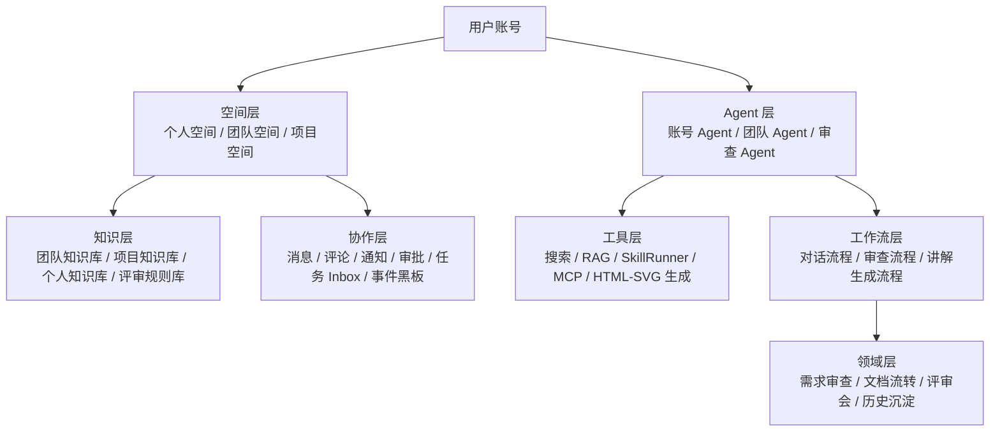
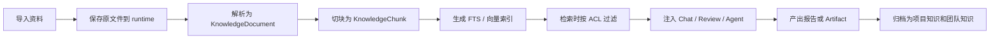
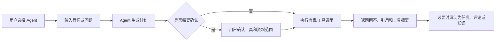
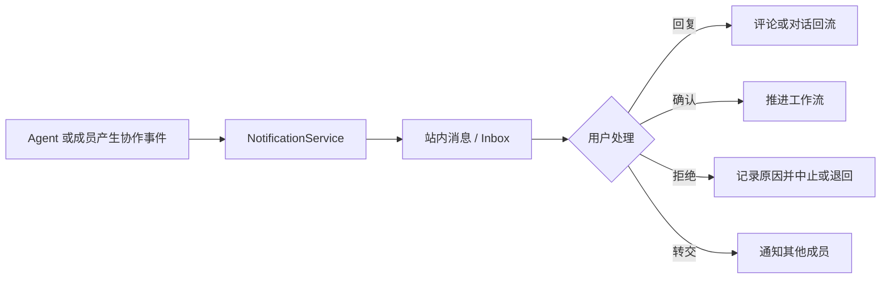
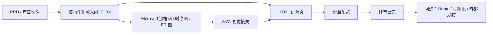

# 需求业务工作流的 cowork 版工具设计规划

> 日期：2026-06-04
> 状态：终稿
> 范围：整合 `docs/2-discussion/` 下 5 份讨论稿，并吸收 `docs/2-discussion/调研报告/` 下 5 份调研材料，补充团队评审、成本资源估算、技术选型对比和 POC 建议。
> 核心结论：本项目不应转向通用 AI 平台，而应从“需求审查工作流平台”演进为“团队需求协作与知识增强 cowork 工具”。

---

## 1. 结论摘要

远期产品建议定义为：

> 以团队空间为组织单元，以需求文档、评审记录、团队规范、个人上下文和协作消息为知识底座，以智能对话和审查任务为入口，以 SkillRunner、受限 Pi Agent、RAG 检索和 MCP 工具为执行层，形成一个可被团队成员对话、委托、评审、追踪和治理的内部需求 cowork 工具。

这条路线与当前系统连续，不需要推倒重来。当前已有 `ReviewProject`、`ReviewContext`、`ReviewTask`、`SkillRunner`、`Conversation`、`Message`、`ContextItem`、`ModelConfig`、Prompt 管理、Skill 管理、审计日志、运行时数据隔离等基础。下一步要补的不是“再加一个聊天框”，而是建立四个产品和技术抽象：

1. **Space**：团队空间、个人空间、项目空间，作为资源归属和权限边界。
2. **Knowledge**：团队资料、需求文档、评审规则、历史结论、个人知识和检索索引。
3. **Agent**：账号 Agent、团队 Agent、审查 Agent，负责目标理解、资料检索、工具调用和任务委托。
4. **Workflow + Collaboration**：发起审查、AI 初审、人工确认、讲解产物、评论通知、评审会归档。
5. **Governance**：预算、审计、工具白名单、审批挂起、Agent 生命周期治理，确保 AI 能执行但不能越权。

终稿推荐的实施路径是：

1. 先把公共文件库收束为“团队资料库 MVP”。
2. 再补团队空间和权限底座。
3. 之后做知识库检索和 Agent 对话。
4. 再把审查平台升级为多阶段协作流程，并补消息、评论、通知和 AI 讲解产物管线。
5. 最后进入组织级治理：Agent 生命周期、MCP Hub、质量评估、成本预算和跨团队规模化。

---

## 2. 已调研材料的合并判断

5 份讨论稿已经能支撑远期方向决策：

| 文档 | 主要价值 | 进入本终稿的内容 |
| --- | --- | --- |
| `Skill-as-a-Service人机协同工具开发范式.md` | 明确 Skills、SkillRunner、Pi Agent 三层分工和确定性边界 | 作为执行层和工程治理底座 |
| `Claude-Cowork-需求初审工作流迭代启示-20260602.md` | 从 cowork 产品形态提炼任务委托、项目空间、插件包、多角色并行、人在环、观测 | 作为产品形态和协作流程设计来源 |
| `CoWork-远期规划与开源项目调研-20260604.md` | 梳理团队空间、知识库、Agent、消息、审查升级和开源项目对标 | 作为业务蓝图和开源支持来源 |
| `CoWork-远期规划与架构演进方案-20260604.md` | 给出六层架构、四条主线、阶段路线图和领域对象 | 作为系统架构主框架 |
| `CoWork-子Agent调研与Plan规划汇总-20260604.md` | 汇总 6 路子 Agent 调研、50+ 仓库、分域取舍、推荐技术组合 | 作为技术选型和阶段拆解来源 |

补强后的结论：

1. **方向充分**：内部范式、外部竞品、架构方案、子 Agent 深调和 cowork 启示相互印证，远期方向可以定为“需求协作 cowork”，不是通用 AI 应用平台。
2. **立项仍需补三件事**：团队评审优先级、资源成本估算、技术选型 POC。
3. **近期不要大改技术栈**：FastAPI + SQLite + 原生 SPA + runtime 数据隔离仍能支撑下一阶段抽象；先新增领域层和服务层，再评估 worker、前端框架、专用向量库和外部编排框架。

### 2.1 `调研报告/` 的补充启发

`docs/2-discussion/调研报告/` 下 5 份材料进一步强化了本规划的几个判断，并补充了更明确的组织与治理设计：

| 调研材料 | 核心启发 | 本规划吸收方式 |
| --- | --- | --- |
| `面向需求文档流转的 Cloud Co-worker 全球调研报告-ChatGPT.md` | 需求工具的北极星不是“聊天”，而是团队空间、知识、Agent、消息和审查协作四个回路；强调团队空间和权限先于 Agent | 保持 Space/Knowledge/Agent/Workflow 主抽象；把团队资料库和权限前置为 P0/P1 |
| `AI 原生文档工作流与 Agent Co-worker 场景调研报告-ChatGPT.md` | 大厂趋势收敛到上下文、执行力、治理；强调个人空间、团队空间、评审空间三层分离，以及文档-讲解-评审一体化 | 增补“评审快照空间”、AI 讲解产物链、消息卡片和审批回调 |
| `google-aistudio-需求工作流要素调研报告.md` | 明确个人 Workspace、团队 Workspace、Twin Agent、MCP Gateway、HTML sandbox 和 actionable message | 增补 MCP Hub/Gateway、ToolPolicy、AgentApprovalRequest、HTML/SVG 沙盒渲染边界 |
| `AI原生文档工作流调研与规划-Gemini.md` | 强调 MetaGPT/ChatDev 式 SOP、Blackboard/PubSub、多角色 Agent、Human Approval Workflow | 在 Review Workflow 中加入黑板/事件总线、阶段挂起、审批回调和结构化角色审查 |
| `AI智能体组织：5个人管理100个智能体员工.pdf` | 智能体型组织不是多放几个 Agent，而是结果导向团队、嵌入式治理、人类位于环路之上、Agent 生命周期治理 | 增补 M 型监督者/T 型专家/AI 增强型一线人员角色，强化人类最终责任和 Agent 资产治理 |

调研报告带来的关键修正是：**不能只规划“系统功能”，还要规划“组织如何管理一群 Agent”。** 因此，本规划将“人在环确认”升级为“人位于环路之上监督”，把审批、审计、预算、工具策略和 Agent 生命周期作为后续治理层的一等能力。

### 2.2 三个 cowork 相关开源项目的分层借鉴

`过程讨论稿/2026-06-04-三个cowork相关开源项目设计借鉴评估.md` 进一步明确了三个项目各自应该借鉴的层级。它们不应被当成可直接替换当前系统的主底座，而应分别补强“流程确定性、Agent 产品化、知识权限层”三个缺口：

| 项目 | 更像什么 | 对本项目的主要价值 | 吸收方式 |
| --- | --- | --- | --- |
| `AGI-is-going-to-arrive/workflow-cookbook` | 确定性 Agent 工作流方法论 | Workflow/Phase/Step、结构化输出、预算、续传、并行/流水线、对抗验证 | 补强 `WorkflowTemplate`、`AgentRun`、`ReviewStageExecution`、预算和复核机制；不做 CLI/DSL 式通用工作流产品 |
| `OpenCoworkAI/open-cowork` | 本地优先 AI Agent 桌面产品 | 工作区授权、沙盒执行、Skills/MCP、Trace Panel、远程控制、审批面板、多模型配置 | 补强工作区授权、工具调用轨迹、审批请求、SkillPackage 和沙盒策略；不迁移到 Electron 桌面形态 |
| `onyx-dot-app/onyx` | 企业知识搜索与 Agent 平台 | 连接器、权限感知检索、Document Set、Agent/Action/MCP、查询审计、使用分析 | 补强知识源、资料集合、连接器凭证、索引状态、权限过滤和检索反馈；不直接搬重型企业知识平台栈 |

对应到阶段上：

1. **P0/P1**：先吸收 Onyx 的团队资料库数据模型和权限过滤；吸收 open-cowork 的工作区授权、工具调用日志和人工确认；吸收 workflow-cookbook 的阶段化运行状态。
2. **P2/P3**：补轻量连接器、混合检索 POC、`AgentRun / ToolCallTrace`、`WorkflowTemplate` 内置模板。
3. **P4+**：再评估服务化向量库、远程审批通道、MCP 管理台、复杂沙盒、连接器权限同步、质量评估和对抗验证。

---

## 3. 产品定位与边界

### 3.1 产品定位

本工具不是通用聊天系统、低代码 Agent 平台或独立知识库，而是围绕需求业务流转的 cowork 工具：

- **需求输入**：需求文档、历史版本、业务规则、评审上下文、会议材料。
- **AI 初审**：分类、逐篇分析、系统评审、缺口识别、行动建议。
- **人机协作**：发起人确认、修改、驳回、强行通过、评论、提及、通知。
- **交付产物**：Markdown 报告、问题清单、PRD 修订稿、HTML/SVG 快速讲解、评审会包。
- **团队沉淀**：团队规范、历史评审、典型问题、决策记录、知识索引、质量趋势。

### 3.2 明确不做什么

1. 不直接 Fork Dify、RAGFlow、Flowise 或 n8n 作为主产品。
2. 不把第一阶段做成通用画布编排平台。
3. 不让 Pi Agent 替代 SkillRunner 执行稳定审查流程。
4. 不把个人知识默认暴露给团队。
5. 不把知识库索引、上传文件、日志、运行结果提交到 git；这些都属于 `runtime/`。
6. 不在代码中硬编码品牌名称、内部域名或特定企业标识。

---

## 4. 目标用户与核心场景

| 角色 | 核心诉求 | 工具应提供的能力 |
| --- | --- | --- |
| 需求发起人 / PM | 快速确认需求文档是否可进入评审 | 发起审查、AI 初审、修改建议、讲解材料、历史规则引用 |
| 技术负责人 | 快速定位架构风险、边界缺口、实现争议 | 技术视角评审、评论、阻断项、决策记录 |
| 测试 / 交付 / 运营 | 明确验收口径、风险点、上线影响 | 多角色评审、行动项、评审会包 |
| 团队管理员 | 管理团队知识、规则、模型、成本和质量 | 团队空间、成员权限、资料库、Prompt/Skill 治理、运营仪表盘 |
| 账号 Agent / 团队 Agent | 代表个人或团队上下文回答、检索、委托任务 | AgentProfile、工具白名单、授权确认、消息回流 |

### 4.1 角色、空间权限与分工

cowork 版工具必须把“人和 AI 协作”落到角色和权限上。每个人既是系统用户，也是某些需求、资料、评审结论的责任人；每个人在系统内还应有自己的账号 Agent，用来回答自己负责需求的问题，但这个 Agent 不能默认替本人做越权承诺，也不能默认公开个人知识。

建议把角色分成两层：**空间角色**和**流程角色**。空间角色决定一个人在某个团队空间/个人空间/项目空间能看什么、配什么、管理什么；流程角色决定一个人在某次需求审查里能发起、修改、审核、确认、强行通过或归档什么。

| 角色层 | 角色 | 核心权限 | MVP 口径 |
| --- | --- | --- | --- |
| 空间角色 | 系统管理员 | 管理全局模型、Prompt/Skill、品牌配置、系统用户、审计与成本 | 保留现有 admin 能力，新增空间入口时只做必要配置 |
| 空间角色 | 团队空间 Owner/Admin | 管理团队成员、团队资料库、团队规则、团队 Agent、空间级配额 | P0/P1 需要有粗粒度角色 |
| 空间角色 | 团队成员 | 上传/引用资料、发起审查、参与评论、使用团队 Agent | MVP 默认 member 可使用，管理动作受限 |
| 空间角色 | 访客/观察者 | 只读查看被授权资料、审查结论和讲解产物 | MVP 可后置，先用 member/viewer 两档 |
| 个人角色 | 个人空间 Owner | 管理个人知识、个人 Agent、个人授权范围 | MVP 先做“默认私有 + 显式授权” |
| 流程角色 | 需求发起人 | 发起审查、补充材料、采纳/驳回 AI 初审意见、提交评审 | P4 前先在 ReviewRequest 里保留 initiator |
| 流程角色 | 审核人/评审人 | 查看审查材料、评论、提出阻断项、确认某些问题是否通过 | MVP 不做复杂审批链，先做 reviewer/commenter |
| 流程角色 | 最终确认人 | 允许进入评审会、允许强行通过、允许归档最终结论 | 早期可由发起人或空间 Admin 兼任 |
| 组织角色 | M 型监督者 | 跨产品、技术、数据、合规视角统筹 Agent 团队，设置目标和验收标准 | 远期角色，不作为 MVP 权限模型强制实现 |
| 组织角色 | T 型专家 | 对特定专业域做深度复核、处理异常和边缘案例 | 可先映射为流程 reviewer |
| 组织角色 | AI 增强型一线人员 | 用个人 Agent 和团队 Agent 提升日常需求处理效率 | 可先映射为普通团队成员 |
| Agent 角色 | 个人 Agent | 代表用户的需求上下文回答问题，必要时生成待本人确认消息 | 默认只读个人授权资料，不自动代表本人确认 |
| Agent 角色 | 团队 Agent | 代表团队规范、公共资料和历史经验回答问题 | 只访问团队授权资料 |
| Agent 角色 | 审查 Agent | 调用 SkillRunner、检索资料、生成初审/讲解/会议包 | 关键动作必须有人确认 |

### 4.2 空间与权限边界

空间权限建议按四个边界设计：

| 空间 | 归属 | 默认可见性 | 典型内容 | 权限原则 |
| --- | --- | --- | --- | --- |
| 个人空间 | 单个用户 | 默认私有 | 个人需求画像、个人历史对话、个人负责需求、个人 Agent 记忆 | 本人管理；对外沟通必须显式授权或转成消息确认 |
| 团队空间 | 团队/部门 | 团队成员可见 | 团队资料库、团队规则、团队 Agent、团队审查记录 | Owner/Admin 管理；member 使用；viewer 只读 |
| 项目空间 | 某个需求或项目 | 项目成员可见 | 项目需求文档、审查上下文、版本链、评审记录 | 继承团队权限，但可收窄到项目成员 |
| 审查流程空间 | 某次 ReviewRequest | 流程参与者可见 | AI 初审、人工确认、评论、讲解产物、评审会包 | 按流程角色控制动作权限 |
| 评审快照空间 | 某次审查冻结上下文 | 只对审查参与者可见 | 本次审查使用的资料版本、检索结果、Prompt/Skill 版本、模型配置 | 审查开始后冻结，确保复盘时依据一致 |

MVP 不需要做很细的 RBAC/ABAC，但必须先立下三个原则：

1. 个人资料默认不进入团队知识库。
2. 团队资料进入 Agent 和审查前，必须经过 workspace 权限过滤。
3. 审查流程中的关键动作要落到具体人：谁发起、谁确认、谁强行通过、谁归档。

### 4.2.1 团队空间 MVP 前端 UI 原则

> P0 已落地，以下记录前端设计原则供后续 P1/P2 参照。

1. **页面并列原则**：团队空间与智能对话、审查模式、管理后台同级并列，不嵌套在其他页面内部；各页面共享 topbar 品牌标识、跨页面导航和用户区域。
2. **sidebar + content 布局**：沿用审查模式和管理后台的 sidebar + content 两栏布局；sidebar 含 Tab 导航（资料库/团队成员）和收起按钮；content 区域随 Tab 切换内容。
3. **权限显隐而非阻断**：owner/admin 显示管理操作按钮（删除资料、管理成员），member/viewer 隐藏管理按钮但仍可查看详情和下载；上传按钮对 member 可见，对 viewer 隐藏。
4. **资料库交互**：上传用隐藏 file input + 按钮触发；列表用标准表格（类型/标题/文件名/版本/标签/状态/操作）；详情页用元数据网格 + 正文预览 + 引用项目列表 + 鉴权下载（Bearer token blob）；删除用 modal-overlay 确认弹窗。
5. **空状态**：所有列表/Tab 初始状态使用 SVG 图标 + 标题 + 描述文案的空状态组件，不显示空白占位。
6. **品牌注入**：所有品牌元素（产品名、版本号、Logo、页面 badge 文案）使用 `data-branding` 属性，由 `Branding.apply()` 统一替换；CSS 类名和颜色通过 `var(--color-brand)` / `var(--blue-4)` 等变量控制。
7. **CSS 前缀**：workspace 页面所有 CSS 类名以 `ws-` 或 `workspace-` 前缀，与 `chat-`、`review-`、`admin-` 平行，避免跨页面样式冲突。

### 4.3 个人 Agent、团队 Agent 与人工确认

个人 Agent 和团队 Agent 是 cowork 形态的核心差异：

- **个人 Agent**：回答“这个人负责的需求、历史结论、偏好和待办”相关问题，但默认只能访问本人的个人空间和已授权项目。别人向我的 Agent 提问时，系统应优先生成“待本人确认/回复”的消息，而不是直接替我做承诺。
- **团队 Agent**：回答团队规范、模板、历史评审经验和公共资料问题，默认只访问团队空间中当前用户有权限访问的资料。
- **审查 Agent**：不是一个自由聊天角色，而是围绕 ReviewRequest 调用检索、SkillRunner 和讲解产物生成工具；生成正式结论、通知评审成员、归档团队知识前必须有人确认。

近期 MVP 可以只做粗粒度：

1. 用户有个人空间，个人知识默认私有。
2. 团队空间有 owner/admin/member/viewer 四档中的前两到三档。
3. 审查流程记录 initiator、reviewer、approver 字段，但 UI 第一版可以只开放发起人和管理员控制。
4. Agent 的所有写入、通知、归档动作都需要人工确认。

远期再细化到每个资料集合、每个 Agent 工具、每个审查阶段的精细权限。

### 4.4 人类监督与 Agent 组织管理

调研报告中“智能体型组织”的核心启发是：人不再逐项执行所有任务，而是负责目标设定、边界判断、异常处理和最终责任。落到本项目，应形成三条产品原则：

1. **人类位于环路之上**：AI 可以完成初审、补全、讲解、检索和自检，但最终通过、强行通过、归档、对外通知、跨系统写入必须由具体人确认。
2. **Agent 是组织资产**：团队 Agent、审查 Agent、连接器 Agent 都应有 owner、用途、权限、版本、启停状态、最近运行记录和退役机制，不能只是一段 Prompt。
3. **以结果导向管理 Agent 团队**：审查流程中的产品、技术、测试、数据、合规 Agent 不应互相闲聊，而应围绕同一个 `ReviewRequest` 读取黑板上的输入，输出结构化审查结果，再由汇总阶段归并。

近期不需要真的做到“5 个人管理 100 个 Agent”，但数据模型和审计模型要避免把 Agent 当成一次性调用。至少应预留 `AgentProfile.status`、`AgentProfile.owner_id`、`AgentProfile.version`、`AgentRun.metrics_json` 和 `ToolCallTrace`。

---

## 5. 总体技术架构

### 5.1 六层产品架构



### 5.2 工程分层

继续沿用现有分层，并补充知识、Agent、协作域：

| 层级 | 责任 | 当前基础 | 新增方向 |
| --- | --- | --- | --- |
| Router | HTTP/SSE 入参、鉴权、响应 | `routers/chat.py`、`routers/review.py`、`routers/admin.py` | `workspace.py`、`knowledge.py`、`agent.py`、`notification.py` |
| Application Service | 用例编排、状态机、权限协调 | `ChatApplicationService`、`ReviewPipelinePersistenceService` | `WorkspaceService`、`KnowledgeIngestionService`、`RetrievalService`、`AgentApplicationService`、`ReviewInitiationService`、`EventBusService`、`ApprovalService` |
| Repository | SQLite 业务数据 CRUD | 现有 user/review/context/prompt/model repositories | workspace、ACL、knowledge、agent、notification、comment repositories |
| Storage | 文件、索引、产物、运行时数据 | `runtime/`、review/chat file storage | 知识源文件、向量索引、HTML/SVG artifact、导入缓存 |
| Runner / Tool | 确定性技能和工具执行 | `SkillRunner`、本地 skills | tool registry、MCP adapter、MCP Hub/Gateway、HTML/SVG generator、retrieval tool |
| Observability | 审计、日志、成本、质量 | audit log、LLM session log | AgentRun trace、RetrievalLog、ToolCallTrace、ApprovalLog、成本仪表盘 |

### 5.3 SkillRunner 与 Pi Agent 的边界

| 能力 | SkillRunner | Pi Agent |
| --- | --- | --- |
| 需求分类、逐篇分析、体系评审、报告生成 | 主责 | 只触发和解释结果 |
| PRD 草稿、讲解稿、固定产物生成 | 主责 | 选择资料、组织目标、请求确认 |
| 开放式问答、资料检索、任务计划 | 辅助 | 主责 |
| 工具选择、是否追问、是否通知他人 | 不主责 | 主责，但必须受权限和工具白名单约束 |
| 状态、Schema、缓存、重试、审计 | 强约束 | 必须复用同一事件和审计语义 |

一句话：**稳定流程由 Runner 保证确定性，开放式任务由 Agent 负责规划；两者共用 API、权限、工具池和运行日志。**

---

## 6. 数据层级与领域模型

### 6.1 数据分层

| 数据层 | 归属 | 示例 | 存储原则 |
| --- | --- | --- | --- |
| 配置数据 | 代码仓库 + runtime 配置 | 默认配置、示例品牌配置、Prompt 模板、Skill 元数据 | 示例可入 git，真实配置进 `runtime/config/` |
| 业务元数据 | SQLite | 用户、团队、项目、任务、文档元数据、权限、消息 | 通过 repository 访问 |
| 用户文件 | runtime 文件目录 | 上传文档、导入文件、讲解产物、附件 | 禁止入 git |
| 检索索引 | runtime 索引目录 | FTS 索引、向量索引、chunk 映射 | 视为运行时数据，必须可重建 |
| 运行日志 | runtime 日志目录 | LLM session、AgentRun、ToolCall、RetrievalLog、审计日志 | 支持排查、成本和质量分析 |
| 交付产物 | runtime results/artifacts | Markdown、HTML、SVG、PDF、会议包 | 记录来源和版本，不覆盖历史 |

### 6.2 知识层级

| 知识层 | 归属 | 用途 | 权限原则 |
| --- | --- | --- | --- |
| 团队知识库 | workspace | 团队规范、模板、术语、历史需求、评审经验 | 按 workspace ACL 过滤 |
| 项目知识库 | project | 当前项目需求、上下文版本、评审记录、会议材料 | 按项目成员过滤 |
| 个人知识库 | user/account | 个人需求画像、历史会话、个人偏好 | 默认仅本人和授权 Agent 可用 |
| 评审规则库 | workspace/global | 评分量规、章节规则、专业维度 Prompt、输出 Schema | 管理员维护，运行时按版本引用 |
| 评审快照库 | review_request | 本次审查冻结的资料、Prompt/Skill 版本、检索命中和模型配置 | 审查开始后只追加不覆盖 |

### 6.3 第一批领域对象

| 对象 | 作用 | 第一版字段建议 |
| --- | --- | --- |
| `Workspace` | 团队空间 | `id`、`name`、`description`、`created_by`、`created_at`、`status` |
| `WorkspaceMember` | 成员和角色 | `workspace_id`、`user_id`、`role`、`status` |
| `WorkspacePermission` | 工作区授权摘要 | `workspace_id`、`subject_type`、`subject_id`、`permission_set_json`、`source` |
| `ResourceACL` | 资源权限 | `resource_type`、`resource_id`、`subject_type`、`subject_id`、`permission` |
| `RolePolicy` | 角色策略 | `scope_type`、`role`、`allowed_actions_json`、`created_at` |
| `KnowledgeSource` | 知识源 | `workspace_id`、`source_type`、`title`、`origin_url`、`owner_id`、`status` |
| `KnowledgeDocument` | 解析文档 | `source_id`、`filename`、`content_hash`、`version`、`metadata_json` |
| `KnowledgeChunk` | 检索切块 | `document_id`、`chunk_no`、`text`、`section`、`source_ref`、`embedding_ref` |
| `DocumentSet` | 资料集合 | `workspace_id`、`name`、`description`、`source_ids_json`、`access_policy_id` |
| `ConnectorCredential` | 连接器凭证 | `workspace_id`、`connector_type`、`credential_ref`、`scope_json`、`status` |
| `SyncJob` | 同步任务 | `source_id`、`trigger_type`、`status`、`started_at`、`finished_at`、`error_ref` |
| `IndexAttempt` | 索引尝试 | `document_id`、`index_type`、`status`、`chunk_count`、`latency_ms`、`error_ref` |
| `AccessPolicy` | 访问策略 | `scope_type`、`scope_id`、`rule_json`、`created_by`、`created_at` |
| `KnowledgeSnapshot` | 审查知识快照 | `workspace_id`、`project_id`、`request_id`、`source_refs_json`、`chunk_refs_json`、`created_at` |
| `RetrievalLog` | 检索日志 | `query`、`filters_json`、`hit_count`、`selected_chunks`、`latency_ms` |
| `AnswerFeedback` | 回答反馈 | `object_type`、`object_id`、`user_id`、`rating`、`comment`、`created_at` |
| `AgentProfile` | Agent 身份 | `owner_type`、`owner_id`、`name`、`system_policy`、`allowed_tools_json` |
| `AgentAuthorization` | Agent 授权 | `agent_id`、`granted_by`、`scope_type`、`scope_id`、`permissions_json`、`expires_at` |
| `AgentRun` | Agent 运行 | `agent_id`、`user_id`、`goal`、`plan_json`、`status`、`created_at` |
| `AgentStep` | 运行步骤 | `run_id`、`step_type`、`tool_name`、`input_ref`、`output_ref`、`status` |
| `ToolCallTrace` | 工具调用轨迹 | `run_id`、`step_id`、`tool_name`、`input_json`、`output_ref`、`status`、`latency_ms` |
| `WorkflowTemplate` | 工作流模板 | `name`、`version`、`phase_defs_json`、`schema_defs_json`、`status` |
| `WorkflowRun` | 工作流运行 | `template_id`、`object_type`、`object_id`、`status`、`budget_json`、`created_at` |
| `WorkflowArtifact` | 工作流产物 | `run_id`、`phase`、`artifact_type`、`path_ref`、`snapshot_ref` |
| `WorkflowBudget` | 工作流预算 | `template_id`、`max_steps`、`max_tokens`、`max_cost`、`timeout_seconds` |
| `MCPServerConfig` | MCP 服务配置 | `workspace_id`、`name`、`server_type`、`endpoint_ref`、`status`、`metadata_json` |
| `MCPToolPolicy` | MCP 工具策略 | `server_id`、`tool_name`、`allowed_roles_json`、`requires_approval`、`risk_level` |
| `AgentApprovalRequest` | Agent 人工审批 | `run_id`、`requester_id`、`approver_id`、`action_type`、`payload_ref`、`status`、`decision_comment` |
| `WorkflowEvent` | 工作流事件黑板 | `workspace_id`、`object_type`、`object_id`、`event_type`、`payload_json`、`created_by` |
| `SkillPackage` | 技能包 | `name`、`version`、`description`、`capabilities_json`、`permission_requirements_json` |
| `SandboxPolicy` | 沙盒策略 | `workspace_id`、`tool_name`、`allowed_paths_json`、`network_policy`、`command_policy_json` |
| `Notification` | 站内消息 | `recipient_id`、`actor_id`、`object_type`、`object_id`、`type`、`status` |
| `Comment` | 协作评论 | `object_type`、`object_id`、`author_id`、`body`、`parent_id` |
| `ReviewRequest` | 发起式审查 | `workspace_id`、`project_id`、`initiator_id`、`goal`、`status` |
| `ReviewParticipant` | 审查参与者 | `request_id`、`user_id`、`role`、`permissions_json`、`status` |
| `ReviewStageExecution` | 阶段执行 | `request_id`、`stage`、`status`、`input_snapshot_ref`、`output_ref` |
| `Artifact` | 交付产物 | `object_type`、`object_id`、`artifact_type`、`path_ref`、`source_snapshot_ref` |

### 6.4 数据生命周期



关键约束：

1. 原文、索引、日志、产物都属于运行时数据。
2. 审查任务引用知识时要记录快照，后续资料变更不能污染历史审查结果。
3. AI 回复必须区分“引用资料得出的结论”和“模型推断”。
4. 检索前先做权限过滤，不能先召回再在 UI 隐藏。
5. Agent 工具调用必须记录输入、输出引用、耗时、风险等级和是否经过审批。

---

## 7. 功能业务流程基本流转

### 7.1 团队资料库 MVP


第一版只要求“能共享、能引用、能追溯版本”，不要求复杂自动 RAG。

### 7.2 智能对话升级为 Agent 对话



Agent 对话要显式展示：

- 当前使用的知识范围；
- 调用了哪些工具；
- 哪些结论来自引用，哪些是推断；
- 哪些动作需要用户确认。

### 7.3 需求审查 cowork 流程

```mermaid
flowchart LR
    A[发起审查] --> B[选择需求文档、团队资料和评审目标]
    B --> B1[冻结评审快照]
    B1 --> C[AI 初审]
    C --> D[结构化问题清单]
    D --> E{发起人确认}
    E -->|采纳并修改| B
    E -->|驳回并说明原因| F[保留人工决策]
    E -->|强行通过| F
    F --> G[生成 HTML/SVG 快速讲解]
    G --> H[发布 WorkflowEvent]
    H --> I[通知评审成员]
    I --> J[评论、提问、补充材料]
    J --> K{是否需要审批挂起}
    K -->|是| L[request_human_approval]
    L --> M[审批通过/驳回回调]
    K -->|否| N[人工评审会]
    M --> N
    N --> O[归档决议、行动项和最终版本]
    O --> P[沉淀到团队知识库]
```



关键产物：

| 产物 | 内容 | 用途 |
| --- | --- | --- |
| AI 初审记录 | 问题、证据、严重级别、建议动作、阻断状态 | 发起人修改和技术评审 |
| 人工确认记录 | 采纳、驳回、强行通过、原因 | 审计和复盘 |
| 评审快照 | 本次审查使用的资料版本、Prompt/Skill 版本、检索命中、模型配置 | 防止资料变更污染历史结论 |
| HTML/SVG 快速讲解 | 背景、流程、边界、风险、待决策问题 | 评审会前快速浏览 |
| 评审会包 | 议程、争议点、决策项、行动项、相关资料 | 会议协作 |
| 归档知识 | 最终版本、审查结论、会议决策、后续追踪 | 团队经验沉淀 |

### 7.4 消息与账号协作流程



第一版做站内通知和评论即可，不做完整实时 IM。但事件模型要先按“事件总线 + 多通道路由”设计，避免后续接飞书、钉钉、Slack、Teams 时返工。

### 7.5 AI 讲解产物管线

调研报告反复强调，需求评审不应只让负责人“读长文档”，而应先提供可快速理解的讲解包。建议把 AI 讲解做成标准产物管线，而不是一次性 HTML 生成：



落地原则：

1. **先结构化，后渲染**：先生成讲解 DSL/JSON，再由固定模板渲染 Mermaid、SVG 和 HTML，减少大模型随意写前端代码导致的不稳定。
2. **先 HTML/SVG，后视频化**：P4 优先做可交互 HTML 讲解页；Remotion、Motion Canvas 或视频导出放到后续。
3. **沙盒渲染**：AI 生成的 HTML/CSS/JS 必须在 iframe 或独立 artifact sandbox 中预览，默认不能访问系统 cookie、内部 API 或任意外部网络。
4. **来源可追溯**：讲解页每个关键结论要能回到 `KnowledgeSnapshot`、AI 初审记录或人工确认记录。
5. **可重跑**：讲解产物应记录模板版本和输入快照，后续可重新生成，不覆盖历史评审包。

### 7.6 黑板 / 发布订阅协作机制

多 Agent 审查不建议设计成 Agent 互相自由聊天。更稳妥的方式是借鉴 SOP、黑板模式和发布订阅模型：

1. `ReviewRequest` 创建后，系统把需求文档、评审快照、目标和规则写入 `WorkflowEvent`。
2. 产品、技术、测试、数据、合规等审查 Agent 订阅自己负责的事件类型，各自读取同一份快照并输出结构化结论。
3. 汇总阶段只读取结构化结论和引用来源，不依赖中间自然语言闲聊。
4. 任何 Agent 需要写入、通知、归档或跨系统调用时，先创建 `AgentApprovalRequest`，等待人处理。
5. 所有事件、审批、评论和产物都绑定到同一个 `ReviewRequest`，便于审计、复盘和团队知识沉淀。

---

## 8. 技术选型建议

### 8.1 总体选型

| 模块 | 近期推荐 | 中期演进 | 取舍说明 |
| --- | --- | --- | --- |
| 后端 | FastAPI | 保持 | 当前分层已成型，继续扩展 service/repository 更稳 |
| 主数据 | SQLite + WAL | 数据量上来后评估 PostgreSQL | 单机内网工具先保持低运维 |
| 前端 | 原生 SPA | 协作复杂后评估 React/Vue | 近期避免重写，先补任务中心/消息中心 |
| 长任务 | 当前后台任务 + SSE | durable job/event 表，再评估 worker | AgentRun 和 ReviewStageExecution 需要可恢复 |
| 全文检索 | SQLite FTS5 | 混合检索 | 第一版低成本、可控、易测试 |
| 向量库 | SQLite FTS5 + LanceDB / Milvus Lite / Chroma POC | 数据规模扩大后评估 Milvus Standalone/Distributed、Qdrant 等服务化方案 | 近期优先低运维和 `runtime/` 友好，中后期再服务化 |
| Embedding | text-embedding-3-small 或 BGE-M3 POC | 内网模型成熟后可替换 | 一个省运维，一个保本地和中文多功能 |
| Agent 编排 | 自建受限 ReAct 循环 | 复杂持久 Agent 再评估 LangGraph | 先保持可审计、少依赖 |
| 工具接入 | ToolRegistry + MCP adapter + 轻量 MCP Hub | 按连接器逐步扩展 | 先注册 search、SkillRunner、artifact 生成；敏感工具必须经策略和审批 |
| 观测 | 现有日志 + 新增 trace 表 | 可参考 Langfuse 模型 | 先做本系统内可解释闭环 |

### 8.2 向量库候选：LanceDB / Milvus / Chroma / Qdrant

Milvus 应纳入候选，但不建议把 Milvus Standalone/Distributed 直接设为当前 P0/P2 的默认底座。Milvus 在开源向量数据库里非常成熟，官方支持 Lite、Standalone、Distributed 等形态；它更适合资料规模扩大、并发上来、需要独立向量服务和更完整运维能力时评估。当前项目近期目标仍是“低运维、单机内网、runtime 数据隔离、先验证业务闭环”，所以应先用轻量方案做 POC。

| 方案 | 适合阶段 | 优势 | 风险 / 边界 | 本项目判断 |
| --- | --- | --- | --- | --- |
| SQLite FTS5 | P0/P1 | 零新增服务、易测试、和现有 SQLite 体系一致 | 不是语义向量检索 | 先做关键词检索和引用闭环，最低成本 |
| LanceDB | P2 POC | 本地嵌入式、目录型数据管理、适合 `runtime/` 隔离 | Python/native 依赖、索引维护需验证 | 近期强候选 |
| Milvus Lite | P2 POC | Milvus 生态的轻量本地形态，便于后续迁移到服务化 Milvus | 仍需验证本地部署、备份、依赖和中文召回表现 | 应纳入 POC |
| Chroma | P2 POC | AI retrieval 生态成熟，社区认知度高 | 部署模式和依赖需验证 | 作为轻量候选一起对比 |
| Milvus Standalone / Distributed | 中后期 | 成熟开源向量数据库，适合大规模数据、独立服务、后续集群化 | 增加部署、备份、升级、监控和运维复杂度 | 数据规模扩大后重点评估 |
| Qdrant | 中后期备选 | 服务化向量库候选，部署和过滤能力成熟 | 同样引入独立服务运维 | 与 Milvus 服务化方案一起评估 |

建议：**Phase 1/2 先用 SQLite FTS5 做关键词检索；Phase 2 用 LanceDB / Milvus Lite / Chroma 做小样本 POC 验证召回质量、权限过滤、备份恢复和 runtime 兼容；资料规模扩大后再评估 Milvus Standalone/Distributed、Qdrant 等服务化向量库。**

### 8.3 text-embedding-3-small vs BGE-M3

| 维度 | text-embedding-3-small | BGE-M3 |
| --- | --- | --- |
| 部署 | API 调用，运维简单 | 本地模型，需算力和推理服务 |
| 数据边界 | 文本需发往模型 API | 可完全本地化 |
| 中文/多语言 | 通用能力强，成本低，OpenAI 官方模型 | 官方模型卡强调 Multi-Lingual、Multi-Functionality、Multi-Granularity，支持 dense/sparse/multi-vector，最大长度示例为 8192 |
| 成本 | 按 token 计费，适合早期低量 | 机器成本固定，适合高频和数据敏感场景 |
| 工程复杂度 | 低 | 中，高于 API 模式 |

建议：

1. 早期 POC 可同时跑两套 embedding，不在业务代码中硬编码模型。
2. 若团队对数据外发敏感，优先 BGE-M3 本地化。
3. 若目标是最快上线、低维护，优先 OpenAI-compatible embedding API。
4. 检索评估用业务样例说话：命中率、引用准确率、无命中率、用户采纳率，而不是只看通用榜单。

### 8.4 自建 ReAct vs LangGraph

| 维度 | 自建受限 ReAct 循环 | LangGraph |
| --- | --- | --- |
| 适用阶段 | Phase 2/3 的轻量 Agent 对话 | Phase 4+ 的长任务、多状态、人机中断 |
| 优点 | 依赖少、可控、贴合现有 SSE 和审计 | 官方定位为长运行、状态化、durable execution、human-in-the-loop 的 agent orchestration |
| 风险 | 后续复杂状态机可能自研成本上升 | 引入框架和依赖后，安全、升级和调试成本上升 |
| 本项目建议 | 先实现 `AgentRun -> AgentStep -> ToolCall` 最小闭环 | 当需求出现跨天运行、暂停恢复、多人审批、多分支计划时再 POC |

结论：**不是二选一。近期自建受限 Agent loop，数据模型按 LangGraph 类状态机预留；中期如果持久执行复杂度超过自研阈值，再引入 LangGraph POC。**

### 8.5 开源工具支持边界

| 项目 | 可借鉴 | 不照搬 |
| --- | --- | --- |
| Dify | 应用/工作流/知识库/日志的平台化装配 | 不做通用 AI 应用平台 |
| AnythingLLM | Workspace-first、local-first、资料即上下文 | 不以 Chat 吞掉审查业务主线 |
| RAGFlow / LlamaIndex | 文档解析、切块、召回、重排、引用、评估 | 不把 RAG 变成产品本体 |
| Onyx | 企业知识连接器、权限、搜索入口 | 不第一阶段做大而全连接器市场 |
| Rowboat | coworker + memory + MCP 的产品心智 | 不让长时记忆越权 |
| Mem0 | user / agent / session 记忆作用域 | 不把记忆写成不可审计黑盒 |
| n8n | 触发器、动作、审批、send-and-wait | 不开放通用流程画布作为早期主界面 |
| LangGraph | 状态化长任务、durable execution、HITL | 不在轻量阶段过早引入 |
| MetaGPT / ChatDev | SOP、角色分工、黑板式中间产物交接 | 不把多 Agent 表演当成业务价值 |
| LobeHub / OpenAgents | Agent Groups、统一工作台、共享上下文 | 不把账号/团队权限和审查责任混成开放协作空间 |
| Docling / MarkItDown / OCRmyPDF | PDF/Office/图片/扫描件解析与 Markdown 中间格式 | 不在 P0 阶段追求全格式高保真解析 |
| Figma MCP / Playwright MCP | 设计稿读取、网页验真、原型联动 | 不让外部 MCP 直接获得生产系统写权限 |
| reveal.js / Remotion / Motion Canvas | HTML/SVG 演示、动画讲解、视频化 | P4 先 HTML/SVG，视频化后置 |
| LanceDB / Milvus / Chroma / Qdrant | 本地或服务化向量检索、metadata filter、hybrid search | 不跳过 FTS、权限过滤和小样本 POC |
| MCP | 标准化工具、资源、Prompt 暴露 | 不允许未审计工具直接执行敏感动作 |

其中 `workflow-cookbook`、`open-cowork`、`onyx` 这三个项目的取舍要特别明确：

1. `workflow-cookbook` 的价值是方法论，不是运行时依赖。近期只吸收阶段、预算、Schema、checkpoint 和对抗验证，不开放用户自定义 Workflow DSL。
2. `open-cowork` 的价值是产品化控制面，不是桌面技术栈。近期只吸收工作区授权、Trace、审批、Skill/MCP 管理和沙盒策略，不迁移到 Electron，也不在 MVP 做 VM 级隔离。
3. `onyx` 的价值是企业知识和权限模型，不是基础设施替换。近期只吸收 DocumentSet、ConnectorCredential、SyncJob、IndexAttempt、AccessPolicy 和权限感知检索，不直接引入重型服务栈。

### 8.6 MCP Registry、MCP Hub 与工具治理

调研报告里对 MCP 的一个重要补充是：**Registry 只解决发现问题，Hub/Gateway 才解决运行治理问题。** 本项目近期不需要建设完整 MCP 平台，但必须按 Hub/Gateway 的职责预留边界。

| 层级 | 责任 | MVP 处理方式 | 后续演进 |
| --- | --- | --- | --- |
| Registry | 记录有哪些 MCP server、工具、资源、Prompt、连接方式 | 可先用 `MCPServerConfig` 表和后台配置页 | 内部工具市场、版本管理、审批发布 |
| Hub / Gateway | 统一接收 Agent 工具调用，执行鉴权、路由、限流、脱敏、审计 | 可先由 `ToolRegistry` + `MCPToolPolicy` 实现轻量网关 | 独立服务、RBAC、PII 过滤、策略引擎 |
| Policy | 定义某角色/空间/Agent 能调用什么工具，是否需要审批 | P1/P2 先做工具白名单和 `requires_approval` | 细粒度参数级权限和风险分级 |
| Audit | 记录工具输入、输出、耗时、风险、审批结果 | 必须落 `ToolCallTrace` 和 `AgentApprovalRequest` | 跨 workspace 成本、质量和安全分析 |

近期建议：

1. 不允许 Agent 直接连任意 MCP server。
2. MCP 工具必须先注册，再绑定到 workspace 或 Agent。
3. 工具分低风险只读、高风险写入、外部发送、数据导出四类。
4. 高风险工具默认进入 `approval_required`，由真实用户处理。
5. 任何凭证都进入 `runtime/config` 或加密存储，不写入 git。

---

## 9. 阶段路线图、资源与成本估算

估算口径：

- 按 1 名后端、1 名前端/全栈、0.3 名产品/测试/评审支持计算。
- 若只有 1 名全栈开发，周期按 1.6-2.0 倍估算。
- 模型成本以实际供应商价格和调用量为准；这里给出预算公式和控制点，不在规划文档中固化具体单价。
- 立项测算时应以当日官方价格页或内网模型成本表为准，分别填入“输入 token 单价、输出 token 单价、embedding 单价、批处理折扣、缓存折扣、工具调用费用”。

### 9.1 分阶段规划

| Phase | 目标 | 周期估算 | 人力估算 | 主要交付 |
| --- | --- | ---: | ---: | --- |
| P0 | 团队资料库 MVP | 2-3 周 | 1.5-2 人月 | 资料上传、分类、标签、项目引用快照、显式选择资料、粗粒度 owner/admin/member 权限 |
| P1 | 团队空间和权限底座 | 3-4 周 | 2-3 人月 | Workspace、成员角色、ACL、RolePolicy、旧数据兼容、权限测试 |
| P2 | 知识库检索和对话 RAG | 4-6 周 | 3-4 人月 | 文档解析、FTS、向量 POC、RetrievalService、引用展示 |
| P3 | Agent 对话和工具注册 | 4-6 周 | 3-5 人月 | AgentProfile、AgentAuthorization、AgentRun、ToolRegistry、MCPToolPolicy、受限 ReAct、工具审计 |
| P4 | 审查平台协作化 | 5-7 周 | 4-6 人月 | ReviewRequest、ReviewParticipant、KnowledgeSnapshot、阶段状态机、人工确认、HTML/SVG 讲解、通知评论 |
| P5 | 个人账号 Agent 和消息中心 | 4-6 周 | 3-5 人月 | 个人 Agent、授权、Inbox、评论提及、跨人协作 |
| P6 | 治理和运营 | 3-5 周 | 2-4 人月 | 成本面板、质量趋势、Skill/Prompt 回归、权限审计、Agent 生命周期治理 |

建议立项方式：

1. **先立 P0-P2**：这三期构成知识底座，能直接增强现有聊天和审查。
2. **P3 单独设技术闸门**：Agent 工具调用必须通过安全评审和 POC。
3. **P4-P6 作为协作平台化阶段**：需要团队真实使用反馈后再定优先级。

### 9.2 与 V0.2.x P4/P5 的归位关系

`V0.2.x-功能迭代任务分解.md` 中的 P4/P5 不再作为小版本直接开发范围，应按下表归位：

| V0.2.x 原阶段 | 原定位 | 新归位 | 处理方式 |
| --- | --- | --- | --- |
| P4 公共文件库 | 本地上传、公共库管理、项目引用、审查快照 | cowork 规划 P0：团队资料库 MVP | 改名并收束范围；补 `Workspace` 雏形、资料元数据、项目引用快照、权限约束；原 P4 明细仅作归档参考 |
| P5 飞书导入 | 飞书凭证、文档读取、导入公共库 | 后续连接器/知识源导入规划 | 整体后置；待团队资料库、空间权限、检索底座和连接器抽象稳定后再设计 |

这样处理后，V0.2.x 可以收尾在模型思考级别、Markdown/Mermaid 修复、品牌与本地个性化配置三条已经落地或接近落地的主线；后续能力从 cowork 规划 P0 重新立项，避免旧“公共文件库”方案和新“团队资料库/知识层”方案并行分叉。

### 9.3 模型成本估算公式

每月模型成本可按下面估算：

```text
月成本 = Σ(调用次数 × 平均输入 tokens / 1,000,000 × 输入单价)
       + Σ(调用次数 × 平均输出 tokens / 1,000,000 × 输出单价)
       + embedding tokens / 1,000,000 × embedding 单价
       + 可选工具调用费用
```

建议预算分三档：

| 使用档位 | 假设 | 月 token 量级 | 控制建议 |
| --- | --- | ---: | --- |
| 小团队试点 | 5-10 人，每天 10-30 次对话/审查步骤 | 500 万-2000 万 tokens | 优先 mini/nano、缓存、限制 full review |
| 部门级使用 | 20-50 人，高频审查和知识检索 | 3000 万-1 亿 tokens | 建立按 workspace 配额和成本看板 |
| 高强度运行 | 多团队、多 Agent、频繁产物生成 | 1 亿 tokens 以上 | 评估本地 embedding、Batch/Flex、内网模型 |

成本控制点：

1. 分类、摘要、检索改写优先用低价模型。
2. 体系评审、争议裁决、最终报告使用高质量模型。
3. 知识库 ingestion 可批处理，避免每次对话重复 embedding。
4. Agent 必须限制最大步骤数、最大工具调用数、最大上下文 tokens。
5. 每个 workspace 配置月度预算、预警阈值和高成本模式权限。

---

## 10. 技术选型 POC 计划

### 10.1 POC 目标

在正式进入 P2/P3 前，用 1-2 周完成三类 POC：

1. **检索 POC**：SQLite FTS5 vs LanceDB vs Milvus Lite vs Chroma。
2. **Embedding POC**：text-embedding-3-small vs BGE-M3。
3. **Agent POC**：自建受限 ReAct vs LangGraph 状态机。

### 10.2 检索 POC 样例集

样例集建议包含：

- 20 份历史需求文档；
- 5 份团队规范/模板/评分规则；
- 5 份历史评审报告；
- 30 个真实问题，包括章节查找、风险定位、术语解释、跨文档对比、无答案问题；
- 10 个权限用例，验证个人/项目/团队资料不会串用。

### 10.3 POC 指标

| 指标 | 目标 |
| --- | --- |
| Top-5 命中率 | 关键资料能进前 5 |
| 引用准确率 | 回复引用的片段确实支持结论 |
| 无命中识别 | 无资料时明确提示，不编造 |
| 权限过滤 | 无越权召回 |
| ingestion 耗时 | 单份常规 PRD 可接受 |
| 查询延迟 | 普通检索 < 1 秒，复杂混合检索可放宽 |
| 运维复杂度 | 能否与 `runtime/`、SQLite、现有部署脚本兼容 |

### 10.4 POC 决策门槛

1. LanceDB 若 ingestion、查询、备份恢复、runtime 目录管理都简单，则作为 Phase 2 本地向量库首选候选。
2. Milvus Lite 若在中文召回、权限过滤、备份恢复和后续迁移到 Milvus Standalone/Distributed 的路径上更优，则可作为 Phase 2 首选候选。
3. Chroma 若在中文召回、维护体验或生态集成上明显更好，则作为 Phase 2 备选替代。
4. Milvus Standalone/Distributed 和 Qdrant 不作为近期默认底座；只有当资料规模、并发、隔离和运维能力进入服务化阶段时再做专项 POC。
5. BGE-M3 若在中文需求资料上显著优于 API embedding，且本地算力可接受，则优先本地化。
6. LangGraph 只有在“暂停恢复、多审批、多分支状态机”价值明显时引入；否则继续自建受限 loop。

---

## 11. 团队评审与优先级确认

正式立项前建议开一次 60-90 分钟评审会，参会角色包括 PM、技术负责人、测试/交付、平台管理员和至少 1 名真实业务使用者。

### 11.1 评审议程

1. 10 分钟：确认产品定位，不做通用 AI 平台。
2. 15 分钟：确认四个基础抽象 Space / Knowledge / Agent / Workflow + Collaboration。
3. 20 分钟：评审 P0-P2 是否能解决近期真实痛点。
4. 15 分钟：讨论 P3 Agent 的安全边界。
5. 15 分钟：确认资源、人力、模型预算和试点范围。
6. 10 分钟：输出决策项和下一步负责人。

### 11.2 需要团队拍板的问题

| 问题 | 推荐答案 | 需要谁确认 |
| --- | --- | --- |
| 近期主线是资料库还是 Agent？ | 先资料库，再 Agent | PM + 技术负责人 |
| 团队空间是否作为 P1 必做？ | 必做，否则权限和知识都会返工 | 技术负责人 |
| 个人 Agent 是否默认共享个人资料？ | 不共享，必须授权 | 业务负责人 + 管理员 |
| MVP 权限是否做细粒度 RBAC？ | 不做过细，先 owner/admin/member/viewer + 流程关键动作授权 | 技术负责人 + 管理员 |
| 审查流程谁有强行通过权限？ | MVP 可由发起人或空间 Admin 兼任，后续再拆 approver | PM + 技术负责人 |
| 是否第一阶段做向量库？ | 先 POC，业务先用 FTS 显式检索 | 技术负责人 |
| 是否引入 LangGraph？ | 暂不引入，P3 后评估 | 技术负责人 |
| HTML/SVG 讲解优先级？ | P4 优先于视频化 | PM + 使用者 |

### 11.3 试点成功标准

P0-P2 试点建议用 4 周验证：

- 至少 1 个团队空间真实使用；
- 至少 30 份资料进入团队资料库；
- 至少 10 次审查引用团队资料；
- AI 回复引用来源可被用户理解；
- 无权限串用事件；
- 至少 3 个真实评审会使用 AI 初审结果或讲解材料；
- 团队愿意继续把资料和评审结论沉淀进去。

---

## 12. 风险与治理

| 风险 | 影响 | 控制方式 |
| --- | --- | --- |
| 过度平台化 | 稀释需求审查主线 | 所有能力围绕需求文档、审查任务、评审会闭环设计 |
| RAG 幻觉 | 误导评审结论 | 强制引用、低置信提示、无命中提示、检索评估 |
| 权限串用 | 泄露个人或团队资料 | Workspace ACL、个人默认私有、检索前过滤、审计日志 |
| 角色边界不清 | Agent 代替用户做承诺、审核人权限过大或过小 | 个人 Agent 默认只读授权资料；关键动作绑定具体人和流程角色 |
| Agent 失控 | 绕过审查流程或执行敏感动作 | 工具白名单、步骤上限、人在环确认、敏感动作审批 |
| Agent 资产失管 | Prompt、工具、权限、版本长期漂移 | Agent owner、版本、启停状态、运行指标、退役机制 |
| MCP 越权 | 外部工具读取或写入超出授权范围 | MCPToolPolicy、轻量 MCP Hub、凭证隔离、参数审计 |
| 讲解产物不可信 | HTML/SVG 讲解和原文不一致 | 结构化讲解 DSL、来源引用、快照绑定、模板版本记录 |
| 成本失控 | 模型费用不可控 | workspace 配额、成本看板、低价模型分层、缓存和批处理 |
| 长任务中断 | 审查或 Agent 运行不可恢复 | AgentRun/AgentStep/ReviewStageExecution 持久化 |
| 前端复杂度 | 原生 SPA 难承载复杂协作 | 分阶段补任务中心和消息中心，必要时再评估框架迁移 |
| 开源合规 | 暴露品牌、内部域名或用户数据 | 品牌配置化、runtime 数据隔离、提交前扫描 |

---

## 13. 推荐近期行动清单

1. 将 V0.2.x 未完成的 P4/P5 归档：P4 改名为“团队资料库 MVP”并转入 cowork P0，P5 飞书导入转入后续连接器规划。
2. 新增 P0 设计稿：`Workspace` 雏形、资料元数据、项目引用快照、粗粒度角色权限约束。
3. 补一版角色与分工设计：空间角色、流程角色、个人 Agent/团队 Agent 权限边界、关键动作确认人。
4. 启动检索与 embedding POC，先准备业务样例集。
5. 在智能对话中先做“显式检索资料”按钮，不急着全自动 RAG。
6. 设计 `AgentRun / AgentStep / ToolCall` 最小模型，为未来 Pi Agent 和 SkillRunner 共用事件语义。
7. 设计 `KnowledgeSnapshot`，确保审查引用的资料、Prompt/Skill 版本和检索命中可冻结、可复盘。
8. 设计发起式审查最小状态机：发起 -> 快照冻结 -> AI 初审 -> 发起人确认，并预留 reviewer/approver。
9. 为 HTML/SVG 讲解先定义结构化讲解 JSON，而不是直接让模型生成整页 HTML。
10. 为 MCP/工具调用补 `MCPToolPolicy` 和 `AgentApprovalRequest` 最小模型。
11. 准备团队评审会材料，确认 P0-P2 人力、周期、预算和试点范围。

---

## 14. 资料来源

### 14.1 本地讨论稿

- [Skill-as-a-Service人机协同工具开发范式.md](Skill-as-a-Service人机协同工具开发范式.md)
- [Claude-Cowork-需求初审工作流迭代启示-20260602.md](Claude-Cowork-需求初审工作流迭代启示-20260602.md)
- [CoWork-远期规划与开源项目调研-20260604.md](CoWork-远期规划与开源项目调研-20260604.md)
- [CoWork-远期规划与架构演进方案-20260604.md](CoWork-远期规划与架构演进方案-20260604.md)
- [CoWork-子Agent调研与Plan规划汇总-20260604.md](CoWork-子Agent调研与Plan规划汇总-20260604.md)

### 14.2 本地调研报告

- [调研报告/面向需求文档流转的 Cloud Co-worker 全球调研报告-ChatGPT.md](调研报告/面向需求文档流转的%20Cloud%20Co-worker%20全球调研报告-ChatGPT.md)
- [调研报告/AI 原生文档工作流与 Agent Co-worker 场景调研报告-ChatGPT.md](调研报告/AI%20原生文档工作流与%20Agent%20Co-worker%20场景调研报告-ChatGPT.md)
- [调研报告/AI原生文档工作流调研与规划-Gemini.md](调研报告/AI原生文档工作流调研与规划-Gemini.md)
- [调研报告/google-aistudio-需求工作流要素调研报告.md](调研报告/google-aistudio-需求工作流要素调研报告.md)
- [调研报告/AI智能体组织：5个人管理100个智能体员工.pdf](调研报告/AI智能体组织：5个人管理100个智能体员工.pdf)

### 14.3 外部官方和一手资料

- GitHub API：`https://api.github.com/repos/langgenius/dify`，2026-06-04 返回 `stargazers_count=143756`
- GitHub API：`https://api.github.com/repos/n8n-io/n8n`，2026-06-04 返回 `stargazers_count=190984`
- GitHub API：`https://api.github.com/repos/open-webui/open-webui`，2026-06-04 返回 `stargazers_count=139896`
- GitHub API：`https://api.github.com/repos/infiniflow/ragflow`，2026-06-04 返回 `stargazers_count=81861`
- GitHub API：`https://api.github.com/repos/Mintplex-Labs/anything-llm`，2026-06-04 返回 `stargazers_count=61013`
- GitHub API：`https://api.github.com/repos/onyx-dot-app/onyx`，2026-06-04 返回 `stargazers_count=30006`
- GitHub API：`https://api.github.com/repos/rowboatlabs/rowboat`，2026-06-04 返回 `stargazers_count=14886`
- GitHub API：`https://api.github.com/repos/mem0ai/mem0`，2026-06-04 返回 `stargazers_count=57631`
- GitHub API：`https://api.github.com/repos/lancedb/lancedb`，2026-06-04 返回 `stargazers_count=10491`
- GitHub API：`https://api.github.com/repos/chroma-core/chroma`，2026-06-04 返回 `stargazers_count=28198`
- [LanceDB 官方文档](https://docs.lancedb.com/)
- [Chroma 官方文档](https://docs.trychroma.com/docs/overview/introduction)
- [Milvus 官方文档](https://milvus.io/docs)
- [Milvus Lite 文档](https://milvus.io/docs/milvus_lite.md)
- [Milvus Standalone 文档](https://milvus.io/docs/install_standalone-docker.md)
- [Milvus GitHub](https://github.com/milvus-io/milvus)
- [BAAI/bge-m3 Hugging Face 模型卡](https://huggingface.co/BAAI/bge-m3)
- [OpenAI Embeddings FAQ](https://help.openai.com/en/articles/6824809-embeddings-faq)
- [OpenAI API Pricing](https://openai.com/api/pricing/)
- [LangGraph GitHub](https://github.com/langchain-ai/langgraph)
- [LangGraph Durable Execution 文档](https://docs.langchain.com/oss/python/langgraph/durable-execution)
- [Model Context Protocol 官方文档](https://modelcontextprotocol.io/docs/learn/server-concepts)
