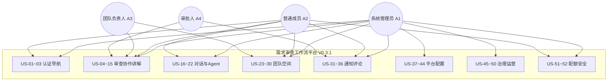
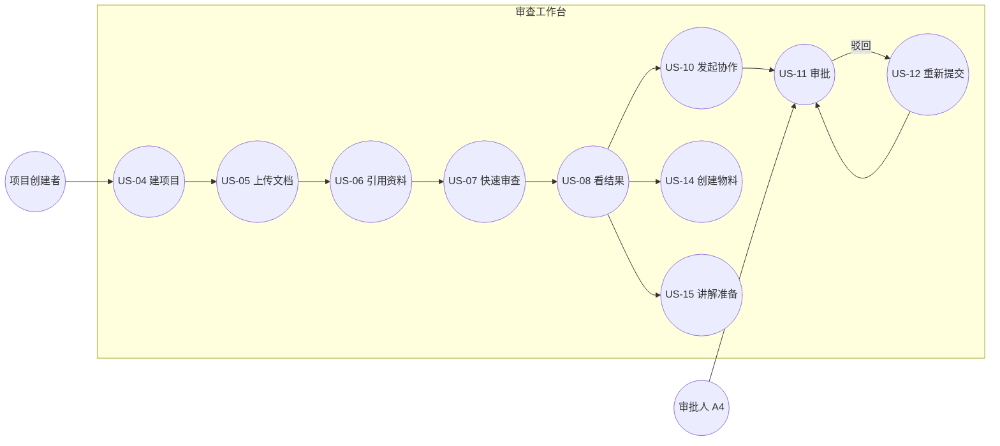
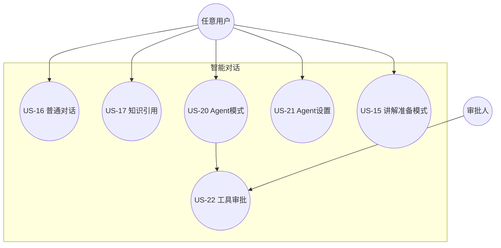
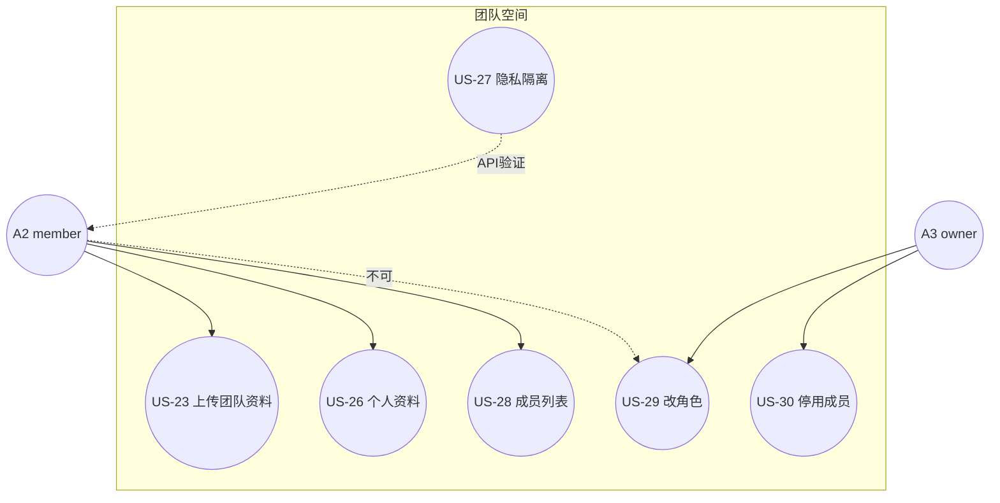
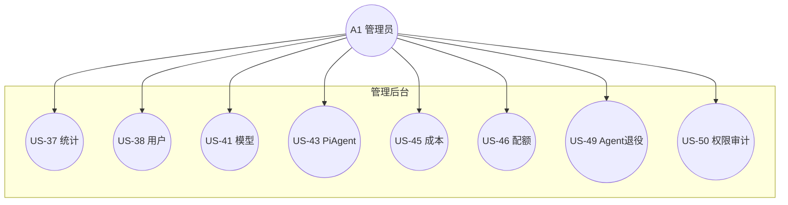

# 用户故事与 E2E 测试用例图

> **版本**：V0.3.1  
> **日期**：2026-06-26  
> **基线**：V0.3.0 代码实现（含 P6 治理 Admin UI）  
> **目的**：统一新版用户故事，并给出可逐条讨论的端到端（E2E）测试用例图与测试矩阵  
> **替代关系**：在 [P0~P4 用户故事](用户故事清单-P0到P4.md) 与 [P5~P6 用户故事](用户故事清单-P5到P6.md) 基础上合并修订，以本文为准讨论 E2E 测试范围

---

## 1. 参与者（Actor）定义

端到端测试至少需要以下 **5 类参与者**。注意系统角色与团队空间角色是两套体系。

| 参与者 ID | 名称 | 系统角色 `User.role` | 团队空间角色 `WorkspaceMember.role` | 测试账号建议 |
|-----------|------|----------------------|-------------------------------------|--------------|
| **A1** | 系统管理员 | `admin` | 通常为 `owner`（bootstrap） | `admin` / admin@2026 |
| **A2** | 普通成员 | `user` | `member` | `member_a`（注册或后台创建） |
| **A3** | 团队负责人 | `user` | `owner` | `owner_b` |
| **A4** | 审批人 | `user` | `member` 或 `viewer` | `approver_c` |
| **A5** | 编外访客 | 未登录 / 停用成员 | — | 无 token / 被停用账号 |

**权限速查**

| 能力 | A1 系统管理员 | A2 普通 member | A3 团队 owner | A4 审批人 |
|------|---------------|----------------|---------------|-----------|
| 管理后台入口 | ✅ | ❌ 隐藏 | ❌ | ❌ |
| 平台配置（模型/Prompt/Pi Agent/治理） | ✅ | ❌ | ❌ | ❌ |
| 审查：看全部团队项目 | ✅（若 workspace owner/admin） | ❌ 仅自己的 | ✅ | 仅参与的 |
| 协作审查：发起 | 项目创建者 | 项目创建者 | 项目创建者 | ❌ |
| 协作审查：审批 | 若被指定 | 若被指定 | 若被指定 | ✅ |
| 个人 Agent 使用 | ✅ | ✅ | ✅ | ✅ |
| 团队资料上传 | ✅ | ✅ | ✅ | 视角色 |
| 团队成员管理 | 视 workspace 角色 | ❌ | ✅ | ❌ |

---

## 2. 新版用户故事（US-01 ~ US-52）

每条故事包含：**角色 · 操作 · 验收 · E2E 建议级别**。

E2E 级别说明：

| 级别 | 含义 | 建议工具 |
|------|------|----------|
| **E2E-UI** | 必须在浏览器完整走通 | Playwright / ce-test-browser / 手工 |
| **E2E-API** | 可用 API + DB 断言替代 UI | pytest + httpx |
| **E2E-Hybrid** | UI 触发 + API/DB 校验结果 | 两者结合 |
| **Skip-E2E** | 已有充分自动化单测，E2E 优先级低 | pytest 即可 |

---

### 2.1 基座：认证与导航（US-01 ~ US-03）

#### US-01 登录与默认落地页

| 字段 | 内容 |
|------|------|
| **角色** | A2 普通成员 / A1 管理员 |
| **操作** | 输入用户名密码 → 登录 |
| **验收** | 进入「需求审查工作台」；顶栏显示用户名；可切换到智能对话、团队空间 |
| **E2E** | E2E-UI |
| **差异** | A1 额外可见「管理后台」链接；A2 不可见 |

#### US-02 注册（若环境开放）

| 字段 | 内容 |
|------|------|
| **角色** | 新用户 |
| **操作** | 注册 → 自动登录 |
| **验收** | 系统角色为 `user`；自动加入默认 workspace、角色 `member`；落地审查工作台 |
| **E2E** | E2E-API（若 `public_registration=false` 则 Skip-E2E，仅测 403） |

#### US-03 顶栏品牌、版本与退出

| 字段 | 内容 |
|------|------|
| **角色** | 任意已登录用户 |
| **操作** | 观察顶栏；点击退出 |
| **验收** | 显示产品名与版本号；退出后回到登录页 |
| **E2E** | E2E-UI |

---

### 2.2 需求审查工作台（US-04 ~ US-15）

#### US-04 创建审查项目

| 字段 | 内容 |
|------|------|
| **角色** | A2 / A3 |
| **操作** | 审查页 → 新建项目 → 输入名称 |
| **验收** | 项目出现在列表；A2 仅见自己创建的；A3（owner）可见团队全部项目 |
| **E2E** | E2E-Hybrid |

#### US-05 上传 PRD 文档

| 字段 | 内容 |
|------|------|
| **角色** | 项目创建者 |
| **操作** | 在项目中上传 DOCX |
| **验收** | 文档列表出现新条目，显示文件名与类型 |
| **E2E** | E2E-UI |

#### US-06 项目引用团队资料

| 字段 | 内容 |
|------|------|
| **角色** | 项目创建者 |
| **操作** | 引用资料 → 选择团队资料 → 设置引用类型 → 确认 |
| **验收** | 项目页显示引用列表；审查启动时冻结版本快照 |
| **E2E** | E2E-Hybrid |

#### US-07 执行快速审查

| 字段 | 内容 |
|------|------|
| **角色** | 项目创建者 |
| **操作** | 选择审查模式与模型 → 开始审查 |
| **验收** | 流式进度展示；完成后结果区可见 |
| **E2E** | E2E-Hybrid（可 mock LLM 降本） |

#### US-08 查看审查结果

| 字段 | 内容 |
|------|------|
| **角色** | 项目创建者 |
| **操作** | 浏览结果 Tab（概览 / 逐篇 / 体系评审） |
| **验收** | 各区块可折叠；含评分、专家意见等 |
| **E2E** | E2E-UI |

#### US-09 导出审查报告

| 字段 | 内容 |
|------|------|
| **角色** | 项目创建者 |
| **操作** | 点击导出 Markdown |
| **验收** | 下载/复制有效 Markdown 内容 |
| **E2E** | E2E-UI |

#### US-10 发起协作审查

| 字段 | 内容 |
|------|------|
| **角色** | 项目创建者 |
| **操作** | 审查完成 → 发起协作审查 → 填写目标 → **指定审批人** → 提交 |
| **验收** | 请求状态「待审批」；审批人收到通知 |
| **前置** | 审查已完成；必须传 `approver_ids` |
| **E2E** | E2E-Hybrid |

#### US-11 审批人通过/驳回

| 字段 | 内容 |
|------|------|
| **角色** | A4 审批人 |
| **操作** | 通知/审查页 → 查看协作请求 → 通过或驳回并填写意见 |
| **验收** | 状态变更；发起人收到结果通知 |
| **E2E** | E2E-Hybrid |

#### US-12 驳回后重新提交

| 字段 | 内容 |
|------|------|
| **角色** | 发起人 |
| **操作** | 驳回后点击重新提交 |
| **验收** | 新轮次创建；继承上轮审批人；状态回「待审批」 |
| **E2E** | E2E-Hybrid |

#### US-13 非授权用户不可发起/审批

| 字段 | 内容 |
|------|------|
| **角色** | A2（非项目创建者、非审批人） |
| **操作** | 尝试在他人的项目上发起协作 / 审批 |
| **验收** | 403 或 UI 不可用 |
| **E2E** | E2E-API |

#### US-14 创建与确认讲解物料（Artifact）

| 字段 | 内容 |
|------|------|
| **角色** | 项目创建者 |
| **操作** | 创建产物 → 选类型（讲解稿/Mermaid/HTML展示/SVG）→ 手填 JSON → 保存 → 确认 |
| **验收** | draft → confirmed 冻结；confirmed 不可改内容 |
| **说明** | **无 HTML 动画播放器**；查看为 JSON `<pre>` |
| **E2E** | E2E-UI |

#### US-15 进入讲解准备模式（Presentation）

| 字段 | 内容 |
|------|------|
| **角色** | 项目创建者 |
| **操作** | 审查完成 →「准备讲解」 |
| **验收** | 跳转智能对话；`mode=presentation`；AI 注入审查上下文；可迭代讲解稿 |
| **说明** | 非项目创建者无上下文注入 |
| **E2E** | E2E-Hybrid |

---

### 2.3 智能对话（US-16 ~ US-22）

#### US-16 普通流式对话

| 字段 | 内容 |
|------|------|
| **角色** | 任意已登录用户 |
| **操作** | 智能对话 → 选模型 → 输入问题 → 发送 |
| **验收** | SSE 流式回复；对话保存到左侧列表 |
| **E2E** | E2E-Hybrid |

#### US-17 开启知识库引用

| 字段 | 内容 |
|------|------|
| **角色** | 任意已登录用户 |
| **操作** | 打开「引用资料」→ 提问团队相关知识 |
| **验收** | 回复含引用卡片；区分知识库与推理段落 |
| **E2E** | E2E-Hybrid |

#### US-18 历史对话切换

| 字段 | 内容 |
|------|------|
| **角色** | 任意已登录用户 |
| **操作** | 点击左侧历史对话 |
| **验收** | 加载完整记录；可继续发送 |
| **E2E** | E2E-UI |

#### US-19 上下文管理（文件/URL）

| 字段 | 内容 |
|------|------|
| **角色** | 任意已登录用户 |
| **操作** | 上传文件或粘贴 URL → 上下文面板启停 |
| **验收** | 禁用项不注入；启用项被模型感知 |
| **E2E** | E2E-UI |

#### US-20 开启 Agent 模式并执行

| 字段 | 内容 |
|------|------|
| **角色** | A2 / A1 |
| **操作** | Agent 开关 ON → 输入任务 → 发送 |
| **验收** | 创建 Run；展示工具调用轨迹；有步骤/状态/耗时 |
| **前置** | A1 已在 Pi Agent 配置中配好 LLM Key |
| **E2E** | E2E-Hybrid（可 stub Pi 子进程） |

#### US-21 个人 Agent 简化设置

| 字段 | 内容 |
|------|------|
| **角色** | A2 普通成员 |
| **操作** | 对话页用户菜单 → Agent 设置 → 改名称/默认范围/启停 → 保存 |
| **验收** | 保存成功；下次 Run 使用新配置 |
| **E2E** | E2E-UI |

#### US-22 高风险工具审批

| 字段 | 内容 |
|------|------|
| **角色** | A4 审批人（或被指定的 approver） |
| **操作** | Agent 触发审批 → 通知 → 跳转 Admin Agent Tab 或 API decide |
| **验收** | 批准后继续；拒绝后中止该工具 |
| **E2E** | E2E-Hybrid |

---

### 2.4 团队空间（US-23 ~ US-30）

#### US-23 上传团队资料

| 字段 | 内容 |
|------|------|
| **角色** | A2 member |
| **操作** | 团队空间 → 资料库 → 团队资料 → 上传 DOCX |
| **验收** | 列表出现新条目；全员可读 |
| **E2E** | E2E-UI |

#### US-24 查看/下载团队资料

| 字段 | 内容 |
|------|------|
| **角色** | A2 |
| **操作** | 点击资料 → 查看详情 → 下载 |
| **验收** | 详情含 hash/标签/预览；下载原文件 |
| **E2E** | E2E-UI |

#### US-25 删除团队资料

| 字段 | 内容 |
|------|------|
| **角色** | A3 owner / A1 workspace admin |
| **操作** | 点击删除 |
| **验收** | 软删除；A2 member 无删除按钮 |
| **E2E** | E2E-UI |

#### US-26 个人资料上传与管理

| 字段 | 内容 |
|------|------|
| **角色** | A2 |
| **操作** | 切换到「我的资料」→ 上传 → 查看/下载/删除 |
| **验收** | 仅本人可见；不进入团队检索；member 可自行删除 |
| **E2E** | E2E-Hybrid |

#### US-27 个人资料隐私隔离

| 字段 | 内容 |
|------|------|
| **角色** | A2 上传者 vs A2' 其他成员 |
| **操作** | A2 上传 private 资料；A2' 尝试列表/检索/下载 |
| **验收** | A2' 不可见、不可检索、不可下载 |
| **E2E** | E2E-API |

#### US-28 查看团队成员列表

| 字段 | 内容 |
|------|------|
| **角色** | A2 |
| **操作** | 团队空间 → 团队成员 Tab |
| **验收** | 显示用户名、角色、状态 |
| **E2E** | E2E-UI |

#### US-29 变更成员角色

| 字段 | 内容 |
|------|------|
| **角色** | A3 owner |
| **操作** | 成员角色下拉 → member 改 admin → 确认 |
| **验收** | 即时生效；A2 无此控件 |
| **E2E** | E2E-UI |

#### US-30 停用/恢复成员

| 字段 | 内容 |
|------|------|
| **角色** | A3 owner |
| **操作** | 停用某成员 → 该成员再登录访问 |
| **验收** | 停用后无法访问业务 API；恢复后可访问 |
| **E2E** | E2E-Hybrid |

---

### 2.5 通知与评论（US-31 ~ US-36）

#### US-31 通知铃铛与未读数

| 字段 | 内容 |
|------|------|
| **角色** | 任意已登录用户 |
| **操作** | 观察顶栏铃铛；展开面板 |
| **验收** | 未读角标；未读/已读/归档三 Tab |
| **E2E** | E2E-UI |

#### US-32 通知跳转与已读

| 字段 | 内容 |
|------|------|
| **角色** | 任意已登录用户 |
| **操作** | 点击通知「查看」 |
| **验收** | 跳转到审查/对话/Admin；标记已读；角标减 1 |
| **E2E** | E2E-UI |

#### US-33 创建评论与回复

| 字段 | 内容 |
|------|------|
| **角色** | 审查参与者 |
| **操作** | 评论区发评 → 回复 |
| **验收** | 即时展示；回复缩进显示 |
| **E2E** | E2E-UI |

#### US-34 @提及通知

| 字段 | 内容 |
|------|------|
| **角色** | 评论者 → 被 @ 用户 |
| **操作** | 评论输入 `@username` → 提交 |
| **验收** | 被提及者收到 mention 通知 |
| **E2E** | E2E-Hybrid |

#### US-35 评论 resolve

| 字段 | 内容 |
|------|------|
| **角色** | 审查参与者 |
| **操作** | 点击「解决」→ 选 resolved / forced_pass |
| **验收** | 显示 resolved 标记；通知评论作者 |
| **E2E** | E2E-Hybrid |

#### US-36 Agent 对话请求通知

| 字段 | 内容 |
|------|------|
| **角色** | Agent 所有者 |
| **操作** | 他人向 Agent 提问后查看通知 |
| **验收** | 类型为 agent_conversation；跳转智能对话 |
| **E2E** | Skip-E2E（P5.A.3 场景较少，API 覆盖即可） |

---

### 2.6 管理后台：平台配置（US-37 ~ US-44）— 仅 A1

#### US-37 系统统计

| 字段 | 内容 |
|------|------|
| **角色** | A1 |
| **操作** | 管理后台 → 系统统计 |
| **验收** | 用户/对话/消息数卡片；最近 7 天访问记录表 |
| **E2E** | E2E-UI |

#### US-38 用户管理 CRUD

| 字段 | 内容 |
|------|------|
| **角色** | A1 |
| **操作** | 添加用户 → 编辑角色/密码 → 禁用 → 删除 |
| **验收** | 列表即时更新；不可删默认 admin |
| **E2E** | E2E-Hybrid |

#### US-39 预置对话 Prompt 管理

| 字段 | 内容 |
|------|------|
| **角色** | A1 |
| **操作** | 预置对话 Prompt Tab → 新建/编辑/删除 |
| **验收** | 对话页可选到新模板 |
| **E2E** | E2E-Hybrid |

#### US-40 评审风格 Prompt 管理

| 字段 | 内容 |
|------|------|
| **角色** | A1 |
| **操作** | 评审风格 Prompt Tab → 新建/编辑 |
| **验收** | 审查流程可选用；A2 只读列表 |
| **E2E** | E2E-Hybrid |

#### US-41 模型配置与测速

| 字段 | 内容 |
|------|------|
| **角色** | A1 |
| **操作** | 模型 Tab → 新建模型 → 连接测试 → 拖拽排序 |
| **验收** | 最上方启用模型为各页默认；测速结果行内展示 |
| **E2E** | E2E-UI（测速可 mock） |

#### US-42 Skills 启停与更新地址

| 字段 | 内容 |
|------|------|
| **角色** | A1 |
| **操作** | Skills Tab → toggle 启停 → 配置 update_url |
| **验收** | 状态变更；停用 Skill 不参与默认列表 |
| **E2E** | E2E-UI |

#### US-43 Pi Agent 全局配置

| 字段 | 内容 |
|------|------|
| **角色** | A1 |
| **操作** | Pi Agent Tab → 配置 LLM/Search/Vision/Extension → 保存 |
| **验收** | 保存成功；Agent Run 使用新配置 |
| **E2E** | E2E-Hybrid |

#### US-44 管理员完整 Agent 配置

| 字段 | 内容 |
|------|------|
| **角色** | A1 |
| **操作** | Agent Tab → 改 System Policy / allowed_tools / 授权范围 / 查看 Run 历史 |
| **验收** | 与 US-21 简化版互补；配置仅作用于管理员自己的 Profile |
| **E2E** | E2E-UI |

---

### 2.7 治理与运营（US-45 ~ US-50）— 仅 A1

> V0.3.1 更新：P6 能力已从「纯 API」升级为 **管理后台「治理与运营」Tab**。

#### US-45 成本概览与聚合

| 字段 | 内容 |
|------|------|
| **角色** | A1 |
| **操作** | 治理 Tab → 查看成本卡片与 30 日明细 → 点击「聚合昨日成本」 |
| **验收** | 汇总数字正确；聚合后明细更新 |
| **E2E** | E2E-Hybrid |

#### US-46 团队配额设置与用量条

| 字段 | 内容 |
|------|------|
| **角色** | A1 |
| **操作** | 治理 Tab → 设置 Token/成本上限、预警阈值、超限动作 → 保存 |
| **验收** | 保存成功；显示 `current_month_tokens` 进度条 |
| **E2E** | E2E-Hybrid |

#### US-47 质量趋势查看

| 字段 | 内容 |
|------|------|
| **角色** | A1 |
| **操作** | 治理 Tab → 质量趋势表 |
| **验收** | 按周展示平均分与审查数 |
| **E2E** | E2E-UI |

#### US-48 Skill 包治理（治理页）

| 字段 | 内容 |
|------|------|
| **角色** | A1 |
| **操作** | 治理 Tab → Skill 状态下拉修改 |
| **验收** | 状态更新为 active/inactive/published/draft/deprecated |
| **E2E** | E2E-UI |

#### US-49 Agent 退役归档

| 字段 | 内容 |
|------|------|
| **角色** | A1 |
| **操作** | 治理 Tab → disabled Agent 列表 → 退役归档 |
| **验收** | 仅 disabled 可归档；有活跃 Run 时 422 |
| **E2E** | E2E-Hybrid |

#### US-50 权限审计导出

| 字段 | 内容 |
|------|------|
| **角色** | A1 |
| **操作** | 治理 Tab → 权限审计 → 复制 JSON |
| **验收** | 含 workspace_members + agent_authorizations |
| **E2E** | E2E-UI |

---

### 2.8 横切：安全与配额（US-51 ~ US-52）

#### US-51 配额硬拦截

| 字段 | 内容 |
|------|------|
| **角色** | A2（使用者）+ A1（配置者） |
| **操作** | A1 设 monthly_token_limit + block；A2 对话/Agent 直到超限 |
| **验收** | 超预警通知；超硬限拒绝调用 |
| **E2E** | E2E-API（造 token 用量数据） |

#### US-52 非管理员不可访问治理/平台 API

| 字段 | 内容 |
|------|------|
| **角色** | A2 |
| **操作** | 直接请求 `/api/admin/*`、`/api/governance/*`、`/api/pi-agent/*` |
| **验收** | 全部 403 |
| **E2E** | E2E-API |

---

## 3. 用例图（可测试视角）

以下用例图按 **业务域** 拆分，便于分组讨论「要不要做 E2E」。  
椭圆形节点 = 用例（对应 US 编号）；方框 = 系统边界。

### 3.1 总览用例图



### 3.2 审查主流程用例图（E2E 核心路径）



**建议 E2E 冒烟路径（P0）**：`US-04 → US-05 → US-07 → US-08 → US-10 → US-11`

### 3.3 智能对话与 Agent 用例图



### 3.4 团队空间用例图



### 3.5 管理后台与治理用例图（仅 A1）



---

## 4. E2E 测试用例矩阵（讨论稿）

下表用于逐个决定：**是否纳入 E2E 套件、优先级、依赖**。

| TC-ID | 用户故事 | 建议级别 | 优先级 | 前置数据 | 是否纳入 E2E？ | 讨论备注 |
|-------|----------|----------|--------|----------|----------------|----------|
| TC-001 | US-01 登录 | E2E-UI | P0 | admin + member 账号 | ☐ 是 ☐ 否 | 所有 E2E 前置 |
| TC-002 | US-01 管理员见后台入口 | E2E-UI | P0 | admin | ☐ | |
| TC-003 | US-04~08 审查主路径 | E2E-Hybrid | P0 | 测试 DOCX | ☐ | 可 mock LLM |
| TC-004 | US-10~12 协作审查全链路 | E2E-Hybrid | P0 | 2 账号 + approver | ☐ | 当前部分 API 测试缺 approver_ids |
| TC-005 | US-14 创建 Artifact | E2E-UI | P1 | 已完成审查 | ☐ | 不测 HTML 播放 |
| TC-006 | US-15 讲解准备 | E2E-Hybrid | P1 | 已完成审查 | ☐ | 验证 presentation 上下文 |
| TC-007 | US-16~18 对话基础 | E2E-Hybrid | P0 | 已配模型 | ☐ | |
| TC-008 | US-20 Agent 执行 | E2E-Hybrid | P1 | Pi Agent 已配置 | ☐ | 成本高，可 stub |
| TC-009 | US-21 个人 Agent 设置 | E2E-UI | P1 | member 账号 | ☐ | |
| TC-010 | US-23~26 资料库 | E2E-UI | P0 | 测试文件 | ☐ | |
| TC-011 | US-27 个人资料隔离 | E2E-API | P0 | 2 member 账号 | ☐ | 安全必测 |
| TC-012 | US-29~30 成员管理 | E2E-UI | P1 | owner 账号 | ☐ | |
| TC-013 | US-31~35 通知评论 | E2E-Hybrid | P1 | 协作审查触发 | ☐ | |
| TC-014 | US-37~44 Admin 配置 | E2E-UI | P2 | admin | ☐ | 可抽样 |
| TC-015 | US-45~50 治理 Tab | E2E-UI | P1 | admin + 成本数据 | ☐ | 新功能重点 |
| TC-016 | US-51 配额拦截 | E2E-API | P1 | 造 budget 数据 | ☐ | |
| TC-017 | US-52 权限拒绝 | E2E-API | P0 | member token | ☐ | 安全必测 |
| TC-018 | US-13 越权协作 | E2E-API | P0 | 3 账号 | ☐ | |

### 4.1 建议分阶段纳入 E2E

| 阶段 | 范围 | 条数 | 目标 |
|------|------|------|------|
| **E2E-Smoke** | TC-001, 003, 007, 010, 017 | 5 | 每次发布必跑，<10min |
| **E2E-Core** | + TC-004, 006, 009, 011, 013, 015 | +6 | 核心业务流程 |
| **E2E-Full** | 全部 TC-001~018 | 18 | 发版前全量 |

### 4.2 不建议做 E2E 的故事（可用 API/单测替代）

| 用户故事 | 原因 |
|----------|------|
| US-02 注册 | 常与环境变量 `public_registration` 冲突 |
| US-09 导出 Markdown | 低价值 UI 点击 |
| US-36 Agent 对话通知 | 场景边缘，API 覆盖 |
| US-18 MCP 配置 | 无 Admin UI，纯 API |
| US-41 模型测速 | 依赖外部 LLM，不稳定 |

---

## 5. 与旧版用户故事对照

| 旧编号 | 新编号 | 变更说明 |
|--------|--------|----------|
| US-01~30 (P0~P4) | US-01~36 | 重新分组；US-13 新增越权；US-14/15 明确无 HTML 动画 |
| US-31~37 (P5) | US-26~27, US-21, US-36 | 合并到对应域 |
| US-38~44 (P6 API) | US-45~52 | 升级为治理 UI；拆分平台配置 US-37~44 |
| — | US-37~44 | 原分散在 Admin 各 Tab，现显式编为故事 |
| US-17 (仅管理员) | US-21 + US-44 | 拆为普通用户简化版 + 管理员完整版 |
| US-38~42 (访问 API) | US-45~50 | 改为治理 Tab UI 操作 |

---

## 6. 待讨论问题（请逐条拍板）

1. **E2E 工具选型**：Playwright 独立套件 vs 现有 pytest + httpx 扩展 vs ce-test-browser MCP？
2. **LLM 依赖**：审查/对话/Agent E2E 是否一律 mock，还是 nightly 才跑真实 LLM？
3. **多账号编排**：协作审查 E2E 是否需要固定 seed 数据（admin / member_a / approver_c）？
4. **US-14 HTML 展示**：是否纳入 E2E，还是明确「仅验证 JSON CRUD」？
5. **US-15 讲解准备**：是否断言 AI 回复含审查关键词，还是只断言 mode 与页面跳转？
6. **Admin E2E 深度**：US-37~50 是冒烟（Tab 可加载）还是全 CRUD？
7. **配额 E2E（US-51）**：是否值得造数据测 block，还是 API 单测足够？
8. **发布门禁**：E2E-Smoke 失败是否阻断 merge？

---

## 7. 附录：测试账号与数据清单（建议）

```yaml
# e2e-fixtures.yaml（建议新增）
users:
  admin:
    username: admin
    password: admin@2026
    system_role: admin
    workspace_role: owner
  member_a:
    username: member_a
    password: test1234
    system_role: user
    workspace_role: member
  approver_c:
    username: approver_c
    password: test1234
    system_role: user
    workspace_role: member

files:
  sample_prd: tests/fixtures/sample_prd.docx
  sample_team_doc: tests/fixtures/team_doc.docx

env:
  public_registration: true   # 仅 US-02 需要
  mock_llm: true              # 降本
  pi_agent_stub: true         # Agent E2E
```

---

**文档状态**：讨论稿 v1 — 请从 §6 待讨论问题开始逐条确认 E2E 范围。
