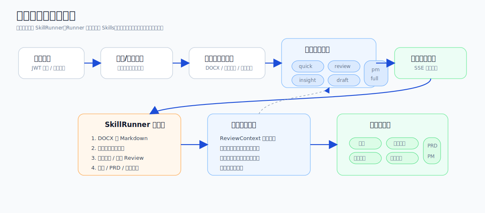
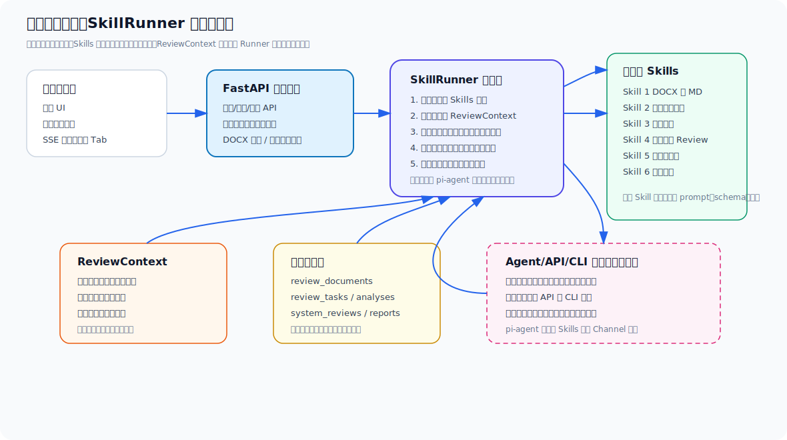
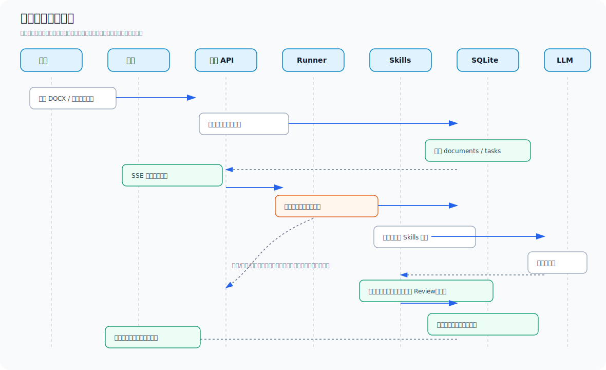
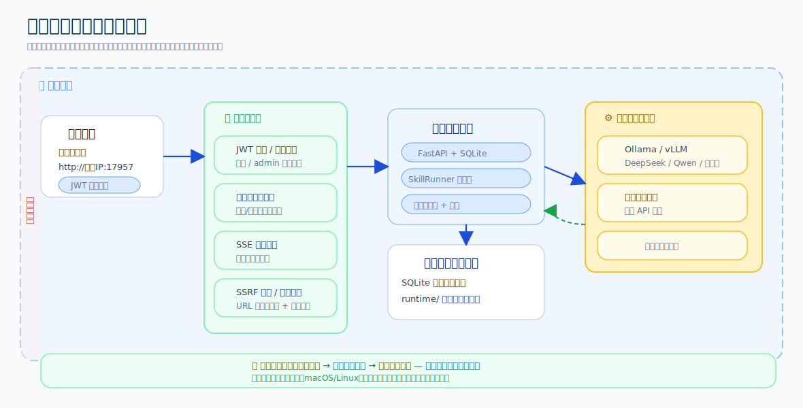
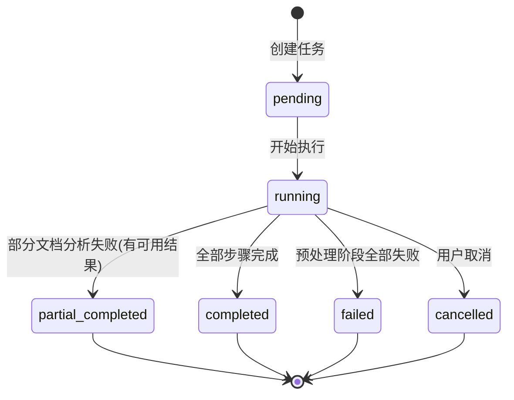
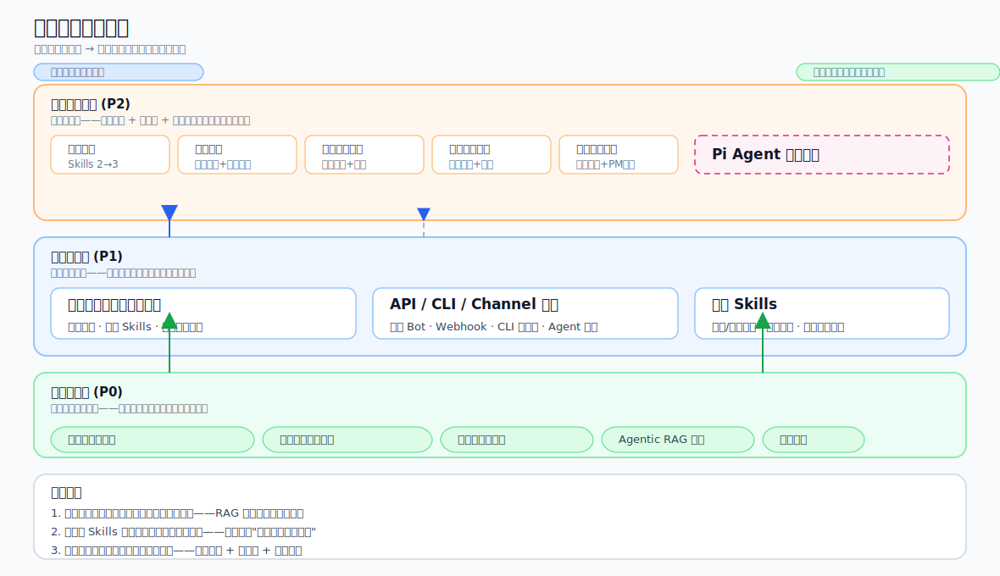

# 需求审查工作流平台 — 需求说明书

> 版本：V2.0
> 日期：2026年5月21日
> 最近补充：2026年5月31日
> 基于：V1.1需求说明书 + 六模式递进方案 + Skills解耦执行机制
> 补充说明：当前实现已进一步落地需求审查动态三栏工作台、智能对话三栏上下文面板、结果区内嵌执行步骤、`@文档` 定向上下文注入，以及登录页内网试用提示等交互能力；本次同时补充了“内网大模型 + 数据安全不外溢”的项目口径。

---

## 一、产品定位

### 1.1 一句话描述

**在部门局域网内搭建一个小型Web平台，让团队成员上传需求文档，AI自动完成初步评审，输出审查意见和改进建议，实现需求评审工作流的初步信息化。**

### 1.2 背景

部门内部的需求评审目前依赖线下流转：PM撰写Word文档 → 邮件/飞书发送 → 评审人逐一阅读 → 线下开会讨论。存在以下痛点：

| 痛点 | 说明 |
|------|------|
| **评审周期长** | 文档发出后评审人各自安排时间阅读，光一轮书面意见就需要1-3天 |
| **评审质量因人而异** | 没有统一的审查框架，不同评审人的关注点差异大，容易遗漏边界问题 |
| **反馈零散** | 评审意见分散在邮件、飞书消息、会议记录中，缺乏集中管理 |
| **没有基线** | 历史评审意见无法形成知识积累，下次同类型文档还得从头审一遍 |
| **缺少量化** | 无法评估团队整体的需求质量水平和进步趋势 |
| **审查标准不一致** | 没有将团队规范（写作规范、评分量规、必需章节）系统性地注入审查过程 |

本项目试图用**局域网内的小网站**解决上述问题——不依赖公网服务，不涉及企业数据出网，部署在部门内部即可使用。平台同时支持接入企业内网大模型或企业可控模型服务，让需求文档、评审上下文、分析过程和输出结果在内网闭环处理，满足数据安全不外溢的实际落地要求。

### 1.3 核心价值

| 角色 | 痛点 | 解决方式 |
|------|------|----------|
| **需求提出人（PM）** | 写完需求不知道质量如何，缺少快速自检手段 | 上传后AI自动审查，给出质量问题清单和改进建议 |
| **评审人（技术负责人）** | 需要逐篇阅读文档，边界不清的地方要反复沟通 | AI自动识别"边界定义"和"边界外问题"，辅助评审 |
| **团队Leader** | 无法量化团队需求写作水平和趋势 | 提供PM写作质量评分卡，支持历史评分趋势对比 |
| **部门全员** | 评审记录分散，历史文档查找困难 | 所有需求文档+评审意见集中管理，支持全文搜索 |

补充说明：除评审效率与质量提升外，平台还具备明确的安全价值。系统可运行在企业内网环境，并对接内网大模型或企业可控模型服务，避免将敏感需求文档、专家意见和审查结果外发到公网模型侧。

### 1.4 与内部原型的关系

本平台基于已有的内部原型项目（FastAPI + SQLite + 原生JS SPA，端口17957）进行扩展，在其基础上增加需求审查工作流模块。复用已有基础设施：

- **FastAPI后端**：增加需求文档管理、审查流水线相关API路由
- **用户认证系统**：复用JWT登录/注册、角色权限（user/admin）
- **管理后台**：扩展项目管理、审查任务管理页面
- **SQLite数据库**：增加review_projects、review_documents等表
- **局域网部署方式**：Uvicorn + 符号链接持久化，IP直访

> 若后续独立部署需要，也可作为一个独立应用运行。

---

## 二、核心流程

### 2.1 六种审查模式（递进关系）

本平台提供六种审查模式，从浅到深递进。每种模式回答一个明确的问题：

| 序号 | 模式 | 前端标签 | 回答的问题 | 触发的Skills | 预计耗时 |
|------|------|---------|-----------|-------------|---------|
| 1 | quick | 快速审查 | 这篇需求有什么问题？ | 1→2→3 | ~2分钟 |
| 2 | review | 需求深度分析 | 需求集的体系性如何？ | 1→2→3→4→6 | ~5分钟 |
| 3 | insight | 挖掘下一阶段需求 | 下一步该写什么需求？ | 1→2→3→4→5→6 | ~6分钟 |
| 4 | draft | 基于历史生成PRD | 最高优先级的缺口怎么写？ | 1→2→3→4→5→6(prd_draft) | ~7分钟 |
| 5 | pm | PM发展建议 | PM的能力如何提升？ | 1→2→3→4→6 | ~5分钟 |
| 6 | full | 批量整体评估 | 全貌如何？ | 1→2→3→4→5→6 | ~8分钟 |

**递进逻辑**：

```
快速审查（逐篇问题）
    │
    ▼
需求深度分析（+ 体系Review 7维度）
    │
    ▼
挖掘下一阶段需求（+ 演进追踪 + 缺口分析）
    │
    ▼
基于历史生成PRD（+ 取最高优先级缺口生成PRD草稿）

                PM发展建议（聚焦PM评分维度）

                批量整体评估（以上全部）
```

### 2.2 Skills与模式解耦机制

**核心原则**：Skills的执行与功能模式相对独立。

- **Skill一旦触发就执行完整流程**：例如Skill 4（体系Review）一旦触发，永远执行完整7维度（业务价值→架构→竞争→产品策略→技术演进→PM评估→行动计划），不做条件分支
- **模式只决定两件事**：(1) 触发哪些Skills；(2) 展示哪些结果
- **缓存生效**：先跑快速审查（Skills 1→2→3），再跑需求深度分析，只需执行Skills 4→6，前面步骤的结果直接复用

**示例**：

| 场景 | 实际执行 | 说明 |
|------|---------|------|
| 先跑快速审查，再跑PM发展建议 | 第1次：1→2→3；第2次：4→6（复用1→2→3缓存） | PM发展建议需要Skill 4，Skill 4跑完整7维，PM维度给下游报告，其余6维存库 |
| 直接跑挖掘下一阶段需求 | 1→2→3→4→5→6 | Skill 4跑完整7维，Skill 5基于逐篇分析和体系Review发现缺口 |
| 先跑需求深度分析，再跑基于历史生成PRD | 第1次：1→2→3→4→6；第2次：5→6（复用1→2→3→4缓存） | draft需要Skill 5的缺口列表来确定PRD主题 |

### 2.3 六个Skills说明

| # | Skill | 职责 | 核心产出 |
|---|-------|------|----------|
| 1 | docx-to-markdown | Word→Markdown转换，提取图片、嵌入Excel转表格 | 每篇文档的.md文件 + assets/ |
| 2 | prd-overview-classify | 文档集分类、版本号提取、版本演进链构建、文档间依赖发现 | classify.json（分类+版本链+依赖） |
| 3 | prd-per-analysis | 逐篇6维度分析（核心问题/分类/边界/边界外问题/解决追踪/要点提取）+ 质量评分 | 每篇的analysis.json |
| 4 | system-review | 体系Review 7维度（业务价值→架构→竞争→产品策略→技术演进→PM评估→行动计划） | 7维度结果 + PM评分卡 |
| 5 | requirement-insights | 演进追踪（边界外问题跨版本收敛）+ 缺口分析（功能覆盖矩阵） | 演进链Mermaid图 + 覆盖矩阵 + 缺口列表 |
| 6 | report-generator | 汇总上游所有结果，渲染Markdown报告（可选LLM润色） | 最终.md / .pdf报告 |

**Skill间的数据流**：

```
Skill 1 (docx→md)
    │
    ▼
Skill 2 (分类+版本链)
    │
    ▼
Skill 3 (逐篇6维分析) ←── 评审上下文注入
    │
    ├──────────────────────┐
    ▼                      ▼
Skill 4 (7维体系Review)   │  ←── 评审上下文注入
    │                      │
    ├──────────────┐       │
    ▼              ▼       │
Skill 5 (洞察)    │       │
    │              │       │
    ▼              ▼       ▼
Skill 6 (报告生成) ←── 选择输出类型（report / prd_draft）
```

### 2.4 用户视角的主流程



用户从登录、选择项目、上传或导入需求文档开始，选择六种审查模式之一后由后台异步流水线执行。前端通过 SSE 展示进度，完成后进入结果工作台，可查看概览、快速审查、需求深度分析、下一阶段需求、PRD草稿和PM发展建议。

### 2.5 评审上下文（Review Context）机制

评审上下文是本平台的核心创新——将团队规范、评分量规、必需章节等**可动态更新**的评审依据，系统性地注入到审查流水线的各步骤中，而非硬编码到Prompt中。

```
Skill 1       Skill 2       Skill 3         Skill 4        Skill 5/6
docx→MD  →   概览与分类 →  逐篇6维度分析 → 体系Review   → 洞察/报告
                  ↑               ↑               ↑
                  │               │               │
        ┌─────────┴───────────────┴───────────────┘
        │
        ▼
┌──────────────────────────────────────────────────────┐
│            Review Context（评审上下文）                │
│                                                      │
│  ┌─────────────────┐  ┌─────────────────┐           │
│  │ 规范文档          │  │ 团队要求          │           │
│  │ • 需求写作规范    │  │ • 质量标准        │           │
│  │ • 模板要求        │  │ • 必需章节清单    │           │
│  │ • 术语表          │  │ • 评分量规        │           │
│  └─────────────────┘  └─────────────────┘           │
│                                                      │
│  version: 1    updated_at: 2026-05-15    is_active: true │
└──────────────────────────────────────────────────────┘
```

**注入策略**：

| 被注入的步骤 | 注入方式 | 注入内容 | 效果 |
|-------------|---------|---------|------|
| Skill 2 (分类) | `category_overrides` 覆盖默认分类关键词 | 自定义分类体系 | 团队用自己的分类标准，而非通用默认值 |
| Skill 3 (逐篇分析) | 规范文档全文追加到Prompt"评审依据"章节 | 写作规范+必需章节清单+评分量规 | LLM对照团队规范逐篇审查，检查必需章节是否缺失 |
| Skill 4 (体系Review) | 规范文档摘要注入system prompt | 质量标准+评分量规+业务规则 | PM评估使用团队自定义的评分维度和权重 |

**默认评审上下文**：项目创建时不配置评审上下文也可使用，平台提供内置默认值（通用需求审查规范和评分维度）。用户可随时配置自定义上下文覆盖默认值。

### 2.6 SkillRunner 与可插拔 Skills 设计

平台采用“Skill 可插拔、Runner 负责编排、Agent 负责调用”的分层设计，避免把审查经验直接写死在页面逻辑或单个 Agent Prompt 中。



三类概念边界如下：

| 概念 | 定位 | 主要职责 | 变化方式 |
|------|------|----------|----------|
| Skill | 单一能力包 | 封装提示词、Schema、脚本、输入输出约定，例如 DOCX 转换、逐篇分析、体系 Review、洞察生成 | 可独立新增、替换、升级，不要求重写整条流水线 |
| SkillRunner | 确定性执行引擎 | 根据模式配置选择 Skills，负责输入裁剪、上下文注入、缓存复用、重试、取消检查、失败收口和结构化结果传递 | 通过配置扩展编排关系，保持核心执行语义稳定 |
| Agent | 目标驱动调用者 | 理解用户意图，选择审查模式或调用 API/CLI，将用户问题转化为 Runner 可执行任务 | 后续接入 pi-agent、飞书 Bot、CLI、外部 Channel |

设计原则：

- **Skill 不等同于 Agent**：Skill 是可被调用的能力单元，Agent 是面向用户目标的调度者。当前 MVP 以页面按钮触发 SkillRunner，后续 Agent 也应复用同一 Runner 和 API。
- **模式只编排，不改 Skill 内核**：quick/review/insight/draft/pm/full 只决定触发哪些 Skills 和展示哪些结果；例如 Skill 4 一旦执行就完整生成 7 个维度，避免同一 Skill 在不同入口下出现逻辑漂移。
- **规范与高级 PM 经验通过 ReviewContext 注入**：团队规范、专业指导意见、评分量规和分类体系不散落在代码中，而是以版本化上下文注入逐篇分析和体系 Review。
- **缓存必须绑定执行上下文**：缓存命中应同时考虑项目、文档范围、模式依赖、模型、评审上下文版本等关键条件，避免不同文档或旧规范结果被误复用。
- **Skill 可独立升级**：Prompt、Schema、脚本或默认规则更新后，可通过版本号和回归样例验证单个 Skill 的质量，再纳入 Runner 编排。

### 2.7 端到端业务时序

审查流程从用户上传或导入文档开始，经由 FastAPI 创建异步任务，SkillRunner 读取上下文和缓存后串联多个 Skills，并通过 SSE 将进度推送到前端。失败、取消和部分成功都需要收口为明确状态，前端保留已生成的中间结果入口。



---

## 三、用户故事

### 3.1 核心角色

| 角色 | 描述 |
|------|------|
| **产品经理** | 撰写需求文档的PM，需要快速获得质量反馈和改进建议 |
| **技术负责人** | 负责需求评审和落地的架构师/技术经理 |
| **团队Leader** | 管理PM团队的负责人，需要量化评估团队能力和成长 |

### 3.2 User Stories

| 编号 | 角色 | 故事 | 验收条件 |
|------|------|------|----------|
| US01 | 产品经理 | 我希望上传一篇刚写完的docx需求文档，AI能在2分钟内给出审查结果，以便我在提交评审前发现问题 | 上传1篇→≤2分钟→输出6维度分析+质量评分+改进建议 |
| US02 | 产品经理 | 我希望审查报告能告诉我"边界外问题"，并标注哪些是团队规范中要求的必需章节但文档缺失的 | 每篇文档识别边界外问题；必需章节缺失项单独标注"规范缺失" |
| US03 | 技术负责人 | 我希望看到需求文档集的体系性评估，了解业务价值、架构合理性、竞争定位等 | 输出7维度体系Review报告，每个维度附具体证据 |
| US04 | 技术负责人 | 我希望知道哪些边界外问题没有收敛，下一步该写什么需求来弥补 | 输出演进追踪图+缺口分析矩阵，明确列出未覆盖的功能点 |
| US05 | 产品经理 | 我希望平台能基于缺口分析自动生成一份PRD草稿，作为我写下一个需求的起点 | 取优先级最高的缺口，输出结构化PRD草稿（含目标、边界、用户故事等） |
| US06 | 团队Leader | 我希望批量审查多篇需求文档后，能看到团队PM的写作风格评分和产品思维评分 | 输出写作4维+思维4维评分卡(1-5分)，附证据引用 |
| US07 | 团队Leader | 我希望在项目的评审上下文中配置团队的写作规范和评分量规，让审查标准与团队要求一致 | 配置后后续审查自动使用自定义标准；历史结果不受影响 |
| US08 | 所有角色 | 我希望审查报告可以在线浏览，也能导出Markdown以便分享 | Tab切换浏览 + 一键导出MD |
| US09 | 所有角色 | 我可以实时查看审查流水线的处理进度，知道每篇文档的当前状态和预计剩余时间 | SSE推送进度，文档级粒度，预计剩余时间 |
| US10 | 所有角色 | 我希望一键跑完所有分析，获得完整概览，再按需深入查看某个维度 | 批量整体评估模式跑完全部Skills，概览Tab汇总各维度核心结论 |
| US11 | 所有角色 | 我希望只能看到自己有权限访问的项目、文档和审查结果，切换账号或刷新页面时不会混入其他人的缓存数据 | 项目/文档/审查结果按用户隔离；浏览器刷新或账号切换后不展示其他用户的缓存结果 |
| US12 | 所有角色 | 我希望审查任务取消、失败或服务异常中断后，仍能看到已生成的中间结果，并决定是继续审查还是重新审查 | 取消或失败后自动保留结果入口；结果页可继续审查或重新审查；服务恢复后不存在长期卡住的任务 |
| US13 | 管理员/所有角色 | 我希望管理员能管理用户账号，登录用户能自行修改密码，以满足局域网内的基础账户治理 | 管理员可创建、禁用、删除用户并调整角色；登录用户可从界面修改密码，需校验两次新密码一致 |
| US14 | 管理员 | 我希望系统能保留关键操作与异常日志，便于审计和问题排查 | 关键审查操作、关键错误和重要调用过程可被记录并用于追溯 |

---

## 四、页面设计

### 4.1 页面结构总览

本平台采用单页应用（SPA）架构，核心是**需求审查工作台**：

```
┌──────────────────────────────────────────────────────────────────┐
│  [H] 需求审查平台        [智能对话]  [管理后台]  [用户名 ▼]      │
├──────────┬───────────────────────────────────────────────────────┤
│          │                                                       │
│  审查项目 │  ┌─ 主内容区 ──────────────────────────────────────┐  │
│          │  │                                                  │  │
│  ├ 产品需 │  │  [项目名/描述]                                   │  │
│  │ 求A     │  │                                                  │  │
│  ├ 产品需 │  │  功能卡片（选择审查模式）                         │  │
│  │ 求B     │  │  ┌─────────┐ ┌──────────┐ ┌──────────────┐     │  │
│  └ 示例   │  │  │快速审查  │ │需求深度   │ │挖掘下一阶段   │     │  │
│    助手   │  │  │         │ │分析      │ │需求          │     │  │
│          │  │  └─────────┘ └──────────┘ └──────────────┘     │  │
│  ──────  │  │  ┌──────────────┐ ┌──────────────┐             │  │
│  已添加   │  │  │基于历史生成   │ │PM发展建议    │             │  │
│  文档     │  │  │PRD          │ │              │             │  │
│          │  │  └──────────────┘ └──────────────┘             │  │
│  ├ doc1  │  │                                                  │  │
│  ├ doc2  │  │  ┌─────────────────────────────────────────┐   │  │
│  └ doc3  │  │  │ 批量整体评估                              │   │  │
│          │  │  └─────────────────────────────────────────┘   │  │
│  ──────  │  │                                                  │  │
│  添加文档 │  │  审查结果（6个Tab）                              │  │
│  + 评审   │  │  [概览] [快速审查] [深度分析] [下一阶段] [PRD草稿] [PM建议] │
│   上下文  │  │                                                  │  │
│          │  └──────────────────────────────────────────────────┘  │
└──────────┴───────────────────────────────────────────────────────┘
```

### 4.2 功能卡片区域

功能卡片分为两行排列：

**第一行（5个独立功能）**：

```
┌────────────┐ ┌──────────────┐ ┌────────────────┐
│  快速审查   │ │  需求深度分析  │ │ 挖掘下一阶段需求 │
│  Skills 123 │ │  Skills 12346 │ │ Skills 123456   │
└────────────┘ └──────────────┘ └────────────────┘

┌──────────────────┐ ┌──────────────┐
│  基于历史生成PRD   │ │  PM发展建议   │
│  Skills 123456    │ │  Skills 12346 │
│  (prd_draft)     │ │              │
└──────────────────┘ └──────────────┘
```

**第二行（1个综合功能）**：

```
┌──────────────────────────────────────────────────────┐
│                    批量整体评估                         │
│                 Skills 123456（全部）                   │
└──────────────────────────────────────────────────────┘
```

**交互规则**：
- 未选择文档时，所有卡片显示20%灰色遮罩禁用态
- 已有历史审查结果的模式显示"已审查"徽章，点击直接进入结果页
- 点击后如需执行，进入进度页实时展示SSE推送的步骤状态
- 执行完成后自动切换到结果页，默认展示该模式对应的Tab

### 4.3 审查进度页

```
┌──────────────────────────────────────────────────────────────────┐
│  审查进度                                    [项目：产品需求A]   │
├──────────────────────────────────────────────────────────────────┤
│                                                                   │
│  模式：需求深度分析    评审上下文版本：V2                          │
│  ────────────────────────────────────────────────────────────     │
│                                                                   │
│  ✅ Step 1  文档预处理（docx→Markdown） 3篇已完成      (8秒)     │
│  ✅ Step 2  概览与分类                   3类识别完成    (5秒)     │
│  ✅ Step 3  逐篇6维度分析               3/3篇已完成   (1m30s)    │
│  🔄 Step 4  体系Review（7维度）          3/7维度已完成            │
│     ├ ✅ 业务价值                                               │
│     ├ ✅ 体系架构                                               │
│     ├ ✅ 竞争定位                                               │
│     ├ 🔄 产品策略        ← 当前处理中                          │
│     ├ ⬜ 技术演进                                               │
│     ├ ⬜ PM评估                                                 │
│     └ ⬜ 行动计划                                               │
│  ⬜ Step 5  报告生成                                              │
│                                                                   │
│  预计剩余时间：约2分钟                                            │
│                                                                   │
│                              [取消]                               │
│                                                                   │
└──────────────────────────────────────────────────────────────────┘
```

**关键交互**：
- 步骤数随模式不同而变化（快速审查3步，需求深度分析5步，挖掘下一阶段需求6步等）
- Step 4 展示7维度的逐维度进度
- 审查任务被取消或失败后，自动切换到结果页并保留已完成步骤的中间结果
- 服务异常中断后，未完成任务在恢复后应有明确的失败收口状态，避免用户长期看到“进行中”假象
- 完成后自动跳转到结果页，默认展示该模式对应的Tab

### 4.4 审查结果页（6个Tab）

```
┌──────────────────────────────────────────────────────────────────┐
│  产品需求A — 审查报告                       [导出Markdown]       │
│  评审上下文版本：V2                                               │
├──────────────────────────────────────────────────────────────────┤
│                                                                   │
│  [概览] [快速审查] [需求深度分析] [下一阶段需求] [PRD草稿] [PM发展建议] │
│  ═══════                                                          │
│                                                                   │
│  ═══ 概览Tab ═══                                                 │
│                                                                   │
│  ┌──────────────────────────────────────────────────────────┐    │
│  │  快速审查结论          需求深度分析结论       下一阶段需求   │    │
│  │  3篇文档，平均3.2/5    业务价值偏技术视角     2个未收敛问题  │    │
│  │  1篇规范缺失           架构演进合理           1个功能缺口   │    │
│  │  [查看详情 →]          [查看详情 →]           [查看详情 →]  │    │
│  ├──────────────────────────────────────────────────────────┤    │
│  │  PRD草稿                PM发展建议                           │    │
│  │  建议新增"数据校验"需求  综合评分3.3/5，技术型PM             │    │
│  │  [查看详情 →]           [查看详情 →]                        │    │
│  └──────────────────────────────────────────────────────────┘    │
│                                                                   │
│  ═══ 快速审查Tab ═══                                             │
│                                                                   │
│  ┌──────────────────────────────────────────────────────────────┐ │
│  │ V2.3.6 示例需求V3                    [示例分类]          │ │
│  │ 核心问题：新旧算法设备混合组网的判定流程                     │ │
│  │ 边界外问题：2个（1已解决，1未解决）                         │ │
│  │ ⚠️ 规范缺失：适用范围（团队规范要求必须包含）               │ │
│  │ 质量评分：★★★★☆ 4/5                      [展开详情 ▼]      │ │
│  ├──────────────────────────────────────────────────────────────┤ │
│  │ V2.3.5 示例需求V2                 [示例分类]         │ │
│  │ 核心问题：重复上报导致判定混乱                              │ │
│  │ 边界外问题：1个（已解决）                                   │ │
│  │ 质量评分：★★★★☆ 4/5                      [展开详情 ▼]      │ │
│  └──────────────────────────────────────────────────────────────┘ │
│                                                                   │
│  ═══ 需求深度分析Tab ═══                                         │
│                                                                   │
│  [业务价值] [体系架构] [竞争定位] [产品策略] [技术演进] [PM评估] [行动计划] │
│                                                                   │
│  （以"业务价值"为例）                                             │
│  整体评估：需求集聚焦于技术优化，业务价值描述偏技术视角，         │
│  缺少用户价值量化和ROI分析...                                     │
│                                                                   │
│  ═══ 下一阶段需求Tab ═══                                         │
│                                                                   │
│  演进链追踪：                                                     │
│  V1.8.0→V2.1.0→V2.2.3  "示例链路"链                             │
│  🟡 部分解决：极端混合场景未覆盖                                  │
│                                                                   │
│  功能覆盖矩阵：                                                   │
│  | 功能 | V2.0.4 | V2.2.5 | V2.2.6 | 状态 |                    │
│  | 功能方案A | ✅ | ❌ | ❌ | 已覆盖 |                            │
│  | 数据校验需求 | ❌ | ❌ | ❌ | 缺口❌ |                        │
│                                                                   │
│  建议新增需求：                                                   │
│  1. 🔴 数据校验需求——无任何文档覆盖                              │
│                                                                   │
│  ═══ PRD草稿Tab ═══                                              │
│                                                                   │
│  基于缺口分析，建议优先覆盖"数据校验需求"，生成PRD草稿：          │
│                                                                   │
│  # 数据校验需求 V1.0                                              │
│  ## 一、适用范围                                                  │
│  本文档定义核心数据的校验机制...                                  │
│  ## 二、边界定义                                                  │
│  做：校验规则定义、自动校验流程、异常处理...                      │
│  不做：数据采集实现、数据查询页面...                              │
│  ...                                                              │
│                                                                   │
│  ═══ PM发展建议Tab ═══                                           │
│                                                                   │
│  📝 写作风格（按团队评分量规V2）    🧠 产品思维                    │
│  逻辑结构    ★★★★☆  4/5             迭代思维    ★★★★★  5/5     │
│  技术深度    ★★★★★  5/5             体验思维    ★★★☆☆  3/5     │
│  边界意识    ★★★★☆  4/5             数据思维    ★★☆☆☆  2/5     │
│  商业视角    ★★☆☆☆  2/5             商业思维    ★☆☆☆☆  1/5     │
│                                                                   │
│  PM类型：技术型产品经理                                           │
│  综合评分：3.3 / 5                                                │
│                                                                   │
│  💡 亮点：渐进式问题拆解能力、边界条件系统性思考                 │
│  ⚠️ 盲点：用户价值描述抽象、数据统计空缺、缺乏商业视角          │
│                                                                   │
│  📈 成长路径：                                                    │
│  短期(1-3月) → 补齐用户视角：每个需求增加用户故事章节           │
│  中期(3-6月) → 建立商业闭环思维：学习ROI分析                    │
│  长期(6-12月) → 向产品负责人进阶：产品战略思维                  │
└──────────────────────────────────────────────────────────────────┘
```

**关键交互**：
- 6个Tab固定显示，未执行的维度显示"尚未执行"提示
- 概览Tab汇总各模式核心结论，每个结论卡片点击可跳转到对应Tab
- 逐篇分析列表支持展开/折叠查看详情，规范缺失项醒目标注
- PM评估Tab标注使用的评分量规版本
- PRD草稿Tab支持一键导出Markdown
- 任务取消时结果页显示“审查未完成”，任务失败时显示“审查中断”，但均保留已生成结果的查看入口
- 结果页根据任务状态提供“继续审查”或“重新审查”操作，而不是要求用户回到入口页重新选择

### 4.5 评审上下文管理

评审上下文在项目侧边栏底部区域配置，包含四部分：

| 区域 | 内容 |
|------|------|
| 规范文档 | 需求写作规范、业务规则等，可编辑/删除/新增 |
| 必需章节清单 | 标记哪些章节为必需，配置验证规则 |
| 评分量规 | 写作风格4维+产品思维4维的权重配置 |
| 分类体系 | 自定义分类名称和识别关键词 |
| 专业指导意见 | 团队积累的审查经验和指导意见 |

保存时版本自动递增，已完成的审查结果使用当时的版本，不受影响。未配置的项目使用内置默认值。

### 4.6 管理后台

```
┌──────────────────────────────────────────────────────────────────┐
│  需求审查平台 — 管理后台                                            │
├──────────────────────────────────────────────────────────────────┤
│                                                                   │
│  [项目管理] [Prompt配置] [LLM配置] [用户管理]                     │
│                                                                   │
│  ═══ 项目管理 ═══                                                │
│  项目名称         文档数   报告数    评审上下文   最近更新        │
│  ────────────   ───────  ───────  ──────────  ──────────       │
│  产品需求A       5        2       V2(自定义)   2026-05-15      │
│  产品需求B       3        0       默认         2026-05-12      │
│                                                                   │
│  ═══ Prompt配置 ═══                                              │
│  模板名称         类型        版本    操作                        │
│  ────────────   ──────────  ─────  ─────────                     │
│  逐篇6维度分析    分析Prompt   V2    [编辑]                       │
│  体系Review       分析Prompt   V1    [编辑]                       │
│  PM评估          分析Prompt   V2    [编辑]                       │
│                                                                   │
│  ═══ LLM配置 ═══                                                │
│  接口地址 / 模型 / 温度 / 最大Token / API Key                     │
│  [测试连接+测速]  [新增模型]  [删除]                               │
│                                                                   │
└──────────────────────────────────────────────────────────────────┘
```

**补充说明**：
- 用户管理页支持创建用户、调整角色、启用/禁用账号和删除用户
- 登录用户可从顶部用户菜单修改密码，修改时需二次确认新密码

### 4.7 智能对话三栏上下文辅助面板

智能对话模块采用“左侧对话列表 + 中间消息流 + 右侧上下文辅助面板”的三栏布局。该模块不是需求审查结果页的复制，而是面向需求前期讨论、资料补充和外部团队咨询的对话工作台。

```
┌────────────┬──────────────────────────────┬──────────────────────┐
│ 对话列表     │ 消息流                         │ 对话上下文              │
│            │                              │                      │
│ + 新建      │ 用户与 AI 的连续问答             │ 历史文档   + 添加       │
│ 搜索对话     │ 流式回复                       │ 规则文档   + 添加       │
│ 会话条目     │                              │ 临时资料   + 添加       │
│            │ 输入框 / 上传 / URL             │ 手动规则   + 添加       │
└────────────┴──────────────────────────────┴──────────────────────┘
```

上下文面板的基本能力：

- 支持把历史需求文档、规则文档、临时资料、手动规则、URL 抓取文本加入当前对话上下文。
- 上下文项支持启用、禁用、删除和清空；发送消息前应等待持久化上下文变更同步完成，避免模型使用旧上下文。
- 新会话首轮发送前添加的上下文，在后端返回 `conversation_id` 后需要回写到该会话，保证后续轮次继续可用。
- 窄屏下右侧上下文面板降级为抽屉，不应破坏中间消息流的主要阅读空间。
- URL 类上下文应注入提取后的正文摘要或原文片段，而不是只把 URL 字符串交给模型。

该能力为后续 RAG 和团队知识库打基础：当前阶段由用户显式选择上下文，后续阶段可由搜索 Skills、知识库检索和 Agent 自动召回相关资料。

---

## 五、功能需求

### 5.1 P0 — 核心必做（已实现）

| 编号 | 功能 | 验收标准 | 状态 |
|------|------|----------|------|
| F01 | 项目管理 | 创建/查看/删除项目，项目维度管理文档集和报告 | ✅ 已完成 |
| F02 | 上传docx文档 | 支持单篇/多篇拖拽上传，文件大小≤50MB/篇，中文文件名正常处理 | ✅ 已完成 |
| F03 | 文档预处理 | 自动转换docx→Markdown，嵌入Excel转MD表格，图片提取+魔数格式修正，转换缓存 | ✅ 已完成 |
| F04 | 评审上下文配置 | 项目级配置（规范文档、必需章节、评分量规、分类体系、专业指导意见），未配置时使用内置默认值 | ✅ 已完成 |
| F05 | 六种审查模式 | quick/review/insight/draft/pm/full，功能卡片上行5+下行1布局 | ✅ 已完成（需调整标签和Skills链） |
| F06 | 流水线进度展示 | 实时展示步骤处理进度，文档级粒度+维度级粒度，SSE推送 | ✅ 已完成 |
| F07 | 逐篇9维度分析 | 核心问题、分类、边界、边界外问题、解决追踪、要点提取、规范缺失、关键参数、质量评分 | ✅ 已完成 |
| F08 | 体系Review 7维度 | 业务价值、体系架构、竞争定位、产品策略、技术演进、PM评估、行动计划 | ✅ 已完成 |
| F09 | 报告在线浏览 | 6个Tab切换（概览/快速审查/深度分析/下一阶段/PRD草稿/PM建议），展开/折叠详情 | ✅ 已完成（需调整Tab名称） |
| F10 | 报告导出 | 支持导出Markdown格式 | ✅ 已完成 |
| F10A | 用户与账户基础管理 | 管理员可创建/禁用/删除用户并调整角色；登录用户可自助修改密码 | ✅ 已完成 |
| F10B | 需求审查动态三栏工作台 | 有结果或运行中时展示“项目文档区 + 操作区 + 结果区”，操作与结果不互相驱逐；窄屏可降级 | ✅ 已完成 |
| F10C | 智能对话三栏上下文面板 | 左侧对话列表、中间消息流、右侧会话上下文；支持历史文档、规则文档、临时资料和URL资料加入对话 | ✅ 已完成 |
| F10D | 管理后台 Skills 管理 | 管理员可查看 6 个内置 Skills 的名称、功能、本地路径，并配置更新地址，为后续可插拔更新和编排做准备 | ✅ 已完成 |

### 5.2 P1 — 重要功能

| 编号 | 功能 | 验收标准 | 状态 |
|------|------|----------|------|
| F11 | 历史记录管理 | 审查结果持久化存储，支持按项目查看历史审查记录，每次审查绑定评审上下文版本 | ✅ 已完成 |
| F12 | 审查任务取消 | 用户可随时取消进行中的审查任务，部分结果保留 | ✅ 已完成 |
| F12A | 中断任务结果收口与继续审查 | 取消/失败后自动进入结果页并保留已完成结果，用户可继续审查或重新审查 | ✅ 已完成 |
| F12B | 上下文与缓存一致性 | 审查缓存绑定上下文版本和文档范围；智能对话发送前等待上下文变更同步完成 | ✅ 已完成 |
| F13 | 全文搜索 | 支持搜索已转换的文档内容和审查报告关键词 | 待开发 |
| F14 | 需求洞察质量验证 | 用真实样本文档验证Skill 5（演进追踪+缺口分析）的输出质量 | 待验证 |

### 5.3 P2 — 后续迭代

| 编号 | 功能 | 验收标准 |
|------|------|----------|
| F15 | 增量审查 | 已有项目新增文档后重新审查，与历史结果对比 |
| F16 | PM评分趋势 | 同一项目多次审查的PM评分变化趋势图 |
| F17 | 多人协作 | 项目成员共享查看报告 |
| F18 | 飞书链接接入 | 支持粘贴飞书文档链接直接拉取内容，免手动下载上传 |
| F19 | 智能对话知识库 | 将需求文档和审查结果接入RAG检索，智能对话可查询历史审查结论 |

#### F18 飞书云文档链接接入补充说明

飞书链接导入的核心不是“服务器收到一个 URL 就能读取内容”，而是服务器在读取或导出飞书云文档前，必须带着一个具备目标文档权限的飞书身份调用飞书 OpenAPI 或飞书 CLI。因此权限引入应发生在“服务器准备读取/导出飞书文档”之前，而不是审查流水线开始后才处理。

第一版推荐采用“飞书导出 DOCX → 复用现有审查流水线”的实现路径。用户在需求审查工作台粘贴飞书云文档链接，后端解析文档 token 或知识库 node token，通过飞书导出能力生成 DOCX 文件，保存到 `runtime/data/review_uploads/{project_id}/{document_type}/`，再创建 `review_documents` 记录。后续 DOCX 转 Markdown、缓存、分类、逐篇分析、体系 Review 等流程全部复用现有能力。

权限模型分两阶段设计：

| 阶段 | 权限模型 | 适用场景 | 说明 |
|------|----------|----------|------|
| MVP 阶段 | 企业自建应用身份读取 | 内网工具、文档集中在固定飞书空间或知识库 | 管理员配置飞书 App ID/Secret，服务器使用 `tenant_access_token` 导出文档。目标文档、文件夹或知识库必须授权给该应用；如果飞书返回 403，前端提示“请将文档授权给导入应用或移动到已授权空间”。 |
| 增强阶段 | 用户 OAuth 身份读取 | 多团队共用、权限需要严格跟随发起人 | 用户首次导入前点击“连接飞书账号”，服务器保存并刷新该用户的飞书授权 token；导入时使用发起人的用户身份调用 API。若用户本人没有目标文档权限，导入失败。 |

两种模型的边界不同。企业应用身份实现简单，但它表达的是“应用有权限”，不等同于“粘贴链接的系统用户本来有权限”。因此 MVP 阶段必须增加权限边界约束：仅允许导入白名单飞书域名、知识库、文件夹或空间下的文档；导入前展示文档标题、文档类型、归属空间和权限来源；记录导入人、原始链接、飞书对象 token、导入时间、导入为需求文档或历史文档等审计信息。用户 OAuth 身份读取是长期更准确的权限模型，适合后续多人协作和跨团队场景。

知识库链接需要额外处理。用户粘贴的可能不是直接文档链接，而是飞书 Wiki 链接。此时后端应先通过 wiki node token 查询真实 `obj_token` 和 `obj_type`，再根据对象类型走文档导出流程；如果对象类型不是可导出的文档，应返回明确错误。

接口行为要求：

- 支持导入为 `requirement` 当前需求文档，也支持导入为 `historical` 历史文档。
- 支持 `.docx` 优先导出；如果飞书对象只支持 Markdown 或块内容读取，再降级为 Markdown 导入。
- 对 403、链接格式不支持、导出任务超时、下载失败、对象类型不支持分别给出可读错误。
- 导入成功后，该文档在前端文档列表中表现应与手动上传 DOCX 一致。
- 导入失败不得创建半成品 `review_documents`；已下载临时文件应清理。
- 飞书 access token、refresh token、app secret 不得写入前端或日志明文。

### 5.4 非功能性需求

| 编号 | 类别 | 需求 | 验收标准 |
|------|------|------|----------|
| NF01 | 性能 | 单篇快速审查耗时≤3分钟 | 1篇docx上传到结果展示≤3分钟 |
| NF02 | 性能 | 批量5篇审查总耗时≤10分钟 | 实测5篇docx，从上传到报告生成≤10分钟 |
| NF03 | 部署 | 局域网单机部署 | 1台Mac/Linux主机可独立运行，不依赖公网服务 |
| NF04 | 部署 | 持久化运行 | 终端关闭后服务不中断（launchd/systemd） |
| NF05 | 存储 | SQLite单文件数据库 | 无需安装数据库服务，零运维 |
| NF06 | 可用性 | 部分结果呈现 | 部分文档分析成功时输出"部分成功"状态，展示已完成结果 |
| NF07 | 可用性 | LLM容错 | LLM调用失败时重试3次，失败文档标记为"分析失败" |
| NF08 | 安全性 | 访问控制与数据隔离 | 用户需登录才能访问；项目、文档和审查结果按用户权限隔离；浏览器刷新或账号切换时不应复用其他用户的缓存结果；只有管理员可管理项目和LLM配置 |
| NF09 | 可维护性 | Prompt可在运行时编辑 | 分析Prompt模板可在管理后台在线编辑，无需重启服务 |
| NF10 | 可维护性 | 评审上下文版本管理 | 评审上下文变更后版本递增，历史审查结果使用旧版本，新审查使用新版本 |
| NF11 | 可靠性 | Skills缓存与任务状态收口 | 已执行的Skills结果可被后续模式复用，避免重复执行；服务异常中断后，未完成任务应自动收口为明确状态，避免出现长期僵尸任务 |
| NF12 | 可观测性 | 审计与问题排查日志 | 系统应记录关键审查操作、关键错误和重要调用过程，便于审计、定位问题和复盘 |

### 5.4.1 内网部署与数据安全闭环

平台完整运行在企业内网环境，所有数据流——需求文档上传、模型调用、审查结果存储——均在内网闭环处理，不依赖公网服务，不涉及企业敏感数据外溢。下方架构图展示了内网部署拓扑、安全管控层与数据闭环流向：



### 5.5 已实现能力补充盘点

结合当前 `task-list.md` 的实现记录，以下能力属于已完成或已落地的需求侧能力，需要纳入产品说明和后续验收口径：

| 能力域 | 已实现能力 | 需求价值 |
|--------|------------|----------|
| 审查工作台体验 | 动态三栏布局、结果区与操作区并存、结果头部和操作状态可持续感知、结果页支持继续审查/重新审查 | 用户查看结果时仍能调整文档、规范和模式，减少来回切换造成的上下文丢失 |
| 智能对话上下文 | 会话级上下文面板、历史文档/规则文档/临时资料/URL文本/手动规则接入、首轮上下文持久化、启用删除同步 | 为需求前期讨论提供可控上下文，避免智能对话只依赖裸问题 |
| SkillRunner 可靠性 | 任务取消检查、部分成功状态、失败收口、重复点击保护、已缓存文档跳过重复 LLM 分析、上下文版本绑定缓存 | 降低长流程审查的不确定性，避免重复消耗模型调用和误展示旧结果 |
| 数据隔离与安全 | 项目/文档/审查结果按用户隔离、SSE 票据鉴权、URL 抓取 SSRF 防护、公开注册收口、弱口令告警、关键操作审计 | 适配局域网多人使用，避免跨用户数据串读和链接导入带来的安全风险 |
| 文档与运行时治理 | `runtime` 根目录统一、旧相对路径兼容、Skills 目录解析不依赖启动目录、DOCX 原文件与转换缓存可追溯 | 支撑从本机开发到内网服务的稳定运行，减少路径差异导致的转换和 Prompt 读取失败 |
| 前端可访问性 | 表单和图标按钮补齐 `aria-label`、错误提示 `aria-live`、减少动效模式、按钮语义化、触控与滚动行为优化 | 提升内网页面的可用性、可维护性和基础无障碍水平 |

---

## 六、技术方案

### 6.1 系统架构

```
┌─────────────────────────────────────────────────────────────────┐
│                      前端 SPA 层 (原生JS)                        │
│  ┌────────┐ ┌────────┐ ┌────────┐ ┌────────┐ ┌────────┐       │
│  │审查工作台│ │进度展示 │ │结果报告 │ │管理后台 │ │智能对话│       │
│  └────────┘ └────────┘ └────────┘ └────────┘ └────────┘       │
│                      │ REST API + SSE                           │
├──────────────────────┼─────────────────────────────────────────┤
│              FastAPI 后端 (单体)                                 │
│                                                                  │
│  ┌────────────────────────────────────────────────────────────┐ │
│  │         SkillRunner — Pi-inspired 流水线调度器              │ │
│  │                                                            │ │
│  │  Skills执行与模式解耦：                                     │ │
│  │  • 模式只决定"触发哪些Skills"和"展示什么"                   │ │
│  │  • Skill一旦触发就执行完整流程（如Skill 4永远7维度）        │ │
│  │  • 已执行的Skills结果缓存，后续模式复用                     │ │
│  │                                                            │ │
│  │  Skill 1 → Skill 2 → Skill 3 → Skill 4 → Skill 5 → Skill 6│ │
│  │  docx→md    分类     逐篇分析  7维Review  洞察    报告生成  │ │
│  └────────────────────────────────────────────────────────────┘ │
│                                                                  │
│  ┌───────────┐ ┌───────────┐ ┌───────────┐ ┌───────────┐     │
│  │项目管理API │ │文档API     │ │审查任务API│ │报告API    │     │
│  └───────────┘ └───────────┘ └───────────┘ └───────────┘     │
│                                                                  │
│  ┌────────────────────────────────────────────────────────────┐ │
│  │          数据层                                              │ │
│  │  SQLite (项目/文档/分析结果/评审上下文/Prompt模板)          │ │
│  │  runtime/data/uploads/ (docx原始文件)                       │ │
│  │  runtime/data/converted/ (Markdown文件 + assets/)           │ │
│  └────────────────────────────────────────────────────────────┘ │
└─────────────────────────────────────────────────────────────────┘
```

### 6.2 技术选型

| 层次 | 技术 | 选型理由 |
|------|------|----------|
| **后端框架** | FastAPI (Python 3.11+) | 原生async支持，SSE流式，自动OpenAPI文档 |
| **数据库** | SQLite 3 + FTS5 | 零运维单文件数据库，局域网低并发完全够用 |
| **ORM** | SQLAlchemy 2.0 (async) | 类型安全，异步支持 |
| **前端** | 原生JS SPA | 无构建步骤，修改/部署方便 |
| **认证** | JWT (python-jose) | 无状态认证 |
| **LLM API** | OpenAI兼容接口 | 适配Ollama/vLLM/DeepSeek/Qwen等 |
| **docx转换** | docx-to-markdown Skill | 支持嵌入Excel转MD表格、图片魔数修正、转换缓存 |
| **异步任务** | asyncio (内置) | 局域网低并发场景，不需要重量级任务队列 |
| **部署** | Uvicorn + launchd/systemd | 单进程部署，macOS/Linux原生服务管理 |

### 6.3 六模式→Skills映射（实现规范）

```python
# SkillRunner 内部映射
_MODE_STEPS = {
    "quick":   ["classify", "per_analysis"],
    "review":  ["classify", "per_analysis", "system_review", "report"],
    "pm":      ["classify", "per_analysis", "system_review", "report"],
    "insight": ["classify", "per_analysis", "system_review", "insights", "report"],
    "draft":   ["classify", "per_analysis", "system_review", "insights", "report"],
    "full":    ["classify", "per_analysis", "system_review", "insights", "report"],
}

# Skill 4（system_review）永远执行完整7维度
_REVIEW_DIMENSIONS = [
    "business-value",
    "architecture",
    "competition",
    "product-strategy",
    "tech-evolution",
    "pm-assessment",
    "action-plan",
]
```

**模式差异点**：

| 模式 | 与其他模式的差异 |
|------|----------------|
| quick | 最短链，只到Skill 3 |
| review | Skill 6输出`output_type=report`，展示体系Review各维度 |
| pm | Skill 6输出`output_type=report`，展示聚焦PM评估维度 |
| insight | 多Skill 5（洞察），Skill 6展示演进追踪+缺口分析 |
| draft | 多Skill 5（洞察），Skill 6输出`output_type=prd_draft`，取最高优先级缺口生成PRD |
| full | Skill 6展示全部产出 |

**Skill 4解耦规则**：
- 任何触发Skill 4的模式，都执行完整7维度
- review模式虽然主要展示前6维，PM评估维度结果仍然存库
- pm模式虽然主要展示PM维度，其余6维结果仍然存库
- 后续模式复用已缓存的Skill 4结果，不重复执行

### 6.4 数据库设计

#### 核心表结构

```sql
-- 审查项目
CREATE TABLE review_projects (
    id          INTEGER PRIMARY KEY AUTOINCREMENT,
    name        VARCHAR(100) NOT NULL,
    description TEXT,
    created_by  INTEGER REFERENCES users(id),
    created_at  DATETIME NOT NULL DEFAULT CURRENT_TIMESTAMP,
    updated_at  DATETIME NOT NULL DEFAULT CURRENT_TIMESTAMP
);

-- 审查文档
CREATE TABLE review_documents (
    id              INTEGER PRIMARY KEY AUTOINCREMENT,
    project_id      INTEGER REFERENCES review_projects(id),
    filename        VARCHAR(500) NOT NULL,
    file_path       VARCHAR(1000),
    file_size       INTEGER,
    md_path         VARCHAR(1000),
    content_hash    VARCHAR(64),              -- SHA-256，用于转换缓存
    category        VARCHAR(50),
    version         VARCHAR(30),
    document_type   VARCHAR(20) DEFAULT 'requirement',  -- requirement/historical
    status          VARCHAR(20) DEFAULT 'uploaded',
    created_at      DATETIME NOT NULL DEFAULT CURRENT_TIMESTAMP
);

-- 审查任务
CREATE TABLE review_tasks (
    id              INTEGER PRIMARY KEY AUTOINCREMENT,
    project_id      INTEGER REFERENCES review_projects(id),
    mode            VARCHAR(10) NOT NULL,        -- quick/review/pm/insight/draft/full
    status          VARCHAR(20) DEFAULT 'pending',
    current_step    INTEGER DEFAULT 0,
    total_docs      INTEGER DEFAULT 0,
    completed_docs  INTEGER DEFAULT 0,
    context_version INTEGER DEFAULT 1,
    step_statuses   TEXT DEFAULT '{}',            -- JSON: {step_idx: status}
    step_details    TEXT DEFAULT '{}',            -- JSON: {insights, prd_draft, report_markdown}
    model_id        VARCHAR(50),
    created_by      INTEGER REFERENCES users(id),
    created_at      DATETIME NOT NULL DEFAULT CURRENT_TIMESTAMP,
    completed_at    DATETIME
);

-- 逐篇分析结果
CREATE TABLE doc_analyses (
    id              INTEGER PRIMARY KEY AUTOINCREMENT,
    document_id     INTEGER REFERENCES review_documents(id),
    task_id         INTEGER REFERENCES review_tasks(id),
    core_problem    TEXT,
    category        VARCHAR(50),
    boundary_in     TEXT,                        -- JSON
    boundary_out    TEXT,                        -- JSON
    boundary_issues TEXT,                        -- JSON
    key_points      TEXT,                        -- JSON
    spec_violations TEXT,                        -- JSON
    resolution_tracking TEXT,                    -- JSON
    quality_score   REAL,
    full_analysis   TEXT,                        -- JSON
    created_at      DATETIME NOT NULL DEFAULT CURRENT_TIMESTAMP
);

-- 体系Review结果（7维度）
CREATE TABLE system_reviews (
    id              INTEGER PRIMARY KEY AUTOINCREMENT,
    task_id         INTEGER REFERENCES review_tasks(id),
    project_id      INTEGER REFERENCES review_projects(id),
    business_value  TEXT,                        -- JSON
    architecture    TEXT,                        -- JSON
    competition     TEXT,                        -- JSON
    product_strategy TEXT,                       -- JSON
    tech_evolution  TEXT,                        -- JSON
    pm_growth       TEXT,                        -- JSON
    action_plan     TEXT,                        -- JSON
    pm_scores       TEXT,                        -- JSON
    created_at      DATETIME NOT NULL DEFAULT CURRENT_TIMESTAMP
);

-- 评审上下文
CREATE TABLE review_contexts (
    id              INTEGER PRIMARY KEY AUTOINCREMENT,
    project_id      INTEGER REFERENCES review_projects(id) NOT NULL,
    version         INTEGER NOT NULL DEFAULT 1,
    is_active       BOOLEAN DEFAULT TRUE,
    change_log      TEXT,
    updated_by      INTEGER REFERENCES users(id),
    updated_at      DATETIME NOT NULL DEFAULT CURRENT_TIMESTAMP,
    context_data    TEXT NOT NULL                -- JSON
);

-- Prompt模板
CREATE TABLE review_prompts (
    id              INTEGER PRIMARY KEY AUTOINCREMENT,
    name            VARCHAR(50) NOT NULL UNIQUE,
    description     TEXT,
    content         TEXT NOT NULL,
    version         INTEGER DEFAULT 1,
    is_active       BOOLEAN DEFAULT TRUE,
    created_at      DATETIME NOT NULL DEFAULT CURRENT_TIMESTAMP
);
```

### 6.5 API设计

#### 审查相关API

| 方法 | 路径 | 说明 | 权限 |
|------|------|------|------|
| GET | /api/review/projects | 项目列表 | user |
| POST | /api/review/projects | 创建项目 | user |
| GET | /api/review/projects/{id} | 项目详情 | user |
| DELETE | /api/review/projects/{id} | 删除项目 | admin |
| POST | /api/review/projects/{id}/documents | 上传文档 | user |
| POST | /api/review/projects/{id}/documents/import-feishu | 从飞书云文档链接导入需求文档 | user |
| POST | /api/review/projects/{id}/historical-documents/import-feishu | 从飞书云文档链接导入历史文档 | user |
| GET | /api/review/projects/{id}/documents | 文档列表 | user |
| DELETE | /api/review/projects/{id}/documents/{doc_id} | 删除文档 | user |
| POST | /api/review/projects/{id}/reviews | 发起审查 | user |
| GET | /api/review/projects/{id}/reviews | 审查历史 | user |
| GET | /api/review/projects/{id}/reviews/{rid} | 审查进度(SSE) | user |
| GET | /api/review/projects/{id}/reviews/{rid}/analyses | 逐篇分析结果 | user |
| GET | /api/review/projects/{id}/reviews/{rid}/system-review | 体系Review结果 | user |
| GET | /api/review/projects/{id}/reviews/{rid}/report | 报告内容 | user |
| POST | /api/review/projects/{id}/reviews/{rid}/cancel | 取消审查 | user |
| GET | /api/review/projects/{id}/context | 获取评审上下文 | user |
| PUT | /api/review/projects/{id}/context | 更新评审上下文 | user |

#### 发起审查API

```
POST /api/review/projects/{id}/reviews

请求体：
{
  "mode": "review",            // quick | review | pm | insight | draft | full
  "document_ids": [1, 2, 3],   // 要审查的文档ID列表
  "model_id": "deepseek-chat"  // 可选，指定使用的模型
}

响应：
{
  "task_id": 1,
  "status": "pending",
  "mode": "review",
  "total_docs": 3,
  "context_version": 2,
  "estimated_seconds": 300
}
```

#### 飞书链接导入API（规划）

```
POST /api/review/projects/{id}/documents/import-feishu
POST /api/review/projects/{id}/historical-documents/import-feishu

请求体：
{
  "url": "https://xxx.feishu.cn/docx/xxxx",
  "auth_mode": "tenant_app",      // tenant_app | user_oauth
  "export_format": "docx"         // docx 优先，必要时可扩展 markdown
}

响应：
{
  "document_id": 35,
  "filename": "示例需求V2.7.1.docx",
  "document_type": "requirement",
  "source": "feishu",
  "feishu_obj_type": "docx",
  "feishu_obj_token": "***",
  "permission_mode": "tenant_app"
}
```

后端处理顺序：

1. 校验当前系统用户是否有项目访问权限。
2. 解析飞书链接，识别直接文档链接或知识库链接。
3. 若为知识库链接，先通过 wiki node token 查询真实 `obj_token/obj_type`。
4. 在读取或导出前确定权限身份：MVP 使用企业应用 `tenant_access_token`；增强阶段使用当前用户 OAuth token。
5. 调用飞书导出任务，优先导出为 DOCX。
6. 下载导出文件，落盘到 runtime 上传目录。
7. 创建 `review_documents` 记录，状态为 `uploaded`。
8. 记录审计日志，包括导入用户、项目、飞书对象类型、导入类型、权限模式和失败原因。

如果飞书返回 403，错误文案应明确区分权限来源：

- 企业应用模式：提示“当前飞书文档未授权给导入应用，请将文档、文件夹或知识库授权给应用后重试”。
- 用户 OAuth 模式：提示“当前飞书账号没有该文档读取权限，请确认文档权限或切换授权账号”。

### 6.6 LLM调用适配

支持三种LLM接入方案：

**方案A：通过局域网LLM网关**（推荐）
- 部署Ollama/vLLM等本地推理服务，或通过局域网代理网关转发到外部API
- 后端通过OpenAI兼容接口调用

**方案B：直接调用外部API**
- 如果局域网允许出网，可直连DeepSeek/Qwen/GLM等API

**方案C：Mock降级模式**
- 当LLM不可用时，仅提供docx→Markdown转换和展示
- Step 1(docx→md)始终可用，不依赖LLM

### 6.7 任务状态机



---

## 七、实现状态

### 7.1 已完成

| 模块 | 状态 | 说明 |
|------|------|------|
| 基础架构 | ✅ | FastAPI + SQLite + 原生JS SPA |
| 项目/文档管理 | ✅ | CRUD + 拖拽上传 + 历史文档 |
| 6个Skills | ✅ | docx-to-markdown / classify / per-analysis / system-review / insights / report |
| SkillRunner V2 | ✅ | Pi-inspired: SkillStepResult + PipelineState + 重试 + 裁剪 |
| 评审上下文 | ✅ | 版本化 + 注入到Skill 3/4 |
| 动态三栏审查工作台 | ✅ | 操作区与结果区并存，支持运行中、完成、失败、取消和部分成功状态展示 |
| 智能对话三栏上下文 | ✅ | 会话列表 + 消息流 + 上下文辅助面板，支持资料添加、持久化和同步后发送 |
| 管理后台 | ✅ | LLM配置 + Prompt编辑 + 用户管理 + Skills管理 |
| 安全与数据隔离 | ✅ | 用户级项目隔离、SSE票据、SSRF防护、注册收口、关键操作审计 |
| 部署持久化 | ✅ | launchd + start.sh |
| 持续问题修复 | ✅ | 审查缓存、取消收口、路径兼容、Prompt路径、前端可访问性等问题持续修复并记录到task-list |

### 7.2 待调整（本次方案变更）

| 变更项 | 当前 | 目标 |
|--------|------|------|
| review前端标签 | "Review需求" | "需求深度分析" |
| insight前端标签 | "挖掘下一阶段需求" | 不变 |
| 功能卡片布局 | 一行6个 | 上行5个+下行1个 |
| 结果页Tab | 4个（概览/逐篇/体系/PM） | 6个（概览/快速审查/深度分析/下一阶段/PRD草稿/PM建议） |
| review模式Skill 4 | 跑7维度含PM | 仍跑7维度，但主要展示前6维（解耦机制下无需改执行逻辑） |
| insight模式 | 含system_review | 不变（解耦机制下Skill 4本就完整执行） |
| draft模式 | 12346 | 123456（增加Skill 5洞察步骤，取缺口生成PRD） |

### 7.3 待开发

| 功能 | 优先级 | 说明 |
|------|--------|------|
| 全文搜索与搜索 Skills | P1 | 文档内容、审查结果、团队知识库和外部资料的关键词/语义搜索 |
| Skill 5质量验证 | P1 | 用真实样本文档验证演进追踪和缺口分析的输出质量 |
| Markdown增强渲染 | P2 | 代码高亮、LaTeX、复制代码按钮 |
| 智能对话知识库 | P1 | RAG检索接入历史审查结论和团队知识库 |
| 飞书授权导入 | P0 | 支持飞书云文档和知识库链接授权导入 |
| Agent/API/CLI接入 | P1 | 让需求审查和智能对话可被飞书、CLI和其他Channel调用 |
| pi-agent自定义编排 | P2 | 支持用户自定义Skills组合并沉淀模板 |

---

## 八、后续迭代计划

后续迭代目标是把当前“页面驱动的需求审查工具”升级为“可被智能体、飞书和其他 Channel 调用的需求智能工作台”。新增能力应优先沉淀为可插拔 Skill，再由 SkillRunner、API/CLI 和 pi-agent 统一编排。



### 8.1 增加搜索 Skills，为智能对话辅助真实信息

新增搜索类 Skills，用于在智能对话中补充可追溯的真实资料。搜索来源分阶段支持：

- 内部文档：已上传需求文档、历史审查报告、评审上下文、团队规范。
- 团队知识库：后续接入的知识库、飞书知识库、沉淀的专家意见。
- 外部资料：在安全策略允许时，接入联网搜索或指定白名单站点搜索。

搜索 Skills 的输出必须结构化，至少包含标题、来源链接、摘要、命中片段、可信度和时间信息。智能对话引用搜索结果时，应优先展示来源，避免把检索内容和模型推理混在一起。

验收标准：

- 智能对话可以显式调用“搜索资料”能力，并把检索结果作为上下文参与回复。
- 回复中可查看来源，不允许只输出无来源的结论。
- 搜索 Skill 可独立更新检索策略，不影响审查流水线已有 Skills。

### 8.2 智能对话 RAG 与团队知识库联动

智能对话将从“用户手动添加上下文”升级为“手动上下文 + 自动检索召回”的 RAG 模式，用于需求前期讨论、方案澄清、跨团队咨询和历史经验复用。

RAG 范围包括：

- 当前项目的需求文档、历史文档、审查报告、PRD 草稿和 PM 发展建议。
- 团队级需求规范、专家意见、业务术语、常见问题和优秀案例。
- 飞书知识库或其他团队知识库中已授权的资料。

关键要求：

- 检索权限必须跟随系统用户、项目权限和知识库授权，不得因为向量库存在数据就绕过源文档权限。
- 检索结果需要记录来源、版本、更新时间和所属项目，支持过期资料提示。
- 智能对话应区分“引用资料得出的结论”和“模型推理建议”，便于 PM 判断可信度。

### 8.3 增加飞书授权功能，支持链接快速导入

在 F18 飞书链接导入规划基础上，增加完整飞书授权体验，让用户可以粘贴飞书云文档或知识库链接，完成授权后直接导入为需求文档、历史文档或对话上下文资料。

权限引入阶段应在服务器读取或导出飞书文档前完成。MVP 可优先使用企业自建应用身份，要求目标文档、文件夹或知识库授权给导入应用；增强阶段支持用户 OAuth，让导入权限跟随发起导入的真实用户。

验收标准：

- 支持飞书 docx/doc/wiki 链接解析；知识库链接需先解析 wiki node，再获取真实 `obj_token` 和 `obj_type`。
- 导入前展示文档标题、类型、归属空间和权限来源。
- 导入失败时区分 403 权限不足、链接格式不支持、导出超时、对象类型不支持等错误。
- 导入成功后的文档与手动上传文档进入同一审查流水线。
- 飞书 token、app secret、原始授权信息不得明文出现在前端或普通日志中。

### 8.4 全面接入智能体，开放 API、CLI 与 Channel

后续每个核心板块都应具备可编程入口，使页面、智能体、飞书 Bot、CLI 和其他 Channel 调用同一套业务能力，而不是各自复制逻辑。

优先开放的能力：

| 板块 | API/CLI 能力 | Channel 场景 |
|------|--------------|--------------|
| 需求审查 | 创建项目、导入文档、发起审查、查询进度、导出报告、取消/重审 | 飞书群内发送文档链接后自动创建审查任务 |
| 智能对话 | 创建会话、追加上下文、发送问题、读取流式回复、归档结论 | 飞书 Bot 接收外部团队咨询并调用知识库回答 |
| 评审上下文 | 查询、更新、版本比较、导入规范、回滚版本 | 团队规范更新后触发上下文版本升级 |
| 管理与观测 | 模型配置查询、任务状态巡检、失败任务重试、审计日志查询 | CLI 批处理、定时巡检和运维告警 |

接口设计要求：

- API、CLI 和页面使用同一权限模型、同一任务状态机、同一 SkillRunner。
- 长任务必须支持任务 ID、进度查询、SSE 或事件回调。
- 外部 Channel 调用应记录来源、操作者、关联会话或飞书消息，便于审计。

### 8.5 增加 pi-agent，自定义 Skills 组合

引入 pi-agent 后，用户不再只能选择固定六种审查模式，而是可以按目标自定义 Skills 组合。例如“只做竞品定位 + 生成下一阶段 PRD”、“先搜索资料再做体系 Review”、“对某个项目做月度 PM 能力复盘”。

pi-agent 的职责：

- 理解用户目标，识别需要的输入资料、审查对象和输出格式。
- 从 SkillRegistry 中选择可用 Skills，并生成执行计划。
- 调用 SkillRunner 执行计划，复用现有缓存、上下文注入、重试和失败收口能力。
- 在执行中发现信息不足时追问用户，或自动调用搜索/RAG Skills 补充资料。
- 将高频组合沉淀为可复用模板，允许团队共享和版本管理。

自定义编排约束：

- 每个 Skill 必须声明输入、输出、依赖、权限范围、预计耗时和版本。
- 用户自定义组合需要先通过依赖校验，例如报告生成不能在没有上游分析结果时执行。
- 平台应提供默认模板、团队模板和个人模板三层管理。
- 自定义组合的结果需要记录所用 Skills 版本和 ReviewContext 版本，保证可追溯。

### 8.6 迭代优先级

| 优先级 | 迭代项 | 原因 |
|--------|--------|------|
| P0 | 飞书授权与链接导入 | 直接降低文档进入平台的成本，是提升日常使用频率的关键入口 |
| P0 | 智能对话 RAG 与团队知识库 | 支撑需求前期讨论和外部团队咨询，扩展平台使用场景 |
| P1 | 搜索 Skills | 为 RAG 和智能对话提供真实信息来源，也为后续 Agent 编排提供工具能力 |
| P1 | API/CLI/Channel 接入 | 让需求审查能力从 Web 页面扩展到飞书、自动化任务和外部系统 |
| P2 | pi-agent 自定义 Skills 组合 | 在固定模式稳定后再开放更高自由度，降低初期复杂度和误用风险 |

---

## 九、成功指标

| 指标 | 目标值 |
|------|--------|
| 单篇快速审查耗时 | ≤3分钟 |
| 批量5篇整体评估耗时 | ≤10分钟 |
| LLM调用成功率 | ≥95% |
| docx转换兼容率 | ≥95% |
| 用户操作步骤 | ≤3步从上传到出报告 |
| Skills缓存命中率 | ≥60%（多次审查复用） |

---

## 十、关键技术风险与对策

| 风险 | 影响 | 对策 |
|------|------|------|
| 局域网内无可用LLM | 逐篇分析和体系Review不可用 | 支持Mock降级模式，Skill 1始终可用；后续接入内部推理服务器 |
| 流水线长时间运行 | 浏览器连接断开 | 任务在后台继续运行，SSE重连后恢复进度 |
| docx格式复杂多样 | 转换失败或内容丢失 | 复用docx-to-markdown Skill已验证的错误处理；转换缓存避免重复 |
| SQLite并发写入冲突 | 多个审查任务同时运行 | 任务队列串行化，单Worker处理 |
| 评审上下文变更影响进行中任务 | 审查结果不一致 | 审查任务创建时绑定context_version，变更仅对新任务生效 |
| LLM分析质量不稳定 | 同一文档不同次分析结果差异 | 固定system prompt + 低温度(0.3) + 评审上下文约束 + 要求引用原文证据 |
| Skill 5洞察质量未验证 | 演进追踪和缺口分析输出不理想 | 需用真实样本文档验证；必要时调整prompt或增加LLM二次校验 |

---

## 十一、附录

### 附录A：六模式与Skills对照详表

| 模式 | mode字段 | Skills 1 | Skills 2 | Skills 3 | Skills 4 | Skills 5 | Skills 6 | 展示重点 |
|------|---------|----------|----------|----------|----------|----------|----------|---------|
| 快速审查 | quick | ✅ | ✅ | ✅ | — | — | — | 逐篇分析+评分 |
| 需求深度分析 | review | ✅ | ✅ | ✅ | ✅(7维) | — | ✅ | 体系Review |
| 挖掘下一阶段需求 | insight | ✅ | ✅ | ✅ | ✅(7维) | ✅ | ✅ | 演进+缺口 |
| 基于历史生成PRD | draft | ✅ | ✅ | ✅ | ✅(7维) | ✅ | ✅(prd_draft) | PRD草稿 |
| PM发展建议 | pm | ✅ | ✅ | ✅ | ✅(7维) | — | ✅ | PM评分卡 |
| 批量整体评估 | full | ✅ | ✅ | ✅ | ✅(7维) | ✅ | ✅ | 全部 |

### 附录B：评审上下文默认值

项目未配置自定义评审上下文时，使用以下内置默认值：

**默认必需章节清单**：

| 章节 | 是否必需 | 验证规则 |
|------|---------|----------|
| 适用范围 | 是 | 非空 |
| 边界定义 | 是 | 包含"做"和"不做" |
| 用户故事 | 否 | — |
| 技术方案 | 否 | — |
| 效果评估 | 否 | — |

**默认评分量规**：

| 维度 | 权重 |
|------|------|
| 逻辑结构 | 0.30 |
| 技术深度 | 0.25 |
| 边界意识 | 0.25 |
| 商业视角 | 0.20 |

**默认分类体系**：

| 分类 | 关键词 |
|------|--------|
| 功能需求 | 功能, 交互, 页面, 流程 |
| 技术方案 | 架构, 接口, 算法, 策略 |
| 效果评估 | 评估, 指标, 数据, 效果 |
| 调研竞品 | 调研, 竞品, 对标, 分析 |

### 附录C：术语表

| 术语 | 说明 |
|------|------|
| Skills | 独立的分析模块，6个Skills按序串联构成审查流水线 |
| SkillRunner | 流水线调度器，负责Skills的触发、重试、缓存和结果传递 |
| 逐篇分析 | 对单篇文档进行9维度（核心问题、分类、边界、边界外问题、解决追踪、要点提取、规范缺失、关键参数、质量评分）分析 |
| 体系Review | 对多篇文档集进行7维度体系化审查（业务价值→架构→竞争→产品策略→技术演进→PM评估→行动计划） |
| PM评分 | 对需求撰写者的写作风格(4维)和产品思维(4维)进行量化评分 |
| 边界外问题 | 需求文档中未涵盖但相关的邻近问题 |
| 演进追踪 | 跨版本追踪边界外问题的收敛状态（未解决/部分解决/已解决） |
| 缺口分析 | 构建功能覆盖矩阵，识别未被任何文档覆盖的功能需求 |
| 评审上下文 | 项目级的评审依据（规范文档、必需章节、评分量规、分类体系、专业指导意见），可动态更新，版本化管理 |
| 规范缺失 | 文档缺少团队规范中要求的必需章节，在审查结果中单独标注 |
| Skills解耦 | Skills的执行与功能模式相对独立：Skill一旦触发就执行完整流程，模式只决定触发哪些Skills和展示什么结果 |

### 附录D：参考文档

- 《网站架构设计说明》（`docs/`）
- 《工作全景分析报告》（`20260513-需求评审工作流/discussions/`）
- 《PRD-Review智能审查平台-需求与技术方案书》（`20260513-需求评审工作流/discussions/`）
- 《Skill-as-a-Service人机协同工具开发范式》（`docs/`）
- `docx-to-markdown` Skill — docx→Markdown转换工具
- V1.1需求说明书（`docs/archive/20260515-局域网需求审查工作流平台-需求说明书.md`）
