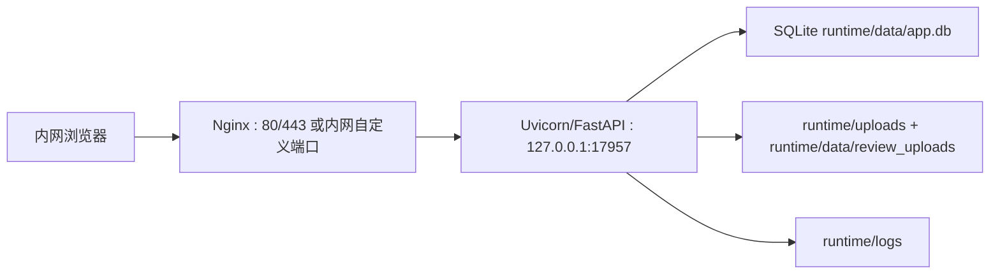

# Ubuntu + Nginx + systemd 部署与安全加固方案

> 2026-05-26 复核结论：本文的 Ubuntu 部署拓扑、Nginx/systemd/UFW 组合、runtime 独立目录和 EnvironmentFile 思路仍然正确；但当前仓库已经落地 SSE 短票据、基础 SSRF 防护和“注册不再自动提权为管理员”，同时仍保留 Bearer token + localStorage、公开注册默认开启、启动时自动确保 admin 存在等开发期默认行为。本文以下内容已按当前代码状态校准为“可直接指导生产部署”的版本。

## 1. 目标与范围

本文给出当前需求审查平台迁移到 Ubuntu 服务器后的推荐部署架构，并同步给出三类高优先级安全问题的修复方案：

1. SSE 认证不再通过 query token 传递
2. URL 抓取接口增加 SSRF 防护
3. 首次部署不开放自助注册，首个管理员通过离线方式初始化

同时补充：

- Nginx 作为统一入口层的接入方式
- systemd 作为后台守护方式
- UFW 防火墙与端口暴露策略
- Ubuntu 运行账户、目录权限、日志与环境变量管理
- 短期安全加固项与开放问题的推荐决策

## 2. 推荐总体方案

### 2.1 推荐架构

采用四层结构：

1. 浏览器访问 Nginx 入口
2. Nginx 负责入口流量管理、网段控制、请求大小限制、安全响应头、访问日志治理、反向代理
3. FastAPI/Uvicorn 只监听本机回环地址，处理业务逻辑
4. systemd 负责进程保活，UFW 负责主机层入站流量限制

推荐拓扑：



### 2.2 为什么推荐 Nginx

Nginx 在本项目里不是可有可无的装饰层，而是入口治理层。它主要解决四件事：

1. 收口端口暴露：Uvicorn 不再直接对整个内网暴露
2. 控制来源：按网段或 IP 允许访问
3. 统一限额：上传大小、请求体、超时、连接数、限流在入口层统一管理
4. 统一安全头与日志：减轻应用层负担，并降低 query 参数、上传异常等日志泄露面

### 2.3 不推荐的部署方式

不建议继续沿用“Uvicorn 直接监听 0.0.0.0 并裸暴露到内网”的方式。该模式在 Ubuntu 上存在以下问题：

1. 业务端口直接暴露
2. 无入口层访问控制
3. 无统一安全头和请求限额
4. 不利于后续接入 HTTPS、统一域名或反向代理策略

## 3. Ubuntu 目标部署形态

### 3.1 系统账户与目录

建议创建专用系统用户，例如 `prd-review`：

- 服务运行用户：`prd-review`
- 服务组：`prd-review`
- 项目部署目录：`/opt/prd-review/app`
- 运行时目录：`/opt/prd-review/runtime`
- 环境变量文件：`/etc/prd-review/prd-review.env`

推荐目录布局：

```text
/opt/prd-review/
├── app/                 # 代码目录（git checkout 或发布包）
├── runtime/
│   ├── data/
│   │   ├── app.db
│   │   ├── converted/
│   │   └── review_uploads/
│   ├── uploads/
│   └── logs/
└── venv/

/etc/prd-review/
└── prd-review.env
```

### 3.2 权限建议

推荐权限：

- `/etc/prd-review/prd-review.env`：`600`
- `/opt/prd-review/runtime`：`750`
- `/opt/prd-review/runtime/logs`：`750`
- `/opt/prd-review/runtime/data`：`750`
- `app.db`：`640` 或更严
- 服务进程 `umask`：`027`

目标是保证：

1. 只有服务用户可写运行时数据
2. 其他本机普通用户不可读取敏感环境变量
3. 日志、上传文件、数据库不会因为默认权限过宽而暴露给本机其他账户

## 4. Nginx + systemd + UFW 推荐配置

### 4.1 Uvicorn 运行方式

Uvicorn 只监听本机：

```bash
/opt/prd-review/venv/bin/uvicorn src.main:app \
  --host 127.0.0.1 \
  --port 17957 \
  --workers 1
```

说明：

- 保持 `workers=1`，因为当前依赖 SQLite
- 不再让 Uvicorn 直接监听 `0.0.0.0`
- 外部所有访问都必须经过 Nginx

### 4.2 systemd service 示例

建议新建 `/etc/systemd/system/prd-review.service`：

```ini
[Unit]
Description=PRD Review Web App
After=network.target
Wants=network.target

[Service]
Type=simple
User=prd-review
Group=prd-review
WorkingDirectory=/opt/prd-review/app
EnvironmentFile=/etc/prd-review/prd-review.env
Environment=PYTHONPATH=src
Environment=RUNTIME_ROOT=/opt/prd-review/runtime
UMask=0027
ExecStart=/opt/prd-review/venv/bin/uvicorn src.main:app --host 127.0.0.1 --port 17957 --workers 1
Restart=always
RestartSec=5
TimeoutStopSec=20
NoNewPrivileges=true
PrivateTmp=true
ProtectSystem=full
ProtectHome=true
ReadWritePaths=/opt/prd-review/runtime

[Install]
WantedBy=multi-user.target
```

说明：

- `EnvironmentFile` 存放 `JWT_SECRET` 等敏感变量
- `UMask=0027` 控制新建文件默认权限
- `ReadWritePaths` 只放开 runtime 目录写权限
- `NoNewPrivileges=true` 可减少提权面

### 4.3 Nginx 反向代理示例

建议新建 `/etc/nginx/sites-available/prd-review.conf`：

```nginx
server {
    listen 80;
    server_name _;

    # 仅允许指定内网段访问，示例按需调整
    allow 10.20.0.0/16;
    allow 192.168.10.0/24;
    deny all;

    client_max_body_size 60m;
    keepalive_timeout 30;

    # 基础安全响应头
    add_header X-Content-Type-Options nosniff always;
    add_header X-Frame-Options SAMEORIGIN always;
    add_header Referrer-Policy same-origin always;
    add_header Content-Security-Policy "default-src 'self'; img-src 'self' data: blob:; style-src 'self' 'unsafe-inline'; script-src 'self'; connect-src 'self'; frame-ancestors 'self'; base-uri 'self'; form-action 'self'" always;

    location / {
        proxy_pass http://127.0.0.1:17957;
        proxy_http_version 1.1;
        proxy_set_header Host $host;
        proxy_set_header X-Real-IP $remote_addr;
        proxy_set_header X-Forwarded-For $proxy_add_x_forwarded_for;
        proxy_set_header X-Forwarded-Proto $scheme;
        proxy_set_header Connection "";
        proxy_buffering off;
        proxy_read_timeout 3600;
    }

    # 对 SSE 进度流显式关闭代理缓冲
    location /api/review/ {
        proxy_pass http://127.0.0.1:17957;
        proxy_http_version 1.1;
        proxy_set_header Host $host;
        proxy_set_header X-Real-IP $remote_addr;
        proxy_set_header X-Forwarded-For $proxy_add_x_forwarded_for;
        proxy_set_header X-Forwarded-Proto $scheme;
        proxy_buffering off;
        proxy_cache off;
        proxy_read_timeout 3600;
    }
}
```

### 4.4 UFW 规则建议

原则是：

1. 对外只开放 Nginx 端口
2. 不开放 Uvicorn 17957
3. 仅允许指定办公网段访问入口端口

示例：

```bash
sudo ufw default deny incoming
sudo ufw default allow outgoing
sudo ufw allow from 10.20.0.0/16 to any port 80 proto tcp
sudo ufw allow from 192.168.10.0/24 to any port 80 proto tcp
sudo ufw enable
```

如启用 HTTPS，则对应开放 443。

## 5. 上线前必须修复的三项方案

## 5.1 SSE 不再使用 query token

### 5.1.1 推荐方案

推荐直接把整站 JWT 认证迁移为 HttpOnly Cookie。原因：

1. EventSource 会自动携带同源 Cookie
2. 前端不再需要 query token 拼接
3. 统一解决 localStorage 持久化 JWT 的风险
4. 为后续 token 缩短有效期、服务端失效控制打基础

### 5.1.2 改造目标

当前：

- 登录接口返回 JSON 中的 access token
- 前端写入 localStorage
- SSE 已改为先调用 `POST /api/auth/sse-ticket`，再使用短时一次性 `?ticket=...` 建链

改造后：

- 登录成功后后端通过 `Set-Cookie` 写入 `access_token`
- Cookie 属性建议：`HttpOnly; Path=/; SameSite=Lax`
- 若入口启 HTTPS，则再加 `Secure`
- 前端普通 fetch 调用改为 `credentials: 'same-origin'`
- SSE 直接 `new EventSource(url)`，不再拼 token
- 后端认证中间件优先从 Cookie 读取 token

说明：当前代码已经完成“主 JWT 不再出现在 SSE URL”这一步；Cookie 化仍是推荐终态，但不再是 Ubuntu 首次上线的唯一阻塞项。

### 5.1.3 后端改造点

1. `POST /api/auth/login`
   - 返回成功时设置 Cookie
   - 响应体可以保留基础用户信息，不再把 token 暴露给前端 JS

2. `get_current_user`
   - 支持从 `Authorization` 头读取 token
   - 同时支持从 Cookie 读取 token
   - 头优先或 Cookie 优先均可，但建议兼容一段时间

3. SSE 端点
   - 去掉 `Query(token)` 入口
   - 改用和普通接口一致的身份校验逻辑

4. 登出接口
   - 增加 `POST /api/auth/logout`
   - 服务端清空 Cookie

### 5.1.4 前端改造点

1. 去掉 localStorage 中 token 的持久化逻辑
2. `API.request()` 改成带 `credentials`
3. `EventSource` 不再拼接 query token
4. 初始化登录态不再依赖本地 token，而是调用 `/api/auth/me`

### 5.1.5 日志治理

即便完成 Cookie 改造，也建议：

1. Nginx access log 不记录完整 query string，或至少对敏感路径做单独日志格式
2. Uvicorn 访问日志不要落完整查询串
3. 审计日志里持续保留 token、authorization、secret 等字段脱敏策略

### 5.1.6 当前已落地的过渡方案

当前仓库已经采用以下折中方案：

- 继续保留普通 API 的 Bearer token
- 由后端新增 `POST /api/auth/sse-ticket` 签发 30-60 秒有效、一次性使用的短票据
- SSE 只带这个一次性票据，而不带主 JWT

这满足 Ubuntu 上线时“不要在 URL 上传主 JWT”的最低要求，但仍不是终态。若后续继续做 Cookie 化，可再移除前端 localStorage token。

## 5.2 URL 抓取增加 SSRF 防护

### 5.2.1 推荐策略

推荐默认关闭 URL 抓取功能，只有确认业务必须保留时才开启。

当前代码状态补充：仓库已具备基础 SSRF 防护，包括内网/回环/链路本地地址拦截、重定向重复校验、DNS rebinding 后连通 IP 再校验；但尚未实现“生产默认关闭 URL 抓取”的开关，也未实现域名白名单配置。因此在 Ubuntu 生产环境，如果业务并不依赖该能力，仍建议优先关闭或收口此接口。

如果保留，必须同时满足三层约束：

1. 功能开关：生产默认关闭，配置显式打开才可用
2. 域名白名单：仅允许预置域名或域名后缀
3. IP 拦截：解析后拒绝所有私网、回环、链路本地、保留地址

### 5.2.2 拦截范围

至少拒绝：

- `127.0.0.0/8`
- `10.0.0.0/8`
- `172.16.0.0/12`
- `192.168.0.0/16`
- `169.254.0.0/16`
- `::1/128`
- `fc00::/7`
- `fe80::/10`
- 以及其他保留网段、未指定地址、多播地址

### 5.2.3 实施细则

1. 仅允许 `http` / `https`
2. 先解析 hostname 到 A/AAAA 记录
3. 所有解析出的 IP 都必须通过公网校验
4. 如果任一 IP 落入禁止网段，则直接拒绝
5. 禁止自动跳转到新主机，或对每次重定向重复做同样校验
6. 限制返回内容大小、超时、Content-Type
7. 建议只允许文本型响应，不处理任意二进制下载

### 5.2.4 代码层方案

当前已有：

- URL scheme/hostname 校验
- 解析后内网 IP 拦截
- 重定向逐跳复验
- 连接建立后的 peer IP 再校验

建议继续补齐：

- `upload.url_fetch_enabled` 配置项，生产默认 `false`
- `upload.url_allowlist` 白名单配置
- 独立的 `validate_outbound_url(url)` 校验函数
- 独立的 `resolve_public_ips(hostname)` 解析与校验函数

### 5.2.5 Nginx/网络层辅助

Nginx 本身不适合解决 SSRF 根因，但可以辅助：

1. 服务器层面禁止对敏感内网网段出站访问
2. 如果机器有条件接出站防火墙，可对应用用户的出站访问做白名单
3. 在容器化或沙箱化时，把 URL 抓取放进单独受限执行单元

## 5.3 首次部署禁止自助注册抢占管理员

### 5.3.1 推荐策略

生产环境默认关闭公开注册；首个管理员通过离线命令初始化。

当前代码状态补充：注册接口已不再把“首个注册用户”自动提升为管理员，但仓库默认配置 `auth.allow_public_registration` 仍为 `true`，且数据库初始化阶段会自动确保 `admin` 账号存在。因此 Ubuntu 生产部署时，不能直接沿用仓库默认配置，必须显式覆盖注册策略，并确认管理员初始化方式。

推荐顺序：

1. 离线初始化管理员账号
2. 校验可登录
3. 再决定是否开启普通用户注册

### 5.3.2 推荐实现

更稳妥的目标实现是补一个离线 CLI。当前仓库尚未提供该 CLI，文档中的命令是推荐补齐项，而不是现成能力。例如：

```bash
python -m app.cli.init_admin --username admin_ops --password '...'
```

行为：

1. 若数据库内不存在管理员，则创建管理员
2. 若已存在管理员，则拒绝重复初始化
3. 操作写审计日志

### 5.3.3 配置策略

建议增加：

- `auth.allow_public_registration: false`
- `auth.bootstrap_admin_username`
- `auth.bootstrap_admin_password_hash` 或仅供首次导入的临时密码

其中更推荐 CLI 初始化，而不是在配置里存明文密码。如果短期内还未补 CLI，则至少应满足两点：

1. Ubuntu 生产环境显式设置 `auth.allow_public_registration: false`
2. 首次启动后立即核对默认 admin 初始化行为，并通过后台或离线 SQL/脚本完成密码轮换

### 5.3.4 兼容方案

如果必须保留注册接口：

1. 生产默认关闭
2. 仅管理员可在后台开启
3. 即便开启，注册用户默认只能是普通用户
4. “首个用户自动成为管理员”的逻辑必须移除

## 6. 短期应补的安全加固方案

## 6.1 JWT 从 localStorage 迁移到 Cookie

当前 SSE 主 JWT 泄露面已经通过 `sse-ticket` 收口；这一项现在更多是“生产加固”和“终态收敛”问题。终态建议：

- Access Token：HttpOnly Cookie
- SameSite：Lax 或 Strict
- HTTPS 下启用 Secure
- 前端 JS 不再直接接触 token

## 6.2 安全响应头

建议由 Nginx 统一注入：

- `Content-Security-Policy`
- `X-Content-Type-Options: nosniff`
- `X-Frame-Options: SAMEORIGIN`
- `Referrer-Policy: same-origin`
- 若启 HTTPS，再加 `Strict-Transport-Security`

注意：当前前端存在一定量 `innerHTML` 渲染，CSP 需要与现有脚本加载方式兼容，建议先以 `script-src 'self'` 为目标，避免允许任意外部脚本。

## 6.3 密码策略与登录限流

推荐目标：

1. 密码最小长度提高到 12 位
2. 管理员密码要求更严格，可要求字母、数字、特殊字符组合
3. 登录接口按 `IP + username` 做失败计数
4. 连续失败 5 次锁定 10-15 分钟
5. 管理员账户可额外缩短阈值并加强审计

如希望先在入口层快速落地，可先在 Nginx 做基础限流，再在应用层补细粒度的账号锁定。

## 6.4 Token 有效期与服务端失效能力

当前 access token 时长偏长。建议：

1. 将 access token 从 480 分钟下调到 60-120 分钟
2. 增加 token 版本号或会话版本号字段
3. 用户改密、用户被禁用、管理员强制退出时，服务端递增会话版本，使旧 token 失效

如果后续引入 refresh token，则 refresh token 同样建议走 HttpOnly Cookie。

## 7. Ubuntu 部署层应补的治理方案

## 7.1 不使用 root 运行服务

必须使用专用系统用户。理由：

1. 降低应用被利用后的横向影响面
2. 避免上传、日志、数据库文件被 root 所有，后续运维困难
3. 能更清晰地做出站和目录权限控制

## 7.2 EnvironmentFile 管理 JWT_SECRET

不要依赖启动时临时生成密钥。推荐：

- 文件路径：`/etc/prd-review/prd-review.env`
- 权限：`600`
- 拥有者：`root:root`
- 由 systemd 读取注入环境

示例：

```bash
JWT_SECRET=请填64字节以上随机密钥
CONFIG_PATH=/opt/prd-review/app/src/config.yaml
```

## 7.3 审计与日志保留

建议把以下操作明确纳入审计：

1. 登录成功/失败
2. 管理员创建、禁用、删除用户
3. 修改密码
4. 模型配置增删改、API Key 更新
5. 审查任务创建、取消、失败、继续执行
6. 关键上传与 URL 抓取调用

日志保留策略建议：

- 应用运行日志：30 天
- 审计日志：180 天或按部门合规要求
- 大文件上传日志可单独裁剪
- 使用 `logrotate` 做轮转与压缩

## 8. 开放问题与推荐决策

## 8.1 Ubuntu 后是否允许所有内网用户自助注册

推荐默认答案：不允许。

建议：

- 生产默认关闭公开注册
- 由管理员创建账号
- 若确有需要，再单独评估是否开放普通用户自助注册

## 8.2 URL 抓取功能是否必须保留

推荐默认答案：默认关闭。

如果只是内部文档评审，本项目核心能力并不依赖 URL 抓取；它的风险明显高于收益。除非有明确的业务场景，否则不建议在生产开启。

## 8.3 是否通过反向代理统一入口访问

推荐默认答案：是。

建议将 Nginx 作为统一入口。这样后续若要加：

- HTTPS
- 统一域名
- 访问白名单
- 安全头
- 上传大小限制
- 限流

都可以优先在代理层完成。

## 9. 分阶段实施建议

### Phase 1：上线前必须完成

1. Uvicorn 改为只监听 `127.0.0.1`
2. Ubuntu 接入 Nginx + systemd + UFW
3. 保持当前 `sse-ticket` 方案或更进一步改成 Cookie 鉴权，但无论哪种方式都不能再让主 JWT 出现在 URL 中
4. 关闭公开注册；如果继续沿用当前自动确保 `admin` 存在的逻辑，首次部署后必须立即轮换管理员密码；更理想的做法是补齐离线初始化 CLI
5. URL 抓取如非必需，生产建议默认关闭；如保留，至少依赖现有 SSRF 防护，并补充开关/白名单策略
6. 使用 EnvironmentFile 固定 `JWT_SECRET`，并明确注入 `RUNTIME_ROOT`、`CONFIG_PATH`

### Phase 2：上线后一周内完成

1. JWT 从 localStorage 迁移到 HttpOnly Cookie
2. 密码最小长度提升到 12 位
3. 登录限流与账号短时锁定
4. Nginx 补全安全响应头
5. 审计日志保留周期与轮转方案落地

### Phase 3：后续演进

1. 服务端 token 失效机制
2. 可选 refresh token
3. 更严格的出站访问控制
4. 审计报表与异常告警

## 10. 验收标准

完成后应满足以下条件：

1. 外部无法直接访问 `17957` 端口
2. Uvicorn 仅监听 `127.0.0.1`
3. 未授权网段访问 Nginx 被拒绝
4. SSE 建链时 URL 中不再出现主 JWT；若继续使用 `ticket`，则票据应短时有效且一次性消费
5. 生产环境默认不能公开注册；若沿用当前自动初始化 `admin` 逻辑，则已完成首次登录后的密码轮换
6. URL 抓取关闭时接口不可用；开启时能阻断私网/回环/链路本地地址
7. `JWT_SECRET` 由 systemd EnvironmentFile 提供，重启后不会漂移
8. runtime 目录新建文件权限符合 `umask 027` 预期
9. 关键安全操作可在审计日志中检索
10. 若完成 Cookie 化，则浏览器开发者工具中不再能从 localStorage 读取业务 token

## 11. 推荐结论

对于当前项目，推荐的最终结论是：

1. Ubuntu 部署应采用 `Nginx + systemd + UFW + 本机回环 Uvicorn` 组合
2. 截至 2026-05-26，主 JWT 已不再通过 SSE URL 传输，基础 SSRF 防护已落地，注册接口也已移除“首个用户自动成为管理员”的行为；这些项不再是从零开始实施
3. Ubuntu 生产部署前仍需重点处理的是“开发默认值收口”：127.0.0.1 回环监听、固定 `JWT_SECRET`、关闭公开注册、确认默认 admin 初始化策略、决定是否保留 URL 抓取
4. 若资源有限，短期优先顺序建议为：
   - 先收口部署面：Nginx/UFW/systemd/127.0.0.1
   - 再收口生产默认配置：`allow_public_registration=false`、固定 `JWT_SECRET`、首次 admin 密码轮换
   - 再决定是否保留 URL 抓取功能；若保留，补齐开关/白名单
   - 最后再推进 Cookie 化、登录限流和 token 失效机制等增强项
