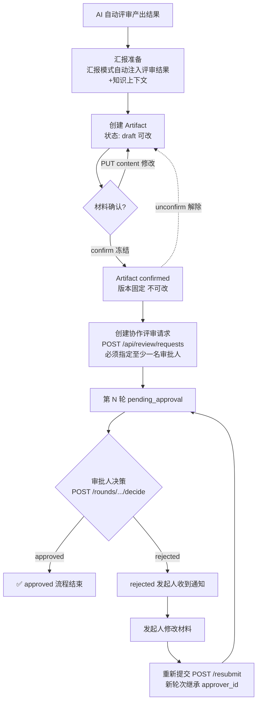
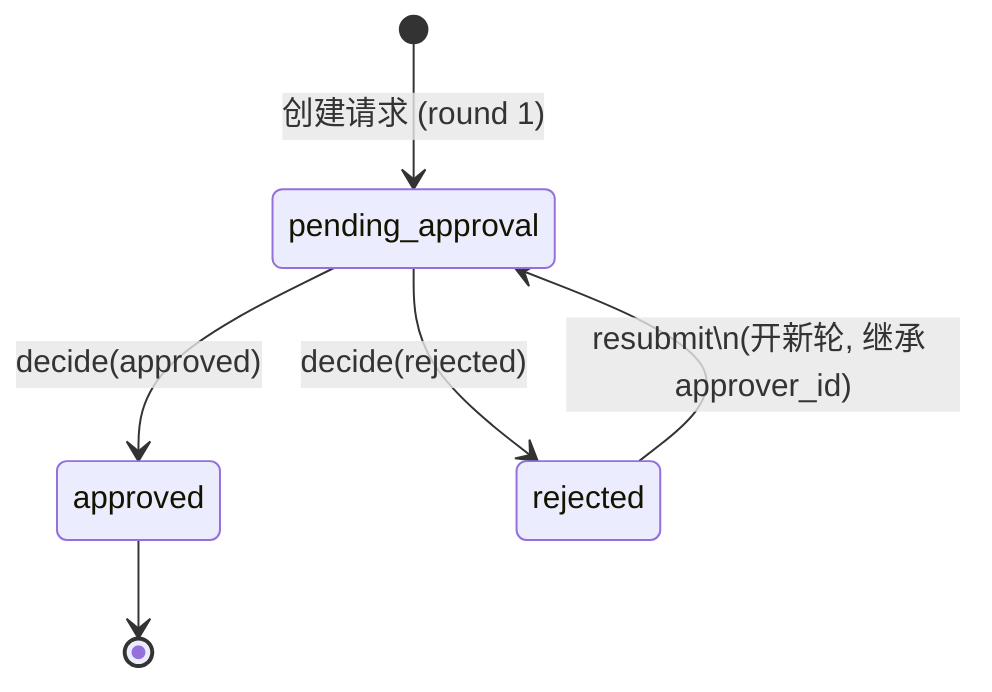
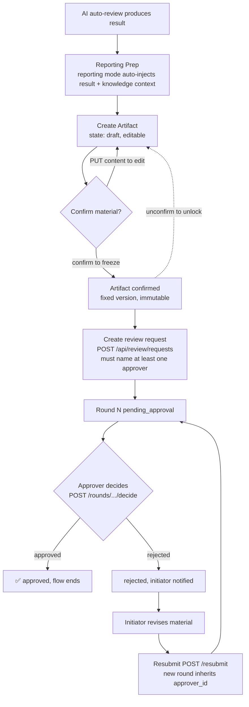
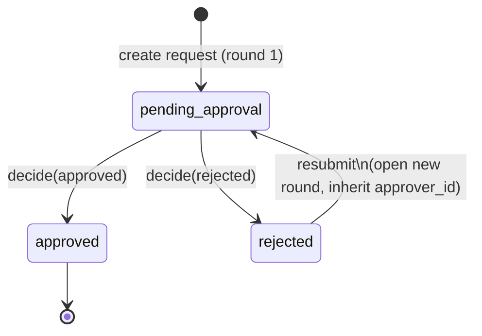

# 协作评审 / Collaborative Review

<p align="center">
	<a href="#中文"><strong>中文</strong></a>
	<span> | </span>
	<a href="#english"><strong>English</strong></a>
</p>

<a id="中文"></a>

## 中文

本文档面向**评审参与者**(评审人、审批人、发起人),讲解「AI 需求评审工作流平台」的**协作评审(P4)**能力。

> 协作评审是 AI 自动评审之后的高级阶段。如果你还不熟悉基础的「上传 DOCX → AI 自动评审」流程,请先阅读 [user-guide.md](user-guide.md)。

### 1. 它解决什么问题

传统线下评审的痛点是:AI 评审产出了结果,但**人是断层的**——评审结论发到群里,谁该拍板不清楚;改了一版,上一版对没对齐没人记得;审批人看得到结论却没责任边界。

协作评审把人正式纳入流程,形成闭环:

**汇报准备(AI 评审产出)→ 材料确认(Artifact 冻结)→ 协作评审(多轮审批 + 评论 + 通知)**

这三步是理解全文的钥匙:

| 阶段 | 谁在做 | 产出 | 状态含义 |
|------|--------|------|----------|
| **汇报准备** | AI(汇报模式自动注入评审结果和知识上下文) | 可呈现的汇报材料(Artifact,初始为 `draft`) | 内容可改 |
| **材料确认** | 发起人 / Reviewer / Approver / 项目管理员 | 冻结(frozen)的 Artifact,版本固定 | 内容锁定,不可改 |
| **协作评审** | 审批人(可决策)+ Reviewer(可评论)+ Observer(只读) | 审批决定 + 评论 + 通知 | 以「轮次」为单位推进决策 |

核心思想:**先冻结材料,再审材料**——评审对象必须是确定的版本,而不是一边审一边还在改的草稿。

### 2. 整体流程图



**为什么强调「冻结后再审」**:协作评审以**轮次(Round)**为单位决策,每个轮次锁定一份材料快照。如果材料还能被随意改动,审批人就失去了判断基准。

### 3. 协作评审请求(ReviewRequest)

#### 3.1 创建请求

```
POST /api/review/requests
```

请求体:

```json
{
  "project_id": 12,
  "approver_ids": [42],
  "goal": "确认 P4 协作评审方案是否可进入开发"
}
```

**关键规则**:

- **必须指定至少一名审批人(`approver_ids` 必填、非空)**。否则返回 `422`「至少指定一名审批人」。
  > 这是 **BUG-084** 的修复:早期版本允许创建一个「无人审批」的请求,导致流程卡死、永远无人能拍板。
- 只有**项目创建者**能发起协作审查;否则 `403`「只有项目创建者可以发起协作审查」。
- 创建后:自动开第 1 轮(`round_no=1`)、把发起人加为 `Reviewer`、把审批人加为 `Approver`,请求状态变为 `pending_approval`。
- 审批人会收到一条**实时通知**(采用 `defer_push`:数据库提交成功后才推送,避免「幽灵通知」**BUG-106**)。

#### 3.2 查询

| 端点 | 说明 |
|------|------|
| `GET /api/review/requests?project_id=...` | 列表(按项目过滤时做权限收敛:非创建者只能看到自己参与的请求) |
| `GET /api/review/requests/{request_id}` | 请求详情 |

### 4. 多轮审批(核心)

协作评审不是「一次性通过/驳回」,而是可以**多轮来回**。每一轮是一个 `ReviewRound`,记录该轮提交的快照、指定审批人、以及决策结果。

#### 4.1 轮次与决策

| 端点 | 说明 |
|------|------|
| `GET /api/review/requests/{request_id}/rounds` | 该请求的所有轮次 |
| `POST /api/review/rounds/{round_id}/decide` | 审批人做决策 |

决策请求体:

```json
{ "decision": "approved", "comment": "方案明确,可以进入开发" }
```

`decision` 只能是 `approved` 或 `rejected`(非法值返回 `422`)。已决策过的轮次不能再改(`400`「轮次已决策」)。

#### 4.2 审批权限校验(重点)

不是任何参与者都能做决策,系统分两层校验:

1. 如果该轮次**指定了 `approver_id`**,但当前用户不是这个人 → 进一步检查该用户是否为该请求的 `Approver` 参与者;都不是则 `403`「只有指定的审批人可以做出决策」。
2. 如果**未指定 `approver_id`** → 当前用户必须是该请求中角色为 `Approver` 的参与者;否则 `403`「只有审批人角色可以做出决策」。

决策结果会同步更新请求状态:`approved` → 请求 `approved`;`rejected` → 请求 `rejected`,并通知发起人。

#### 4.3 重新提交(resubmit)

被驳回后,发起人修改材料可重新提交,**开新轮次**:

```
POST /api/review/requests/{request_id}/resubmit
```

规则:

- 只有 `rejected` 状态的请求可重新提交(`400`「只有被驳回的请求可以重新提交」)。
- 只有**发起人**能重新提交(`403`「只有发起人可以重新提交」)。
- **新轮次会自动继承上一轮的 `approver_id`**,避免「上一轮有人审、新一轮没人审」。
- 状态重新置为 `pending_approval`,并通知审批人(同样使用 `defer_push`)。

#### 4.4 多轮状态流转



> 设计要点:**轮次是审批的最小决策单位,请求是流程的聚合单位**。一个请求可以经历多轮,每轮独立决策;只要任意一轮 `approved`,整个请求即 `approved`。

### 5. 参与人管理(Participant)

协作评审围绕「参与者 + 角色」组织权限。

| 端点 | 说明 |
|------|------|
| `GET /api/review/requests/{request_id}/participants` | 参与者列表 |
| `POST /api/review/requests/{request_id}/participants` | 添加参与者(仅发起人或项目创建者) |

三种角色:

| 角色 | 能力 | 典型场景 |
|------|------|----------|
| **Observer** | 只读,不可写、不可确认 | 仅需知会的相关方 |
| **Reviewer** | 可写、可评论、可确认材料 | 一起打磨方案的人 |
| **Approver** | 可写、可确认、**可做审批决策** | 拍板的人 |

补充:发起人和项目管理员(admin/owner)天然可写、可确认。`role` 必须是 `Reviewer`/`Approver`/`Observer` 之一,否则 `422`。

### 6. 对象级访问与权限拆分(安全重点)

协作评审的权限不是「登录就能用」,而是基于**对象级访问控制**,做到读 / 写分离。详见 [security.md](security.md)。

#### 6.1 读写分离

- **读(read)** vs **写(write)** 拆开校验:同一对象,有的角色只能看、有的能改。
- **Observer 是只读**:不可写、不可确认材料。系统会**阻止只读角色(Observer / 空间 viewer)篡改内容**。
- 发起人 / Reviewer / Approver / 项目管理员可写、可确认。

#### 6.2 BOLA 防护

- **BOLA**(Broken Object-Level Authorization,对象级越权):系统阻止「用户 A 用自己的登录态访问/改动用户 B 的请求、产物、评论」。
- 每个涉及 `object_type + object_id` 的操作都会经过 `assert_object_access` / `assert_artifact_access` / `assert_artifact_write_access`,按对象归属解析权限。
- 无法访问时返回 `404`(而非 `403`),避免泄露对象是否存在。

#### 6.3 统一权限入口

- **`require_action(member, action)`** + **`is_active_member(member)`** 覆盖所有 review 域操作,把「空间成员角色(owner/admin/member/viewer)→ 允许的动作(manage/write/read)」的映射集中收口,杜绝零散的 `if role == ...` 判断。
- 审计:每次拒绝都会写一条 `workspace_access.deny` 警告日志(含 user_id / role / action / 原因)。

### 7. 产物与快照(Artifact & Snapshot)

#### 7.1 Artifact 生命周期

```
POST /api/review/artifacts                      创建(初始 draft)
PUT  /api/review/artifacts/{id}/content         更新内容(仅 draft 态可改)
POST /api/review/artifacts/{id}/confirm         确认 → 冻结(confirmed,不可改)
POST /api/review/artifacts/{id}/unconfirm       解除确认 → 回到 draft 可改
GET  /api/review/artifacts                      列表
GET  /api/review/artifacts/{id}                 详情
```

**状态规则**:

- 创建后为 `draft`,此时 `PUT .../content` 可改内容。
- **`confirm` 把 Artifact 冻结**,此后内容不可改——这就是「材料确认」阶段,产物变为评审的稳定基线。
- 冻结后需要再改?用 **`unconfirm`** 解除,回到 `draft`。
- 非 `draft` 态尝试改内容会返回 `400`。
- 确认 / 写入都需经过 `assert_artifact_write_access`(区分 `write` 和 `confirm` 两种动作)。

`artifact_type` 支持:`html_presentation` / `svg_summary` / `mermaid_diagram` / `explanation_json` 等。

#### 7.2 知识快照(KnowledgeSnapshot)

汇报 / 评审依赖的「项目来源」会自动做**版本化快照**,保证「现在审的内容」和「将来回溯的内容」一致:

```
POST /api/review/snapshots        创建
GET  /api/review/snapshots        列表(按 project_id 或 request_id)
GET  /api/review/snapshots/{id}   详情
```

快照记录 `prompt_version`、`skill_version`、`model_config_hash` 等,可复现当时的评审上下文。

### 8. 评论与 @mention

```
GET    /api/notifications/comments                  评论列表(按 object 过滤)
POST   /api/notifications/comments                  发表评论(支持 @mention 和回复)
DELETE /api/notifications/comments/{comment_id}     删除评论(仅作者)
PUT    /api/notifications/comments/{comment_id}/resolve   解决评论
```

能力:

- **@mention**:评论 body 中写 `@username`,系统正则提取后给被提及的人发通知。
- **回复**:传 `parent_id` 回复原评论,原作者收到通知。
- **解决评论**:`resolution` 可为 `resolved`(正常解决)或 `forced_pass`(强制通过)。**P5.C.2** 起,解决评论会记录**解决人 `resolved_by`**,可追溯是谁关闭的讨论。
- 评论可挂在 `review_request` / `review_round` / `artifact` / `knowledge_source` 上。

### 9. 实时通知(SSE + 铃铛 Inbox)

审批、评论、@mention 等事件实时推送到右上角铃铛。

```
GET  /api/notifications/stream          SSE 流(需短票据 ticket)
GET  /api/notifications/unread-count    未读数
PUT  /api/notifications/{id}/read       标记已读
PUT  /api/notifications/{id}/archive    归档
POST /api/notifications/batch-read      批量已读(P5 增强)
```

说明:

- **SSE 认证**:EventSource 不支持自定义 Header,前端先 `POST /api/auth/sse-ticket` 拿**短票据**,再以 `?ticket=...` 传入流端点;票据一次性、有过期。
- 流每 5 秒发一次 `heartbeat` 保活,响应头带 `X-Accel-Buffering: no` 避免 Nginx 缓冲。
- **`defer_push` 机制**(贯穿全文):创建请求、决策、重新提交、确认产物、评论等关键通知,都是先缓冲、**数据库 commit 成功后才推送**。这样即便事务回滚,也不会发出指向已回滚行的「幽灵通知」(BUG-106 的根因修复)。

### 10. 常见问题

- **Q:创建协作评审时被 422「至少指定一名审批人」?**
  A:必须传非空的 `approver_ids`。这是 BUG-084 的硬约束——没有审批人,流程就没人能拍板。

- **Q:重新提交后谁来审?**
  A:新轮次**自动继承上一轮的 `approver_id`**,默认还是同一位审批人;不需要重新指定,避免「新一轮没人审」。

- **Q:为什么审批人说自己不能决策?**
  A:检查两点:① 该轮次是否指定了 `approver_id` 且不是他本人;② 他是否是该请求中 `Approver` 角色的参与者。任一不满足都会 `403`。

- **Q:Observer 想改内容被拒?**
  A:符合预期。Observer / 空间 viewer 是只读角色,系统会阻止只读角色篡改内容。需要可写就让发起人把他改成 `Reviewer`。

- **Q:已经 confirm 的 Artifact 还能改吗?**
  A:不能直接改。先 `unconfirm` 回到 `draft`,改完再 `confirm`。冻结是为了让评审基线稳定。

### 相关文档

- [user-guide.md](user-guide.md) — 基础评审(上传 DOCX → AI 自动评审)完整流程
- [security.md](security.md) — BOLA、读写分离、权限模型的完整说明
- [api-reference.md](api-reference.md) — 所有端点的参数与响应结构
- [getting-started.md](getting-started.md) — 本地跑通平台

---

<a id="english"></a>

## English

This document explains the **Collaborative Review (P4)** capability of the AI Requirement Review Workflow Platform, written for **review participants** (reviewers, approvers, initiators).

> Collaborative review is the advanced stage that comes *after* AI auto-review. If you are new to the basic "upload a DOCX → AI auto-review" flow, start with [user-guide.md](user-guide.md).

### 1. The problem it solves

The pain of traditional offline review: AI produces a result, but **humans are disconnected** — the verdict lands in a group chat with no clear owner; a new revision is made but no one remembers what the last one agreed on; approvers see the conclusion but have no clear accountability.

Collaborative review formally brings humans into the loop, closing it:

**Reporting Prep (AI produces output) → Material Confirmation (Artifact frozen) → Collaborative Review (multi-round approval + comments + notifications)**

These three steps are the key to the whole document:

| Stage | Who | Output | State meaning |
|-------|-----|--------|---------------|
| **Reporting Prep** | AI (reporting mode auto-injects review result + knowledge context) | A presentable report material (Artifact, starts as `draft`) | Content editable |
| **Material Confirmation** | Initiator / Reviewer / Approver / Project admin | A frozen Artifact with a fixed version | Content locked, immutable |
| **Collaborative Review** | Approver (decides) + Reviewer (comments) + Observer (read-only) | Approval decisions + comments + notifications | Advances decision per **Round** |

Core idea: **freeze the material first, then review it** — the object under review must be a fixed version, not a draft still being edited mid-review.

### 2. End-to-end flow



**Why "freeze then review":** Collaborative review decides per **Round**, and each round locks a snapshot of the material. If the material can still be freely changed, the approver loses a stable basis to judge.

### 3. The review request (ReviewRequest)

#### 3.1 Create

```
POST /api/review/requests
```

Body:

```json
{
  "project_id": 12,
  "approver_ids": [42],
  "goal": "Confirm whether the P4 collaborative-review plan is ready for development"
}
```

**Key rules:**

- **At least one approver is required (`approver_ids` must be non-empty).** Otherwise `422` "at least one approver must be specified".
  > This is the **BUG-084** fix: an earlier version allowed creating a request with no approver, freezing the flow with no one able to decide.
- Only the **project creator** can start a collaborative review; otherwise `403` "only the project creator can start a collaborative review".
- After creation: round 1 (`round_no=1`) is opened, the initiator is added as `Reviewer`, approvers are added as `Approver`, and the request enters `pending_approval`.
- Approvers receive a **real-time notification** (using `defer_push`: pushed only after the DB commit succeeds, avoiding "ghost notifications" — **BUG-106**).

#### 3.2 Query

| Endpoint | Description |
|----------|-------------|
| `GET /api/review/requests?project_id=...` | List (when filtering by project, visibility is narrowed: non-creators see only requests they participate in) |
| `GET /api/review/requests/{request_id}` | Request detail |

### 4. Multi-round approval (core)

Collaborative review is not "one-shot approve/reject" — it can go **multiple rounds**. Each round is a `ReviewRound` recording the submitted snapshot, the assigned approver, and the decision.

#### 4.1 Rounds and decisions

| Endpoint | Description |
|----------|-------------|
| `GET /api/review/requests/{request_id}/rounds` | All rounds of a request |
| `POST /api/review/rounds/{round_id}/decide` | Approver makes a decision |

Decision body:

```json
{ "decision": "approved", "comment": "Plan is clear, ready for development" }
```

`decision` must be `approved` or `rejected` (invalid values return `422`). An already-decided round cannot be changed (`400` "round already decided").

#### 4.2 Approval permission check (important)

Not every participant can decide — the system checks two layers:

1. If the round **has an `approver_id`** but the current user is not that person → further check whether the user is an `Approver` participant of this request; otherwise `403` "only the designated approver can make a decision".
2. If **no `approver_id`** is set → the current user must be an `Approver` participant; otherwise `403` "only an approver role can make a decision".

The decision also updates the request status: `approved` → request `approved`; `rejected` → request `rejected`, and the initiator is notified.

#### 4.3 Resubmit

After rejection, the initiator can revise the material and resubmit, **opening a new round**:

```
POST /api/review/requests/{request_id}/resubmit
```

Rules:

- Only a `rejected` request can be resubmitted (`400` "only a rejected request can be resubmitted").
- Only the **initiator** can resubmit (`403` "only the initiator can resubmit").
- The **new round automatically inherits the previous round's `approver_id`**, avoiding "round N had an approver but round N+1 has none".
- Status resets to `pending_approval`, and the approver is notified (again via `defer_push`).

#### 4.4 Multi-round state flow



> Design point: **the round is the smallest decision unit; the request is the aggregation unit.** A request can span many rounds, each decided independently; as soon as any round is `approved`, the whole request is `approved`.

### 5. Participant management

Collaborative review organizes permissions around "participants + roles".

| Endpoint | Description |
|----------|-------------|
| `GET /api/review/requests/{request_id}/participants` | Participant list |
| `POST /api/review/requests/{request_id}/participants` | Add a participant (initiator or project creator only) |

Three roles:

| Role | Capabilities | Typical use |
|------|--------------|-------------|
| **Observer** | Read-only, cannot write or confirm | Stakeholders who only need to be informed |
| **Reviewer** | Can write, comment, confirm material | People shaping the proposal together |
| **Approver** | Can write, confirm, **and make approval decisions** | The decision-maker |

Additionally: the initiator and project admins (admin/owner) can write and confirm by default. `role` must be one of `Reviewer`/`Approver`/`Observer`, otherwise `422`.

### 6. Object-level access and permission split (security focus)

Collaborative-review permissions are not "logged in = can use" — they are based on **object-level access control** with read/write separation. See [security.md](security.md) for the full model.

#### 6.1 Read/write separation

- **Read** vs **write** are validated separately: the same object may be readable by some roles and editable by others.
- **Observer is read-only**: cannot write or confirm material. The system **prevents read-only roles (Observer / workspace viewer) from tampering with content**.
- Initiator / Reviewer / Approver / project admins can write and confirm.

#### 6.2 BOLA protection

- **BOLA** (Broken Object-Level Authorization): the system stops "user A using their own session to access or alter user B's request, artifact, or comment".
- Every operation involving `object_type + object_id` passes through `assert_object_access` / `assert_artifact_access` / `assert_artifact_write_access`, resolving permission by object ownership.
- On denial it returns `404` (not `403`) to avoid leaking whether the object exists.

#### 6.3 Unified permission entry

- **`require_action(member, action)`** + **`is_active_member(member)`** cover all review-domain operations, centralizing the "workspace member role (owner/admin/member/viewer) → allowed actions (manage/write/read)" mapping and eliminating scattered `if role == ...` checks.
- Auditing: every denial writes a `workspace_access.deny` warning log (with user_id / role / action / reason).

### 7. Artifacts and snapshots

#### 7.1 Artifact lifecycle

```
POST /api/review/artifacts                      create (starts as draft)
PUT  /api/review/artifacts/{id}/content         update content (only draft is editable)
POST /api/review/artifacts/{id}/confirm         confirm → freeze (confirmed, immutable)
POST /api/review/artifacts/{id}/unconfirm       undo confirmation → back to draft
GET  /api/review/artifacts                      list
GET  /api/review/artifacts/{id}                 detail
```

**State rules:**

- Created as `draft`; `PUT .../content` can edit it.
- **`confirm` freezes the Artifact** — after this the content is immutable. This is the "Material Confirmation" stage: the artifact becomes the stable baseline for review.
- Need to change it after freezing? Use **`unconfirm`** to return to `draft`.
- Editing non-draft content returns `400`.
- Both confirm and write pass through `assert_artifact_write_access` (distinguishing `write` vs `confirm` actions).

`artifact_type` supports: `html_presentation` / `svg_summary` / `mermaid_diagram` / `explanation_json`, etc.

#### 7.2 Knowledge snapshot

The "project source" that reporting/review relies on is **auto-snapshotted with versioning**, so "what is reviewed now" matches "what can be traced later":

```
POST /api/review/snapshots        create
GET  /api/review/snapshots        list (by project_id or request_id)
GET  /api/review/snapshots/{id}   detail
```

The snapshot records `prompt_version`, `skill_version`, `model_config_hash`, etc., so the review context at the time is reproducible.

### 8. Comments and @mention

```
GET    /api/notifications/comments                  list comments (filter by object)
POST   /api/notifications/comments                  post a comment (supports @mention and replies)
DELETE /api/notifications/comments/{comment_id}     delete a comment (author only)
PUT    /api/notifications/comments/{comment_id}/resolve   resolve a comment
```

Capabilities:

- **@mention**: write `@username` in the body; the system extracts it via regex and notifies the mentioned user.
- **Replies**: pass `parent_id` to reply to a comment; the original author is notified.
- **Resolve**: `resolution` can be `resolved` (normal) or `forced_pass` (forced). Since **P5.C.2**, resolving records **who resolved it (`resolved_by`)**, so closed discussions are traceable.
- Comments can attach to `review_request` / `review_round` / `artifact` / `knowledge_source`.

### 9. Real-time notifications (SSE + bell inbox)

Approval, comment, and @mention events are pushed in real time to the bell icon at the top right.

```
GET  /api/notifications/stream          SSE stream (needs a short ticket)
GET  /api/notifications/unread-count    unread count
PUT  /api/notifications/{id}/read       mark read
PUT  /api/notifications/{id}/archive    archive
POST /api/notifications/batch-read      batch mark-read (P5 enhancement)
```

Notes:

- **SSE auth**: EventSource cannot set custom headers, so the frontend first `POST /api/auth/sse-ticket` to get a **short ticket**, then passes it as `?ticket=...` to the stream endpoint; the ticket is single-use and expires.
- The stream sends a `heartbeat` every 5 seconds to stay alive, with the `X-Accel-Buffering: no` header to avoid Nginx buffering.
- **`defer_push` mechanism** (throughout this doc): key notifications — request created, decision, resubmit, artifact confirmed, comment — are buffered and **pushed only after the DB commit succeeds**. This way, even if the transaction rolls back, no "ghost notification" pointing to a rolled-back row is emitted (the root-cause fix for BUG-106).

### 10. FAQ

- **Q: I got 422 "at least one approver must be specified" when creating a review?**
  A: You must pass a non-empty `approver_ids`. This is the BUG-084 hard constraint — without an approver, no one can decide and the flow stalls.

- **Q: After resubmitting, who reviews it?**
  A: The new round **inherits the previous round's `approver_id`**, so by default it's the same approver; you don't need to re-specify, avoiding "a new round with no approver".

- **Q: Why can't our approver make a decision?**
  A: Check two things: ① whether the round has an `approver_id` that isn't them; ② whether they are an `Approver` participant of this request. Either failing yields `403`.

- **Q: An Observer was blocked from editing content?**
  A: That's expected. Observer / workspace viewer are read-only roles; the system prevents read-only roles from tampering with content. To make them writable, the initiator should change their role to `Reviewer`.

- **Q: Can a confirmed Artifact still be changed?**
  A: Not directly. First `unconfirm` back to `draft`, edit, then `confirm` again. Freezing keeps the review baseline stable.

### Related docs

- [user-guide.md](user-guide.md) — basic review (upload DOCX → AI auto-review) full flow
- [security.md](security.md) — full explanation of BOLA, read/write separation, and the permission model
- [api-reference.md](api-reference.md) — parameters and response shapes for all endpoints
- [getting-started.md](getting-started.md) — run the platform locally
