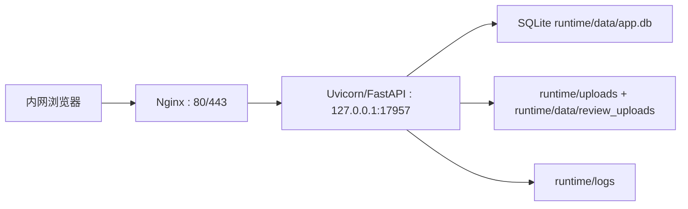
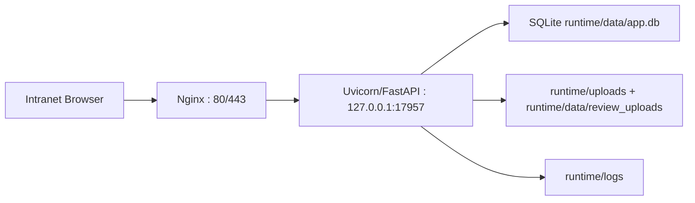

# 部署加固指南 / Deployment Hardening

<p align="center">
	<a href="#中文"><strong>中文</strong></a>
	<span> | </span>
	<a href="#english"><strong>English</strong></a>
</p>

<a id="中文"></a>

## 中文

本文讲目标服务器（以 Ubuntu 为例）上的**部署拓扑与加固操作**：Nginx 入口、systemd 守护、UFW 防火墙、目录权限。与 [打包与部署指南](packaging-and-deployment.md) 互补——那篇讲代码如何从开发机分发到服务器，本文讲服务器上的网络拓扑与加固。

> 安全改造的**设计思路与决策记录**见 `design/3-plan/安全加固方案.md`；基于代码实证的**权限与安全模型**见 [安全与权限](security.md)。

### 1. 推荐架构

采用四层结构，外部不直接接触应用进程：

1. 浏览器访问 **Nginx** 入口（80/443 或内网自定义端口）
2. Nginx 负责入口流量管理、网段控制、请求大小限制、安全响应头、访问日志治理、反向代理
3. **FastAPI/Uvicorn 只监听本机回环地址**（127.0.0.1:17957），处理业务逻辑
4. **systemd** 负责进程保活，**UFW** 负责主机层入站流量限制



**为什么不裸暴露 Uvicorn**：直接让 Uvicorn 监听 `0.0.0.0` 并暴露到内网，存在业务端口直暴、无入口访问控制、无统一安全头与请求限额、不利后续接 HTTPS 等问题。Nginx 在本项目里不是装饰层，而是入口治理层。

### 2. 系统账户与目录布局

创建专用系统用户（如 `prd-review`），**不使用 root 运行服务**：

- 服务运行用户/组：`prd-review`
- 项目部署目录：`/opt/prd-review/app`
- 运行时目录：`/opt/prd-review/runtime`
- 环境变量文件：`/etc/prd-review/prd-review.env`

```text
/opt/prd-review/
├── app/                 # 代码目录（git checkout 或发布包）
├── runtime/
│   ├── data/            # app.db、converted/、review_uploads/
│   ├── uploads/
│   └── logs/
└── venv/

/etc/prd-review/
└── prd-review.env       # JWT_SECRET 等敏感变量
```

**权限建议**：

| 路径 | 权限 |
|------|------|
| `/etc/prd-review/prd-review.env` | `600` |
| `/opt/prd-review/runtime` | `750` |
| `runtime/logs`、`runtime/data` | `750` |
| `app.db` | `640` 或更严 |
| 服务进程 `umask` | `027` |

目标：只有服务用户可写运行时数据；其他本机用户不可读敏感环境变量；日志/上传/数据库不因默认权限过宽而暴露。

### 3. Uvicorn 运行方式

Uvicorn 只监听本机回环，保持单 worker（依赖 SQLite）：

```bash
/opt/prd-review/venv/bin/uvicorn src.main:app \
  --host 127.0.0.1 \
  --port 17957 \
  --workers 1
```

外部所有访问都必须经过 Nginx，17957 端口不对外开放。

### 4. systemd service 配置

新建 `/etc/systemd/system/prd-review.service`：

```ini
[Unit]
Description=PRD Review Web App
After=network.target
Wants=network.target

[Service]
Type=simple
User=prd-review
Group=prd-review
WorkingDirectory=/opt/prd-review/app
EnvironmentFile=/etc/prd-review/prd-review.env
Environment=PYTHONPATH=src
Environment=RUNTIME_ROOT=/opt/prd-review/runtime
UMask=0027
ExecStart=/opt/prd-review/venv/bin/uvicorn src.main:app --host 127.0.0.1 --port 17957 --workers 1
Restart=always
RestartSec=5
TimeoutStopSec=20
NoNewPrivileges=true
PrivateTmp=true
ProtectSystem=full
ProtectHome=true
ReadWritePaths=/opt/prd-review/runtime

[Install]
WantedBy=multi-user.target
```

要点：
- `EnvironmentFile` 存放 `JWT_SECRET` 等敏感变量，避免密钥落在命令行参数中
- `UMask=0027` 控制新建文件默认权限
- `ReadWritePaths` 只放开 runtime 目录写权限
- `NoNewPrivileges=true` 减少提权面

启用：`sudo systemctl daemon-reload && sudo systemctl enable --now prd-review`

### 5. Nginx 反向代理配置

新建 `/etc/nginx/sites-available/prd-review.conf`：

```nginx
server {
    listen 80;
    server_name _;

    # 仅允许指定内网段访问，按需调整
    allow 10.20.0.0/16;
    allow 192.168.10.0/24;
    deny all;

    client_max_body_size 60m;
    keepalive_timeout 30;

    # 基础安全响应头
    add_header X-Content-Type-Options nosniff always;
    add_header X-Frame-Options SAMEORIGIN always;
    add_header Referrer-Policy same-origin always;
    add_header Content-Security-Policy "default-src 'self'; img-src 'self' data: blob:; style-src 'self' 'unsafe-inline'; script-src 'self'; connect-src 'self'; frame-ancestors 'self'; base-uri 'self'; form-action 'self'" always;

    location / {
        proxy_pass http://127.0.0.1:17957;
        proxy_http_version 1.1;
        proxy_set_header Host $host;
        proxy_set_header X-Real-IP $remote_addr;
        proxy_set_header X-Forwarded-For $proxy_add_x_forwarded_for;
        proxy_set_header X-Forwarded-Proto $scheme;
        proxy_set_header Connection "";
        proxy_buffering off;
        proxy_read_timeout 3600;
    }

    # SSE 进度流显式关闭代理缓冲
    location /api/review/ {
        proxy_pass http://127.0.0.1:17957;
        proxy_http_version 1.1;
        proxy_set_header Host $host;
        proxy_set_header X-Real-IP $remote_addr;
        proxy_set_header X-Forwarded-For $proxy_add_x_forwarded_for;
        proxy_set_header X-Forwarded-Proto $scheme;
        proxy_buffering off;
        proxy_cache off;
        proxy_read_timeout 3600;
    }
}
```

启用：`sudo ln -s /etc/nginx/sites-available/prd-review.conf /etc/nginx/sites-enabled/ && sudo nginx -t && sudo systemctl reload nginx`

> **SSE 注意**：评审进度流、通知流走 SSE，必须 `proxy_buffering off`，否则流会被 Nginx 缓冲导致前端收不到实时进度。

### 6. UFW 防火墙规则

原则：对外只开放 Nginx 端口，不开放 17957，仅允许指定网段访问：

```bash
sudo ufw default deny incoming
sudo ufw default allow outgoing
sudo ufw allow from 10.20.0.0/16 to any port 80 proto tcp
sudo ufw allow from 192.168.10.0/24 to any port 80 proto tcp
sudo ufw enable
```

启用 HTTPS 时对应开放 443。

### 7. 上线检查清单

- [ ] Uvicorn 仅监听 `127.0.0.1`，外部无法直连 17957
- [ ] Nginx 网段白名单生效，未授权网段访问被拒
- [ ] `JWT_SECRET` 由 systemd EnvironmentFile 提供，重启不漂移
- [ ] 服务以专用用户 `prd-review` 运行，非 root
- [ ] runtime 目录新建文件权限符合 `umask 027` 预期
- [ ] SSE 端点经反代能正常推送实时进度
- [ ] 生产环境已评估注册策略（`allow_public_registration`）与首 admin 初始化方式

---

<a id="english"></a>

## English

This guide covers the **deployment topology and hardening operations** on the target server (using Ubuntu as an example): Nginx entry point, systemd supervision, UFW firewall, and directory permissions. It complements [Packaging and Deployment](packaging-and-deployment.md) — that one covers distributing code from the dev machine to the server, while this one covers the network topology and hardening on the server.

> The **design rationale and decision log** for security changes is in `design/3-plan/安全加固方案.md`; the **permissions and security model based on the actual code** is in [Security & Permissions](security.md).

### 1. Recommended Architecture

A four-layer structure where external traffic never touches the app process directly:

1. Browsers hit an **Nginx** entry point (80/443 or a custom intranet port)
2. Nginx handles traffic management, CIDR control, request size limits, security headers, access logs, and reverse proxying
3. **FastAPI/Uvicorn listens only on the loopback address** (127.0.0.1:17957) and handles business logic
4. **systemd** keeps the process alive; **UFW** restricts host-level inbound traffic



**Why not expose Uvicorn directly**: Letting Uvicorn listen on `0.0.0.0` and exposing it to the intranet leaves the business port wide open, with no entry-level access control, no unified security headers or request limits, and no clean path to HTTPS. Nginx here is not decoration — it is the governance layer at the edge.

### 2. System Account and Directory Layout

Create a dedicated system user (e.g. `prd-review`); **do not run the service as root**:

- Service user/group: `prd-review`
- Project directory: `/opt/prd-review/app`
- Runtime directory: `/opt/prd-review/runtime`
- Environment file: `/etc/prd-review/prd-review.env`

```text
/opt/prd-review/
├── app/                 # code directory (git checkout or release package)
├── runtime/
│   ├── data/            # app.db, converted/, review_uploads/
│   ├── uploads/
│   └── logs/
└── venv/

/etc/prd-review/
└── prd-review.env       # JWT_SECRET and other sensitive variables
```

**Permission recommendations**:

| Path | Mode |
|------|------|
| `/etc/prd-review/prd-review.env` | `600` |
| `/opt/prd-review/runtime` | `750` |
| `runtime/logs`, `runtime/data` | `750` |
| `app.db` | `640` or stricter |
| Service process `umask` | `027` |

Goal: only the service user can write runtime data; other local users cannot read sensitive env vars; logs/uploads/database are not exposed by overly broad defaults.

### 3. Uvicorn Runtime

Uvicorn listens only on loopback, single worker (SQLite dependency):

```bash
/opt/prd-review/venv/bin/uvicorn src.main:app \
  --host 127.0.0.1 \
  --port 17957 \
  --workers 1
```

All external access must go through Nginx; port 17957 is never opened externally.

### 4. systemd Service

Create `/etc/systemd/system/prd-review.service`:

```ini
[Unit]
Description=PRD Review Web App
After=network.target
Wants=network.target

[Service]
Type=simple
User=prd-review
Group=prd-review
WorkingDirectory=/opt/prd-review/app
EnvironmentFile=/etc/prd-review/prd-review.env
Environment=PYTHONPATH=src
Environment=RUNTIME_ROOT=/opt/prd-review/runtime
UMask=0027
ExecStart=/opt/prd-review/venv/bin/uvicorn src.main:app --host 127.0.0.1 --port 17957 --workers 1
Restart=always
RestartSec=5
TimeoutStopSec=20
NoNewPrivileges=true
PrivateTmp=true
ProtectSystem=full
ProtectHome=true
ReadWritePaths=/opt/prd-review/runtime

[Install]
WantedBy=multi-user.target
```

Key points:
- `EnvironmentFile` stores `JWT_SECRET` and other sensitive variables, keeping secrets out of command-line arguments
- `UMask=0027` controls default permissions of new files
- `ReadWritePaths` opens write access only to the runtime directory
- `NoNewPrivileges=true` reduces privilege-escalation surface

Enable: `sudo systemctl daemon-reload && sudo systemctl enable --now prd-review`

### 5. Nginx Reverse Proxy

Create `/etc/nginx/sites-available/prd-review.conf`:

```nginx
server {
    listen 80;
    server_name _;

    # Allow only specified intranet CIDRs; adjust as needed
    allow 10.20.0.0/16;
    allow 192.168.10.0/24;
    deny all;

    client_max_body_size 60m;
    keepalive_timeout 30;

    # Basic security headers
    add_header X-Content-Type-Options nosniff always;
    add_header X-Frame-Options SAMEORIGIN always;
    add_header Referrer-Policy same-origin always;
    add_header Content-Security-Policy "default-src 'self'; img-src 'self' data: blob:; style-src 'self' 'unsafe-inline'; script-src 'self'; connect-src 'self'; frame-ancestors 'self'; base-uri 'self'; form-action 'self'" always;

    location / {
        proxy_pass http://127.0.0.1:17957;
        proxy_http_version 1.1;
        proxy_set_header Host $host;
        proxy_set_header X-Real-IP $remote_addr;
        proxy_set_header X-Forwarded-For $proxy_add_x_forwarded_for;
        proxy_set_header X-Forwarded-Proto $scheme;
        proxy_set_header Connection "";
        proxy_buffering off;
        proxy_read_timeout 3600;
    }

    # Explicitly disable proxy buffering for SSE progress streams
    location /api/review/ {
        proxy_pass http://127.0.0.1:17957;
        proxy_http_version 1.1;
        proxy_set_header Host $host;
        proxy_set_header X-Real-IP $remote_addr;
        proxy_set_header X-Forwarded-For $proxy_add_x_forwarded_for;
        proxy_set_header X-Forwarded-Proto $scheme;
        proxy_buffering off;
        proxy_cache off;
        proxy_read_timeout 3600;
    }
}
```

Enable: `sudo ln -s /etc/nginx/sites-available/prd-review.conf /etc/nginx/sites-enabled/ && sudo nginx -t && sudo systemctl reload nginx`

> **SSE note**: review progress streams and notification streams use SSE; `proxy_buffering off` is mandatory, otherwise Nginx buffers the stream and the frontend never receives real-time progress.

### 6. UFW Firewall Rules

Principle: open only the Nginx port externally, never 17957, and allow only specified CIDRs:

```bash
sudo ufw default deny incoming
sudo ufw default allow outgoing
sudo ufw allow from 10.20.0.0/16 to any port 80 proto tcp
sudo ufw allow from 192.168.10.0/24 to any port 80 proto tcp
sudo ufw enable
```

Open 443 when enabling HTTPS.

### 7. Go-Live Checklist

- [ ] Uvicorn listens only on `127.0.0.1`; 17957 is not directly reachable externally
- [ ] Nginx CIDR whitelist is active; unauthorized CIDRs are rejected
- [ ] `JWT_SECRET` is provided via systemd EnvironmentFile and survives restarts
- [ ] The service runs as the dedicated `prd-review` user, not root
- [ ] New files under runtime match the `umask 027` expectation
- [ ] SSE endpoints push real-time progress correctly through the proxy
- [ ] Registration policy (`allow_public_registration`) and first-admin bootstrap have been evaluated for production
