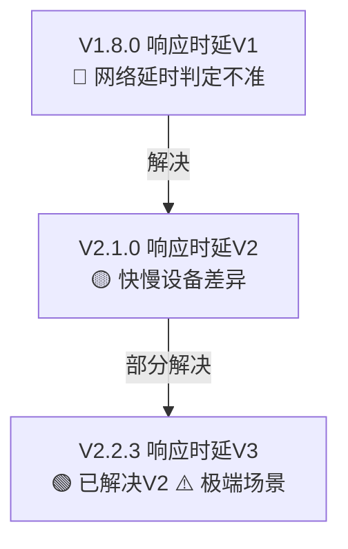

# Requirement Insights

Discover requirement insights from two complementary dimensions: **evolution tracking** (time dimension — which issues haven't converged) and **gap analysis** (feature dimension — which features aren't covered).

## Two Insight Dimensions

| Dimension | What It Finds | Output Type |
|-----------|---------------|-------------|
| Evolution Tracking | Boundary-external issues not resolved across version chains | `--output-type evolution` |
| Gap Analysis | Features not covered by any document | `--output-type gap` |
| Both | Complete insights report | `--output-type all` (default) |

```
                        ┌─ --output-type evolution ──→ 演进追踪结果 + Mermaid图
                        │
Input data ─────────────┼─ --output-type gap ──→ 覆盖矩阵 + 缺口分析
                        │
                        └─ --output-type all ──→ 全部（默认）
```

## Evolution Tracking

From each document's `boundary_issues`, track resolution status across version chains:

```
V1.8.0 raises: "network latency causes inaccurate detection"     → 🔴 unresolved
V2.1.0 resolves: "fast/slow device response speed gap"            → 🟡 partial (V1 resolved)
V2.2.3 advances: "mixed-network latency self-adaptation"          → 🟡 partial (extreme cases remain)
```

**Key principle**: "Partial resolution" is the most common status — requirements evolve incrementally.

### Mermaid Visualization



Color coding: 🔴 unresolved, 🟡 partial, 🟢 resolved, ⚠️ new issue raised

## Gap Analysis

Build a feature coverage matrix to identify uncovered functionality:

| Feature | V2.0.4 | V2.2.5 | V2.2.6 | Status |
|---------|--------|--------|--------|--------|
| Data collection plan definition | ✅ | ❌ | ❌ | ✅ covered |
| Data query page | ❌ | ✅ | ❌ | ✅ covered |
| Terminal data collection impl | ❌ | ❌ | ✅ | ✅ covered |
| Data validation | ❌ | ❌ | ❌ | ❌ **gap** |

**Key principle**: Overlap is not always a problem — version evolution is normal overlap. Only unrelated duplicates are problematic.

## Quick Start

All commands below assume the working directory is the **skill root** (`skills/requirement-insights/`).
Install dependencies first: `pip install -r requirements.txt`

### Run insights analysis

```bash
python scripts/insights.py <classify_json> <analysis_dir> <output_json> [options]

# Full insights (evolution + gap)
python scripts/insights.py classify.json ./analysis/ result.json

# Evolution tracking only
python scripts/insights.py classify.json ./analysis/ result.json --output-type evolution

# Gap analysis only
python scripts/insights.py classify.json ./analysis/ result.json --output-type gap

# With custom feature dimensions
python scripts/insights.py classify.json ./analysis/ result.json --feature-dims dims.json

# Include Mermaid diagram in output
python scripts/insights.py classify.json ./analysis/ result.json --include-mermaid
```

## Input

### Required

1. **Classify result JSON** — output from `prd-overview-classify`
2. **Analysis directory** — containing per-document analysis JSONs from `prd-per-analysis`

### Optional

- **Feature dimensions** — via `--feature-dims` for user-defined feature list (skips LLM extraction)
- **Mermaid output** — via `--include-mermaid` flag

## Output Format

```json
{
  "project_name": "智能联动",
  "output_type": "all",
  "evolution": {
    "evolution_chains": [
      {
        "chain_name": "响应时延",
        "versions": [
          {
            "version": "V1.8.0",
            "doc_id": "uuid1",
            "title": "智能联动响应时延V1",
            "boundary_issues_raised": ["网络延时导致判定不准确"],
            "boundary_issues_resolved": [],
            "boundary_issues_remaining": ["网络延时导致判定不准确"]
          }
        ]
      }
    ],
    "summary": {
      "total_chains": 5,
      "total_issues": 19,
      "resolved": 10,
      "partial": 5,
      "unresolved": 4
    },
    "mermaid_graph": "flowchart TD\n  ..."
  },
  "gap_analysis": {
    "feature_dimensions": ["数据采集方案定义", "数据查询页面"],
    "coverage_matrix": [
      {
        "feature": "数据采集方案定义",
        "covered_by": ["V2.0.4"],
        "status": "covered"
      },
      {
        "feature": "数据校验",
        "covered_by": [],
        "status": "gap"
      }
    ],
    "gaps": [
      {
        "feature": "数据校验",
        "description": "无任何文档覆盖数据校验机制",
        "severity": "high",
        "suggestion": "建议新增需求文档覆盖此功能"
      }
    ],
    "overlaps": [
      {
        "feature": "响应时延判定",
        "covered_by": ["V1.8.0", "V2.1.0", "V2.2.3"],
        "note": "3篇文档覆盖同一功能，属正常演进"
      }
    ],
    "summary": {
      "total_features": 4,
      "covered": 3,
      "gaps": 1,
      "overlap_count": 1
    }
  },
  "metadata": {
    "total_docs": 29,
    "output_type": "all",
    "models_used": {"text": "claude-sonnet-4-20250514"}
  }
}
```

## Key Features

- **Two insight dimensions in one Skill**: Evolution tracking + gap analysis, selectable via `--output-type`
- **Semantic issue matching**: Cross-version boundary issue matching uses LLM for semantic similarity (same issue described differently)
- **Mermaid visualization**: Evolution chain flowcharts with color-coded resolution status
- **Feature extraction**: LLM-driven feature dimension extraction from document boundaries
- **Coverage matrix**: Clear covered/gap/overlap status per feature

## Dependencies

```bash
pip install -r requirements.txt
# Core: anthropic, pydantic
```

## Scripts Reference

| Script | Purpose |
|--------|---------|
| `insights.py` | Main entry: evolution tracking + gap analysis |

## Prompts Reference

| Prompt | Purpose |
|--------|---------|
| `evolution-match.md` | Cross-version boundary issue semantic matching |
| `feature-extraction.md` | Feature dimension extraction from document boundaries |
| `gap-assessment.md` | Gap severity assessment and suggestions |

For detailed API and customization, see [references/usage-guide.md](references/usage-guide.md).
